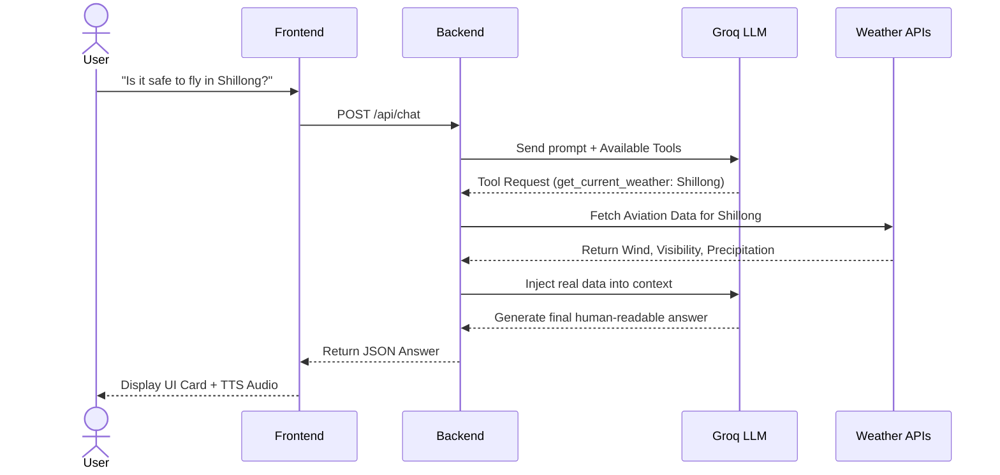
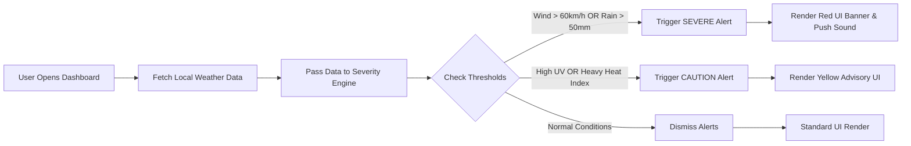

<div align="center">
  <h1>🌦️ WeatherGPT</h1>
  <p><strong>Next-Generation Multilingual Meteorological AI | Smart India Hackathon 2026</strong></p>
</div>

---

## 📖 Overview

**WeatherGPT** is a production-ready, generative AI-powered meteorological dashboard built for the **Smart India Hackathon 2026**. 

Traditional weather apps are passive—users have to dig through charts to find what they need. WeatherGPT flips this paradigm by offering an **Agentic AI Chatbot** that understands complex, conversational queries in **English, Hindi, Bengali, and Assamese**. Whether you are a farmer asking about pesticide schedules, a pilot checking wind shear, or a daily commuter, WeatherGPT fetches hyper-local data and gives you exact, personalized answers.

---

## 🎯 The Problem vs. Our Solution

| The Challenge (SIH Requirements) | WeatherGPT's Solution |
| :--- | :--- |
| **Language Barriers** in rural areas. | Native support for **4 languages** with localized **Cloud Text-to-Speech (TTS)** audio playback. |
| **Complex Meteorological Data** is hard to read. | **Agentic RAG System:** The AI mathematically analyzes raw API data and translates it into simple human advice. |
| **Lack of Specialized Data** for industries. | **Dedicated Hubs** for Agriculture, Marine, Aviation, and Urban Planning with targeted APIs (Soil Moisture, Tide charts, etc). |
| **Internet Unreliability** during disasters. | **Offline SMS Simulation:** Authorities can broadcast Red/Yellow alerts directly to rural feature phones. |
| **Forecast Inaccuracy** | **NWP Divergence Engine:** We cross-check the world's top 3 supercomputers (GFS, ECMWF, ICON) and warn users if they disagree. |

---

## ✨ Features: From Small Details to Massive Systems

### 🔍 Micro-Interactions (The Small Details)
- **Glassmorphism UI:** Stunning, frosted-glass interface that adapts dynamically.
- **Photorealistic Contextual Backgrounds:** The background seamlessly changes based on the active tab (e.g., Farmer fields, Ocean waves) and live weather conditions.
- **Context-Aware Icons:** SVG icons dynamically adapt to the severity of the weather.
- **Progressive Web App (PWA):** Installable directly to iOS/Android home screens as a native app.

### 📊 Core Application (The Medium Systems)
- **Interactive Weather Dashboard:** Hyper-local live data, 7-day visual forecast grids, and hourly condition sliders.
- **Interactive Radar Maps:** Real-time visual overlays for precipitation, temperature, and wind.
- **Crowdsource Reporting:** Users can submit ground-truth weather reports (e.g., "It is flooding here") to validate our data models.
- **Historical Analytics:** Compare today's weather against 10-year historical averages to track climate trends.

### 🧠 Enterprise Logic (The Massive Features)
- **Deterministic Agentic LLM:** Powered by `openai/gpt-oss-120b`, the AI is physically restricted from hallucinating. It must output strict JSON tool calls to fetch real data before answering.
- **NWP Model Divergence:** Forecasts are rarely 100% accurate. We fetch data from **GFS (USA)**, **ICON (Germany)**, and **ECMWF (Europe)**. If the models heavily disagree, the UI flags the forecast with an "NWP Divergence (High Uncertainty)" badge.
- **Zero-CORS Base64 Audio Proxy:** We built a custom Node.js backend to stream Google TTS audio files as Base64 URIs, bypassing browser CORS restrictions and delivering instant multilingual voice playback.

---

## 🛠️ System Architecture

### Core Chat & Agentic Function Calling
*How the AI determines answers without hallucinating.*



### Automated Alert Notification Flow
*How the system automatically triggers severe warnings and SMS fallbacks.*



---

## 💻 Tech Stack Justification

1. **Frontend:** `React.js (Vite)` + `Tailwind CSS` — Chosen for maximum rendering speed, component modularity, and rapid UI prototyping.
2. **Backend:** `Node.js` + `Express.js` — Acts as a secure middleman to protect API keys (Groq, Google TTS) and proxy heavy requests.
3. **AI Inference:** `Groq API` + `openai/gpt-oss-120b` — Groq LPUs provide lightning-fast inference (~500 tokens/sec), essential for a real-time chat interface.
4. **Data Layer:** `Open-Meteo API` — Completely open-source, highly granular, and provides specialized endpoints (Marine, Agriculture, Ensemble models) without rate-limiting our demo.

---

## 🚀 Production Deployment Guide (For SIH Judges)

Because WeatherGPT relies on both a modern React frontend and an Express Node.js backend to securely proxy API keys, it must be deployed as two separate services.

### 1. Local Development Setup
```bash
# 1. Clone the repository
git clone https://github.com/omcodes16/sih-2026.git
cd sih-2026

# 2. Install dependencies
npm install

# 3. Configure Environment Variables
# Create a .env file in the root directory
echo "GROQ_API_KEY=your_api_key_here" > .env

# 4. Run both Frontend and Backend concurrently
npm run dev:all

# 5. Access the application
# Open http://localhost:5173 in your browser
```

### 2. Live Production Deployment

#### Step A: Deploying the Backend (Render / Railway)
1. Create a free account on [Render.com](https://render.com).
2. Create a new **Web Service** and connect this GitHub repository.
3. Set the **Build Command** to: `npm install`
4. Set the **Start Command** to: `npm run server`
5. In the **Environment Variables** tab, add your `GROQ_API_KEY`.
6. Once deployed, copy your backend URL (e.g., `https://weathergpt-backend.onrender.com`).

#### Step B: Deploying the Frontend (Vercel)
1. Create a free account on [Vercel.com](https://vercel.com).
2. Import this repository.
3. **Crucial Step:** Open your project code and navigate to where the frontend calls the backend (e.g., `src/services/chatApi.js`). Update the base URL from `http://localhost:3001` to the Render URL you copied in Step A.
4. Set the **Framework Preset** to Vite.
5. Set the **Build Command** to: `npm run build`
6. Set the **Output Directory** to: `dist`
7. Click **Deploy**. Your frontend will now be live on a fast, global CDN!
