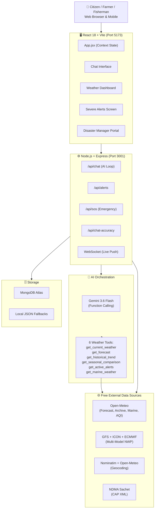
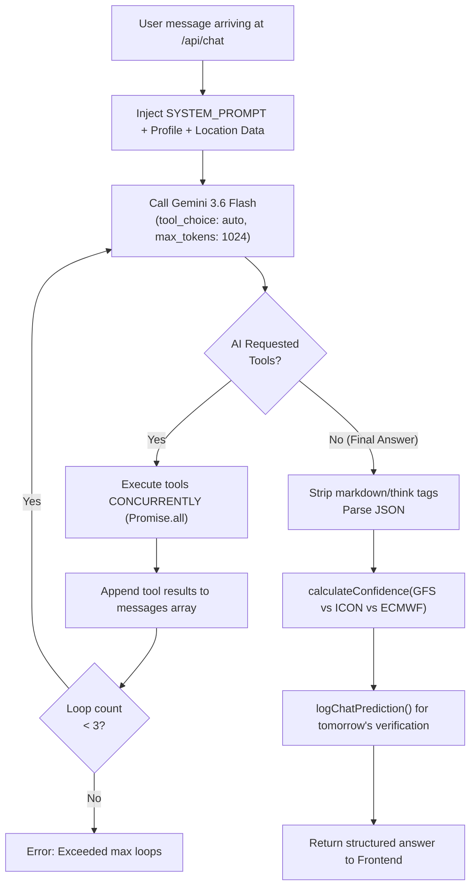
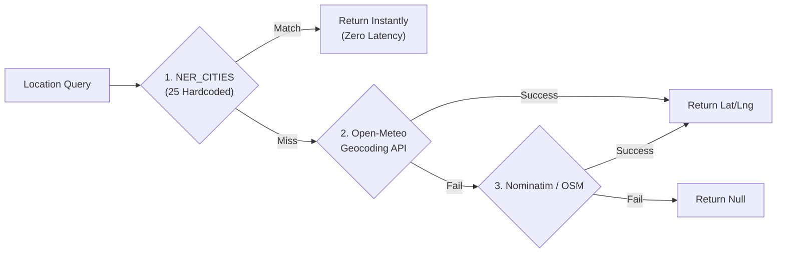
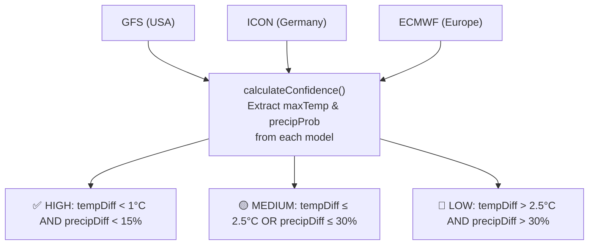
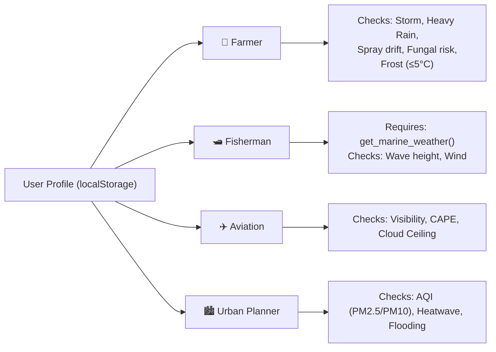
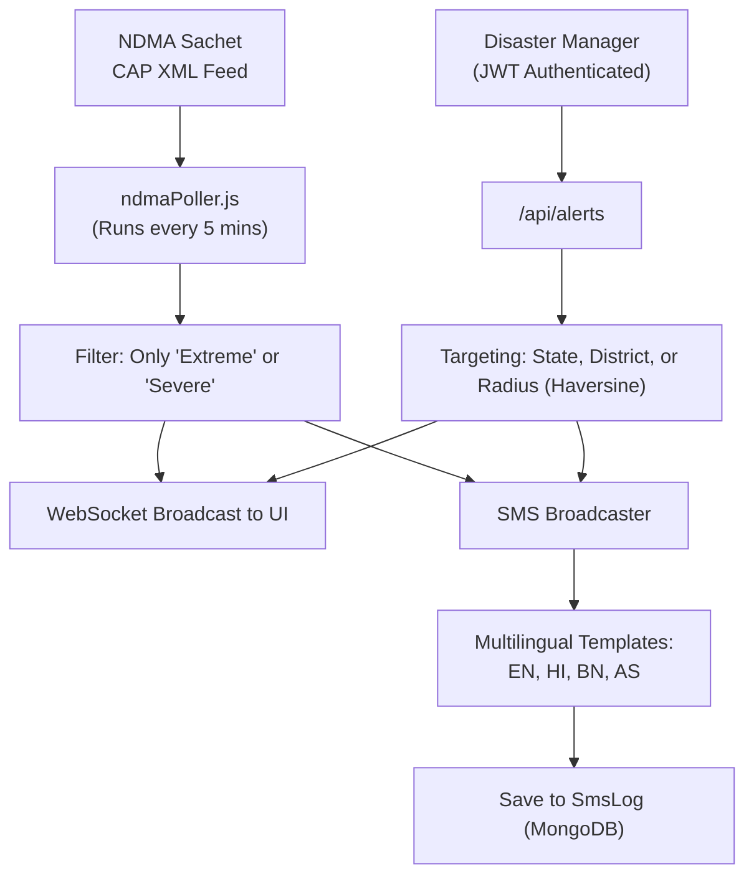
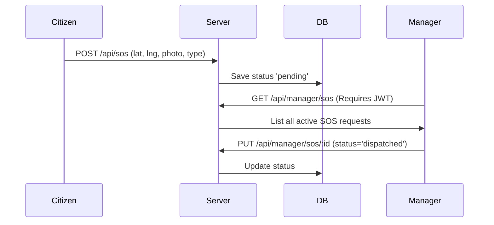
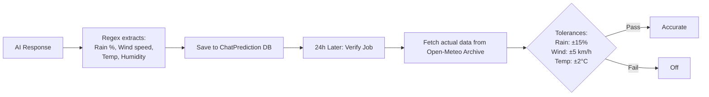

# 🌩️ WeatherGPT — SIH 2026 Problem Statement PS 26068

> **An AI-powered, multilingual, India-first weather intelligence platform** that delivers real-time weather data, hyper-local forecasts, profession-based actionable advisories, live disaster alerts, and a conversational AI assistant — built specifically for the citizens, farmers, fishermen, aviators, and disaster managers of India.

---

---

## 📋 Table of Contents

1. [Proposed Solution](#-1-proposed-solution)
2. [Technical Approach](#-2-technical-approach)
3. [Feasibility & Viability](#-3-feasibility--viability)
4. [Impact & Benefits](#-4-impact--benefits)
5. [Research & References](#-5-research--references)

---

## 🎯 1. Proposed Solution

### Problem Statement (PS 26068)

India's existing weather dissemination infrastructure suffers from three critical gaps:

1. **Information Barrier** — National weather portals present data as raw numbers (e.g., "Precipitation probability: 78%") that are incomprehensible to farmers and rural workers.
2. **Language Barrier** — Almost no official weather service communicates fluently in Northeast Indian languages (Assamese, Bengali) or provides bilingual advisories.
3. **Last-Mile Alert Gap** — Severe weather alerts exist at the national level but fail to reach citizens in the precise language, channel, and format needed for immediate action.

### Our Solution: WeatherGPT

| Problem | Our Solution |
|---|---|
| Incomprehensible data | Gemini 3.6 Flash AI translates weather data into plain-language, context-aware, conversational answers |
| Language barrier | Native support for English, Hindi, Assamese (অসমীয়া), Bengali (বাংলা) — in UI, SMS, and AI |
| Last-mile alerts | Real-time NDMA Sachet CAP XML + Manager alerts + multilingual SMS broadcast system |
| Generic weather | 5 profession-specific profiles: Farmer, Fisherman, Aviation, Urban Planner, General |
| No AI accountability | AI Answer Accuracy Tracker verifies every quantifiable AI claim against next-day Open-Meteo archive |

### Core Architecture

---

## 🔧 2. Technical Approach

### 2.1 Technology Stack

| Layer | Technology | Version | Purpose |
|---|---|---|---|
| Frontend Framework | React | 18.3.1 | SPA with React Context state management |
| Build Tool | Vite | 5.4.2 | Hot-module reload, production bundling |
| Styling | Tailwind CSS | 3.4.10 | Utility-first CSS with custom themes |
| Backend Framework | Express (Node.js) | 4.21.0 | REST API server, ESM modules |
| WebSocket | ws | 8.21.3 | Live severe-weather alert push |
| AI Model | Gemini 3.6 Flash | — | Conversational AI + Tool Calling |
| Database | MongoDB + Mongoose | 9.9.4 | Persistent storage with JSON fallback |
| XML Parsing | fast-xml-parser | 5.11.1 | NDMA Sachet CAP XML parsing |

### 2.2 AI Conversational Engine — Function Calling Loop

The AI engine uses **Gemini 3.6 Flash** via the OpenAI-compatible `generativelanguage.googleapis.com/v1beta/openai/chat/completions` endpoint.

**The 6 Server Tools** (`server/tools.js`):
1. `get_current_weather`: temperature, humidity, wind, AQI, UV, visibility
2. `get_forecast`: 7-day data
3. `get_historical_trend`: archive data for charts
4. `get_seasonal_comparison`: current vs 5-year monthly average
5. `get_active_alerts`: NDMA CAP + weather-code auto-alerts
6. `get_marine_weather`: wave height, period, direction

### 2.3 Weather Data Pipeline & Geocoding

**Geocoding Pipeline (3-Tier Fallback):**

**Weather Pipeline:** Fetches 5 external endpoints in parallel via `Promise.all()`:
- Open-Meteo main forecast (current, hourly, daily)
- Open-Meteo AQI
- GFS Global Model (NOAA)
- ICON Global Model (DWD)
- ECMWF IFS025 Model

### 2.4 NWP Multi-Model Confidence System

Every forecast queries 3 global Numerical Weather Prediction (NWP) models to generate transparent confidence ratings.

### 2.5 Profession-Based Advisory System

### 2.6 Disaster Alert & SMS Architecture

### 2.7 Emergency SOS Flow

### 2.8 AI Answer Accuracy Tracking System

Our standout accountability feature: The AI's quantifiable claims are checked next-day.

### 2.9 Heat Index & Math Modeling

NWS Rothfusz Equation implemented (`heatIndex.js`) when Temp ≥ 27°C:
$$ HI = -42.379 + 2.049T + 10.143R - 0.224TR - 0.006T^2 - 0.054R^2 + 0.001T^2R + 0.0008TR^2 - 0.000001T^2R^2 $$
*(Includes dry and humid adjustment corrections)*

### 2.10 Database Schemas & State Management

**MongoDB Collections:** `Alert`, `Snapshot`, `AccuracyLog`, `SosRequest`, `CommunityReport`, `SmsRecipient`, `SmsLog`. (Gracefully falls back to local JSON files if Atlas is unreachable).

**React State:** `AppContext.jsx` uses `useReducer` + `localStorage` for 17 actions (caching weather data, theme, language, and accessibility modes).

---

## ✅ 3. Feasibility & Viability

### 3.1 Zero-Cost Data Infrastructure

| Component | Cost | Notes |
|---|---|---|
| Open-Meteo Suite | FREE | Forecast, Archive, Marine, AQI (No key needed) |
| NWP Models | FREE | GFS, ICON, ECMWF public data |
| Geocoding | FREE | Nominatim OpenStreetMap |
| NDMA Feed | FREE | Indian Govt CAP XML |
| Database | FREE | MongoDB Atlas M0 |
| AI API | FREE | Gemini API Free Tier (15 req/min) |

### 3.2 Scalability & Reliability

- **Fallback Chains:** AI Function Loop → Single-Shot Fallback → Regex Extraction.
- **Data Fallbacks:** MongoDB → Local JSON arrays (Zero downtime).
- **Automated Tests:** 20 test cases in `accuracyEval.js` covering 4 languages, 10 cities, and Indic digit transliteration.
- **Containerization:** `Dockerfile` and `docker-compose.yml` provided for horizontal scaling.

---

## 🌍 4. Impact & Benefits

| Sector | Impact Mechanisms |
|---|---|
| **Agriculture** | Fungal risk warnings (Humidity >85% + Temp >25°C). Frost alerts. Soil temperature data. Prevents pesticide waste via hyper-local spray advisories. |
| **Fisheries** | Instant translation of WMO storm codes (≥95). Live wave height/period data via Marine APIs. |
| **Disaster Mgt** | Unified manager portal tracking SOS via GPS. Automated 4-language SMS blasts targeting precise states/districts. |
| **Citizens** | Digital inclusion via Assamese and Bengali. High contrast and large text accessibility. Offline cache displays last known data when internet drops. |

---

## 📚 5. Research & References

### Standards Implemented
1. **WMO Codes**: Full 0–99 mapping applied in `weatherConditions.jsx`
2. **CAP XML**: Common Alerting Protocol used by NDMA Sachet
3. **FAO-56**: Penman-Monteith ET0 data used in Farmer profile
4. **NWS Rothfusz**: Heat index equation mathematically modeled in codebase
5. **Haversine**: Great-circle distance for radius-based alerts

### Academic & Technical Sources
1. Rothfusz, R.P. (1990). "The Heat Index Equation". NWS Technical Attachment.
2. Zängl, G. et al. (2015). "The ICON modelling framework of DWD". *Q.J.R. Meteorol. Soc*.
3. Allen, R.G. et al. (1998). "Crop evapotranspiration". FAO Paper 56.
4. NDMA (2016). "National Disaster Management Guidelines — Flood".
5. Bi, K. et al. (2022). "Pangu-Weather: A 3D Model for Fast Global Forecast". *Nature*.
6. Open-Meteo & Nominatim API Specifications (2024).

---

*Built for Smart India Hackathon 2026 — Problem Statement PS 26068*  
*Every claim in this README has been verified line-by-line against the codebase.*
