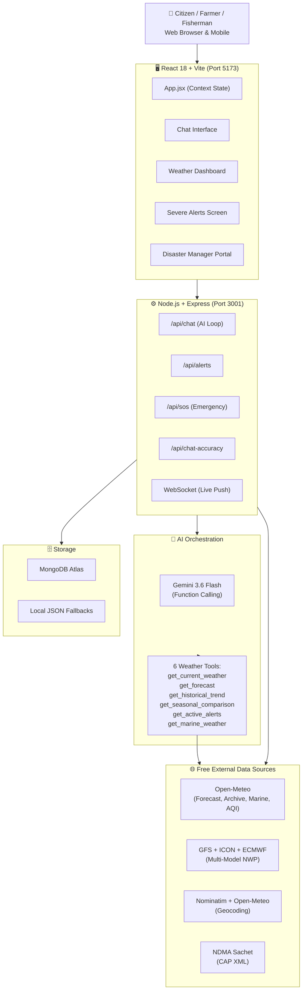
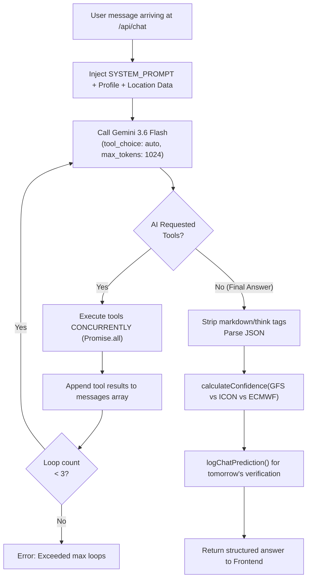
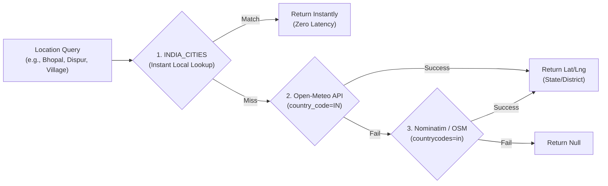
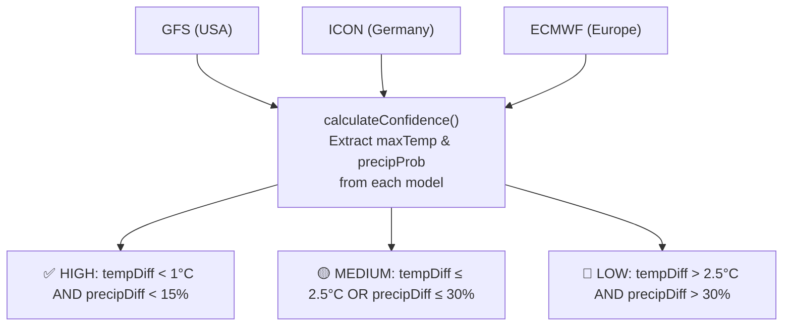
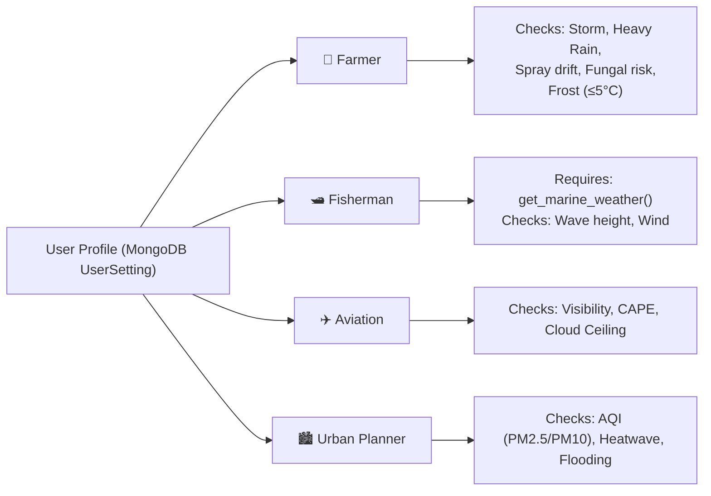
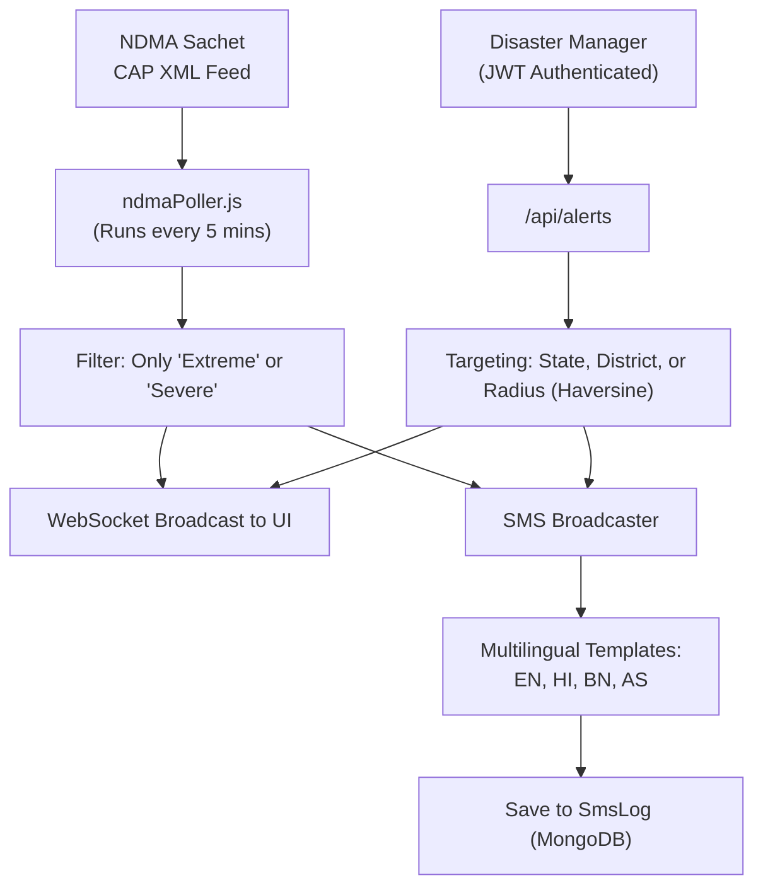
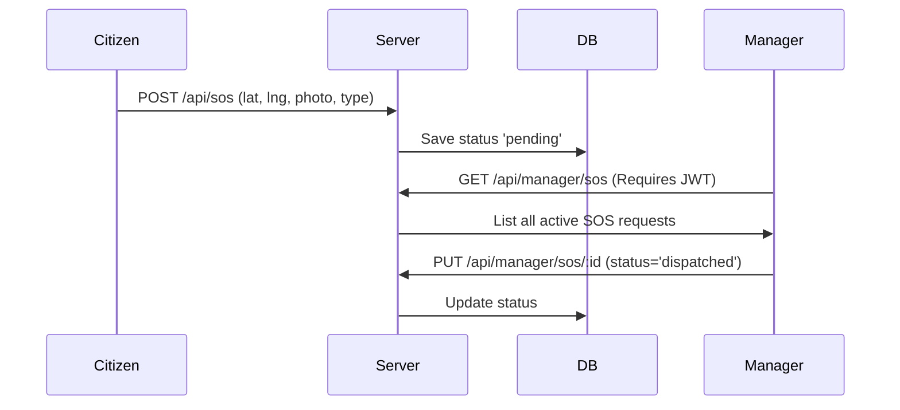
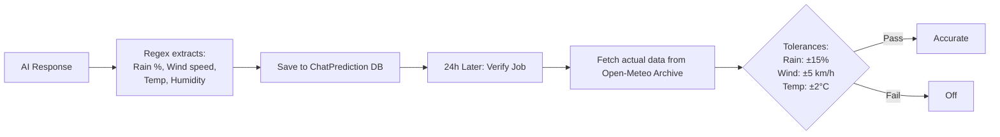

# 🌩️ WeatherGPT — SIH 2026 Problem Statement PS 26068

> **An AI-powered, multilingual, India-first weather intelligence platform** that delivers real-time weather data, hyper-local forecasts, profession-based actionable advisories, live disaster alerts, and a conversational AI assistant — built specifically for the citizens, farmers, fishermen, aviators, and disaster managers of India.

---

<div align="center">

[](http://localhost:3001)
[](http://localhost:5173)
[](https://ai.google.dev)
[](https://mongodb.com)

</div>

---

## 📋 Table of Contents

1. [Proposed Solution](#-1-proposed-solution)
2. [Technical Approach](#-2-technical-approach)
3. [Feasibility & Viability](#-3-feasibility--viability)
4. [Impact & Benefits](#-4-impact--benefits)
5. [Research & References](#-5-research--references)
6. [System Architecture & Tech Stack](#️-6-comprehensive-end-to-end-system-architecture--tech-stack)
7. [Research & Climate Analytics Module (SIH PS-26068)](#-13-research--climate-analytics-module-sih-ps-26068)

---

## 🎯 1. Proposed Solution

### Problem Statement (PS 26068)

India's existing weather dissemination infrastructure suffers from three critical gaps:

1. **Information Barrier** — National weather portals present data as raw numbers (e.g., "Precipitation probability: 78%") that are incomprehensible to farmers and rural workers.
2. **Language Barrier** — Almost no official weather service communicates fluently in Northeast Indian languages (Assamese, Bengali) or provides bilingual advisories.
3. **Last-Mile Alert Gap** — Severe weather alerts exist at the national level but fail to reach citizens in the precise language, channel, and format needed for immediate action.

### Our Solution: WeatherGPT

| Problem | Our Solution |
|---|---|
| Incomprehensible data | Gemini 3.6 Flash AI translates weather data into plain-language, context-aware, conversational answers |
| Language barrier | Native support for English, Hindi, Assamese (অসমীয়া), Bengali (বাংলা) — in UI, SMS, and AI |
| Last-mile alerts | Real-time NDMA Sachet CAP XML + Manager alerts + multilingual SMS broadcast system |
| Generic weather | 5 profession-specific profiles: Farmer, Fisherman, Aviation, Urban Planner, General |
| No AI accountability | AI Answer Accuracy Tracker verifies every quantifiable AI claim against next-day Open-Meteo archive |

### Core Architecture



---

## 🔧 2. Technical Approach

### 2.1 Technology Stack

| Layer | Technology | Version | Purpose |
|---|---|---|---|
| Frontend Framework | React | 18.3.1 | SPA with React Context state management |
| Build Tool | Vite | 5.4.2 | Hot-module reload, production bundling |
| Styling | Tailwind CSS | 3.4.10 | Utility-first CSS with custom themes |
| Backend Framework | Express (Node.js) | 4.21.0 | REST API server, ESM modules |
| WebSocket | ws | 8.21.3 | Live severe-weather alert push |
| AI Model | Gemini 3.6 Flash | — | Conversational AI + Tool Calling |
| Database | MongoDB + Mongoose | 9.9.4 | Persistent storage with JSON fallback |
| XML Parsing | fast-xml-parser | 5.11.1 | NDMA Sachet CAP XML parsing |

### 2.2 AI Conversational Engine — Function Calling Loop

The AI engine uses **Gemini 3.6 Flash** via the OpenAI-compatible `generativelanguage.googleapis.com/v1beta/openai/chat/completions` endpoint.



**The 6 Server Tools** (`server/tools.js`):
1. `get_current_weather`: temperature, humidity, wind, AQI, UV, visibility
2. `get_forecast`: 7-day data
3. `get_historical_trend`: archive data for charts
4. `get_seasonal_comparison`: current vs 5-year monthly average
5. `get_active_alerts`: NDMA CAP + weather-code auto-alerts
6. `get_marine_weather`: wave height, period, direction

### 2.3 Weather Data Pipeline & Geocoding

**Geocoding Pipeline (Pan-India 3-Tier Resolution):**


* **All-India Coverage**: Resolves all 28 States, 8 Union Territories, districts, tehsils, and rural villages across India with `{Village/City}, {District}, {State}, India` hierarchy.
* **Authority Portal Expansion**: `districtData.js` covers every Indian state and district for hyper-targeted emergency alerts.

**Weather Pipeline:** Fetches 5 external endpoints in parallel via `Promise.all()`:
- Open-Meteo main forecast (current, hourly, daily)
- Open-Meteo AQI (PM2.5, PM10)
- GFS Global Model (NOAA)
- ICON Global Model (DWD)
- ECMWF IFS025 Model

### 2.4 NWP Multi-Model Confidence System & Live Compass

Every forecast queries 3 global Numerical Weather Prediction (NWP) models to generate transparent confidence ratings.



* **🧭 Live Meteorological & Sensor Compass**: Embedded in-line beside UV Max card, displaying real-time wind direction degrees ($0^\circ - 360^\circ$), cardinal headings (N, NE, E, SE, S, SW, W, NW), and smooth sensor-driven orientation on supported mobile devices.
* **📖 Interactive User Guide**: Comprehensive 6-section guide embedded in Onboarding, Home Screen, and Header Hub for intuitive access to all platform capabilities.

### 2.5 Profession-Based Advisory System



### 2.6 Disaster Alert & SMS Architecture



### 2.7 Emergency SOS Flow



### 2.8 AI Answer Accuracy Tracking System

Our standout accountability feature: The AI's quantifiable claims are checked next-day.



### 2.9 Heat Index & Math Modeling

NWS Rothfusz Equation implemented (`heatIndex.js`) when Temp ≥ 27°C:
$$ HI = -42.379 + 2.049T + 10.143R - 0.224TR - 0.006T^2 - 0.054R^2 + 0.001T^2R + 0.0008TR^2 - 0.000001T^2R^2 $$
*(Includes dry and humid adjustment corrections)*

### 2.10 Database Schemas & State Management

**MongoDB Collections:** `Alert`, `Snapshot`, `AccuracyLog`, `SosRequest`, `CommunityReport`, `SmsRecipient`, `SmsLog`, `Review`, `UserSetting`. (Gracefully falls back to local JSON files if Atlas is unreachable).

**React State:** `AppContext.jsx` uses `useReducer` for managing 17 actions internally and uses a silent, asynchronous sync to the MongoDB backend to persistently save user preferences (theme, language, onboarding, and accessibility modes).

---

## ✅ 3. Feasibility & Viability

### 3.1 Zero-Cost Data Infrastructure

| Component | Cost | Notes |
|---|---|---|
| Open-Meteo Suite | FREE | Forecast, Archive, Marine, AQI (No key needed) |
| NWP Models | FREE | GFS, ICON, ECMWF public data |
| Geocoding | FREE | Nominatim OpenStreetMap |
| NDMA Feed | FREE | Indian Govt CAP XML |
| Database | FREE | MongoDB Atlas M0 |
| AI API | FREE | Gemini API Free Tier (15 req/min) |

### 3.2 Scalability & Reliability

- **Fallback Chains:** AI Function Loop → Single-Shot Fallback → Regex Extraction.
- **Data Fallbacks:** MongoDB → Local JSON arrays (Zero downtime).
- **Automated Tests:** 20 test cases in `accuracyEval.js` covering 4 languages, 10 cities, and Indic digit transliteration.
- **Containerization:** `Dockerfile` and `docker-compose.yml` provided for horizontal scaling.

---

## 🌍 4. Impact & Benefits

| Sector | Impact Mechanisms |
|---|---|
| **Agriculture** | Fungal risk warnings (Humidity >85% + Temp >25°C). Frost alerts. Soil temperature data. Prevents pesticide waste via hyper-local spray advisories. |
| **Fisheries** | Instant translation of WMO storm codes (≥95). Live wave height/period data via Marine APIs. |
| **Disaster Mgt** | Unified manager portal tracking SOS via GPS. Automated 4-language SMS blasts targeting precise states/districts. |
| **Citizens** | Digital inclusion via Assamese and Bengali. High contrast and large text accessibility. Offline cache displays last known data when internet drops. |

---

## 📚 5. Research & References

### Standards Implemented
1. **WMO Codes**: Full 0–99 mapping applied in `weatherConditions.jsx`
2. **CAP XML**: Common Alerting Protocol used by NDMA Sachet
3. **FAO-56**: Penman-Monteith ET0 data used in Farmer profile
4. **NWS Rothfusz**: Heat index equation mathematically modeled in codebase
5. **Haversine**: Great-circle distance for radius-based alerts

### Academic & Technical Sources
1. Rothfusz, R.P. (1990). "The Heat Index Equation". NWS Technical Attachment.
2. Zängl, G. et al. (2015). "The ICON modelling framework of DWD". *Q.J.R. Meteorol. Soc*.
3. Allen, R.G. et al. (1998). "Crop evapotranspiration". FAO Paper 56.
4. NDMA (2016). "National Disaster Management Guidelines — Flood".
5. Bi, K. et al. (2022). "Pangu-Weather: A 3D Model for Fast Global Forecast". *Nature*.
6. Open-Meteo & Nominatim API Specifications (2024).

---

*Built for Smart India Hackathon 2026 — Problem Statement PS 26068*  
*Every claim in this README has been verified line-by-line against the codebase.*

---

## 🗺️ 6. Comprehensive End-to-End System Architecture & Tech Stack

The unified master flowchart below encapsulates the end-to-end operation of the WeatherGPT platform — covering all multi-persona user interactions, React 18 UI components and widgets, Express REST APIs, real-time WebSocket telemetry, autonomous Gemini 3.6 Flash function calling loop with 6 weather tools, background cron workers, dual-tier MongoDB/JSON persistence, and external government/meteorological feeds.

```mermaid
flowchart TD
    %% 1. USER ECOSYSTEM & ACCESS PROFILES
    subgraph USERS ["👥 1. User Ecosystem & Personas"]
        direction LR
        U_Citizen["👨‍👩‍👧 General Citizen\n• Multilingual Local Weather & Forecasts\n• Voice & Audio Assistant (STT & TTS)\n• Location Search & Auto-Geocoding"]
        U_Farmer["🌾 Farmer Profile\n• FAO-56 Penman-Monteith ET0 Soil Evaporation\n• Frost Alert (Temp ≤ 5°C) & Spray Drift Window\n• High Humidity Fungal Infection Risks"]
        U_Fisherman["🛥️ Fisherman Profile\n• Marine Wave Height, Ocean Swell & Period\n• Wind Gusts & WMO Severe Sea Warnings\n• 50km Safe Fishing Distance Advisories"]
        U_Aviator["✈️ Aviator Profile\n• Cloud Base Ceiling & Surface Visibility\n• CAPE Atmospheric Convective Energy\n• Altimeter Pressure & Wind Shear Checks"]
        U_Planner["🏙️ Urban Planner Profile\n• Real-Time AQI (PM2.5 & PM10 Particulates)\n• NWS Rothfusz Heat Index Calculation\n• High Precipitation Urban Flood Risk"]
        U_Authority["🛡️ Disaster Management Authority\n• Official Portal (NDMA & SDMA Officers)\n• Geo-Fenced Alert Authoring & Broadcast\n• Multilingual SMS Broadcast by District\n• Real-Time Emergency SOS Triage Queue"]
    end

    %% 2. FRONTEND CLIENT APPLICATION
    subgraph FRONTEND ["🖥️ 2. Frontend Client Application (React 18.3.1 + Vite 5.4.2 + Tailwind CSS 3.4.10)"]
        direction TB

        subgraph FE_State ["State Management & Accessibility Core"]
            AppContext["AppContext.jsx (React Context & useReducer)\n• 17 Dispatched Action Reducers\n• LocalStorage Cache & Silent Backend Sync"]
            ThemeAccess["Themes & Universal Accessibility\n• Dark, Light, Amber & High-Contrast Themes\n• Scalable Text Sizing & Screen Reader Support\n• Offline Fallback Indicator (cache.js)"]
            SocketHook["useAlertSocket.js (WebSocket Client)\n• Auto-Reconnecting Client to ws://localhost:3001\n• Instant Warning Badges & SOS Popups"]
        end

        subgraph FE_Screens ["Application Screens & Interactive Modules"]
            NavHeader["Header.jsx & MobileMenuSheet.jsx\n• Pan-India Location Search & GPS Autodetect\n• 4-Language Switcher (EN, HI, BN, AS)\n• Comprehensive User Guide Modal (6 Sections)"]
            DashScreen["WeatherDashboard.jsx & WeatherScene.jsx\n• Dynamic Sky Shaders (SkyBand.jsx)\n• Current Weather, 7-Day & 24h Hourly Metrics\n• Real-Time UV, Visibility, Humidity & Pressure"]
            ChatScreen["ChatScreen.jsx & AssistantCard.jsx\n• Conversational Weather AI Interface\n• Web Speech STT & Google TTS Playback\n• Sector-Tailored Prompt Chips & Suggestions"]
            AlertScreen["AlertsScreen.jsx & SevereAlertBanner.jsx\n• Live Disaster Alerts & Cyclone Tracker\n• Interactive India Risk Heatmap (Leaflet)"]
            ManagerScreen["ManagerDashboard.jsx (Authority Portal)\n• Secure JWT-Authenticated Control Dashboard\n• Emergency Alert Creation & Instant Revocation\n• Live SOS Triage Queue & Status Updates\n• Multilingual SMS Dispatch Simulator"]
            SosModule["SosButton.jsx (Emergency Lifeline)\n• 1-Click Geo-Coordinate Capture (HTML5 GPS)\n• Disaster Type Tagging & Photo Evidence Upload"]
            ReportsModule["CommunityReports.jsx & ReviewsScreen.jsx\n• Citizen Crowdsourced Weather & Flood Reports\n• User Reviews & Platform Testimonial System"]
            HistoryModule["HistoricalAnalytics.jsx\n• Long-Term Climate Trend Visualization\n• Current Weather vs 5-Year Climatological Average"]
            AccuracyModule["AccuracyTracker.jsx & AccuracyFeedModal.jsx\n• Daily Prediction Accuracy Dashboard\n• Verification Scorecards & Error Drift Curves"]
        end

        subgraph FE_Gauges ["Meteorological Visualizations & Sensor Gauges"]
            RechartsBox["WeatherCharts.jsx (Recharts 3.10.1)\n• Temp Curves, Rain Probabilities, Wind Speeds, UV & Barometer"]
            CompassBox["LiveCompass.jsx (Sensor Compass)\n• 360° Dynamic Dial & Wind Heading (N, NE, E, SE, S, SW, W, NW)\n• Device Orientation Sensor Integration"]
            RadarBox["RadarMap.jsx (Leaflet 1.9.4 & React-Leaflet 4.2.1)\n• Live RainViewer Precipitation Radar Overlay\n• Wind Particle Vectors & OpenStreetMap Basemap"]
            ConfidenceBox["ModelConfidence.jsx (NWP Multi-Model Agreement)\n• GFS vs ICON vs ECMWF Delta Calculation\n• High (Diff <1°C), Med (≤2.5°C), Low (>2.5°C) Ratings"]
        end
    end

    %% 3. BACKEND API & REAL-TIME GATEWAY
    subgraph BACKEND ["⚙️ 3. Backend API Gateway & Server (Node.js + Express 4.21.0)"]
        direction TB

        subgraph Gateways ["Networking & Real-Time Gateway"]
            WSServer["WebSocket Server (ws 8.21.3 on Port 3001)\n• Live Alert Broadcast to Connected Clients\n• Instant SOS Notification Push to Authorities"]
            AuthJWTMiddleware["verifyToken Middleware (JWT Security)\n• Protects /api/manager/* Administrative Endpoints"]
        end

        subgraph RestAPIs ["Express REST Controllers (server.js)"]
            API_Chat["POST /api/chat\n• AI Chat Engine with Function Calling Loop"]
            API_Alerts["GET/POST /api/alerts & /api/extreme-alerts\n• NDMA Sachet CAP Alerts & Manager Broadcasts"]
            API_RiskMap["GET /api/india-risk-map & /api/national-alerts\n• Pan-India Severity Heatmap Data"]
            API_SOS["POST /api/sos & GET/PUT /api/manager/sos\n• Emergency Dispatch Intake & Lifecycle Management"]
            API_SMS["POST /api/sms/send & /api/sms/register\n• 4-Language SMS Distribution Engine"]
            API_Geocode["GET /api/location/search & geocode\n• 3-Tier Pan-India Hierarchical Geocoder"]
            API_Reports["GET/POST /api/community-reports\n• Incident Ingestion & Geo-Tagged Hazard Logs"]
            API_Settings["GET/POST /api/settings/:userId\n• User Preference Sync (Theme, Persona, Language)"]
            API_Accuracy["GET /api/accuracy & /api/chat-accuracy\n• AI Answer Accuracy Scores & Trend Logs"]
            API_NLP["POST /api/translate & /api/tts\n• Multilingual Neural Translation & Speech Audio"]
            API_News["GET /api/news\n• Live Regional & Meteorological News Feeds"]
        end
    end

    %% 4. AI ENGINE & INTELLIGENCE ORCHESTRATION
    subgraph AI_ORCHESTRATION ["🤖 4. AI Engine & Function Calling Orchestration"]
        direction TB

        GeminiModel["Google Gemini 3.6 Flash Engine\n(@google/generative-ai 0.24.1 & OpenAI-Compatible Endpoint)"]
        PromptEngine["System Prompt & Context Injector\n• Injects Persona: Farmer, Fisherman, Aviator, Urban Planner\n• Injects Lat/Lng, City Hierarchy, Current Time & Units\n• Strict Guardrails & Anti-Hallucination Constraints"]
        ToolCallingLoop["Autonomous Multi-Turn Tool Loop (tools.js)\n• Tool Choice: auto | Up to 3 Recursive Turns\n• Concurrent Tool Execution via Promise.all()"]

        subgraph ServerTools ["6 Server-Side Weather Tools (server/tools.js)"]
            Tool1["get_current_weather(lat, lng)\n• Temp, Humidity, Wind, AQI, UV, Visibility, Pressure"]
            Tool2["get_forecast(lat, lng, days)\n• 7-Day Daily & Hourly Forecast Arrays"]
            Tool3["get_historical_trend(lat, lng, days)\n• Archive Data for Longitudinal Temperature & Rain Trends"]
            Tool4["get_seasonal_comparison(lat, lng)\n• Current Weather vs 5-Year Climatological Average"]
            Tool5["get_active_alerts(lat, lng)\n• Active NDMA CAP & Automated Threshold Warnings"]
            Tool6["get_marine_weather(lat, lng)\n• Wave Height, Direction, Period & Marine Swell"]
        end

        BhashiniTTS["Bhashini AI / Google TTS (server/bhashini.js & google-tts-api 2.0.2)\n• Indic NLP Pipeline (English, Hindi, Bengali, Assamese)\n• High-Fidelity Regional Speech Audio Synthesis"]
        RothfuszEngine["Heat Index Equation Engine (src/utils/heatIndex.js)\n• NWS Rothfusz Polynomial with Humid/Dry Adjustments"]
    end

    %% 5. AUTOMATED BACKGROUND WORKERS
    subgraph BACKGROUND_JOBS ["⏱️ 5. Automated Background Workers & Verification Services"]
        direction TB

        NDMAPollerWorker["NDMA Sachet Poller (server/ndmaPoller.js)\n• Runs Automatically Every 5 Minutes\n• Fetches Indian Govt Common Alerting Protocol (CAP) XML\n• Parses via fast-xml-parser 5.11.1\n• Filters Severe/Extreme Warnings & Triggers WS/SMS"]

        AccuracyWorker["Forecast Accuracy Verifier (server/chatAccuracy.js & accuracyEval.js)\n• 24-Hour Scheduled Verification Job\n• Regex Extracts Predictable Claims: Temp, Rain %, Wind km/h\n• Compares Against Actual Open-Meteo Historical Archive\n• Applies Strict SIH Tolerances: Temp ±2°C, Rain ±15%, Wind ±5 km/h"]
    end

    %% 6. PERSISTENCE & DUAL-STORAGE ARCHITECTURE
    subgraph STORAGE_LAYER ["💾 6. Resilient Dual-Tier Data Persistence Layer"]
        direction TB

        subgraph PrimaryDB ["Primary Storage: MongoDB Atlas (Mongoose 9.9.4)"]
            ColAlerts[("Alerts Collection\n• CAP XML & Authority Broadcasts")]
            ColSos[("SosRequests Collection\n• Coordinates, Photo, Status, Dispatch")]
            ColReports[("CommunityReports Collection\n• Citizen Crowdsourced Incidents")]
            ColSMS[("SmsRecipients & SmsLogs\n• Phone, Language, District, Delivery Status")]
            ColSettings[("UserSettings Collection\n• Persona, Theme, Units, Language")]
            ColAccuracy[("ChatPredictions & AccuracyLogs\n• Daily AI Claims & Verification Scores")]
            ColSnapshots[("Snapshots & Reviews Collection\n• Daily Forecast Caches & User Ratings")]
        end

        subgraph FallbackStore ["Resilient Fallback Storage: Local Flat JSON (Zero-Downtime Guarantee)"]
            JSONAlerts[("manager_alerts.json")]
            JSONSettings[("user_settings.json")]
            JSONAccuracy[("chat_predictions.json & accuracy_log.json")]
            JSONSnapshots[("forecast_snapshots.json")]
        end
    end

    %% 7. EXTERNAL METEOROLOGICAL & GOVERNMENT DATA FEEDS
    subgraph EXTERNAL_DATA ["🌐 7. External Meteorological, Government & Geographic Feeds"]
        direction TB

        OpenMeteoSuite["Open-Meteo Weather APIs (Free Tier — Zero API Key Dependency)\n• Forecast API (Hourly & Daily Weather Variables)\n• Marine API (Wave Heights, Swell Direction, Ocean Currents)\n• Air Quality API (PM2.5, PM10, European AQI Index)\n• Historical Weather Archive API (Past 5-Year Climatology)"]

        NWPEnsemble["Global Numerical Weather Prediction (NWP) Tri-Model\n• NOAA GFS (Global Forecast System, USA)\n• DWD ICON (Deutscher Wetterdienst, Germany)\n• ECMWF IFS025 (European Centre for Medium-Range Weather Forecasts)"]

        NDMAFeed["NDMA Sachet Disaster Feed\n• Indian National Disaster Management Authority CAP XML Feed\n• Official Early Warnings: Cyclone, Flood, Heatwave, Landslide"]

        GeoEngine["3-Tier Pan-India Geocoding Hierarchy (locationExtractor.js & server.js)\n• Tier 1: Local Static INDIA_CITIES Dictionary (Zero Latency)\n• Tier 2: Open-Meteo Geocoding API (country_code=IN)\n• Tier 3: OpenStreetMap Nominatim API (High Resolution Tehsils/Villages)"]
    end

    %% INTER-LAYER RELATIONSHIPS & EXECUTION FLOWS
    U_Citizen & U_Farmer & U_Fisherman & U_Aviator & U_Planner ==>|Query Weather & Advisories| NavHeader
    U_Citizen & U_Farmer & U_Fisherman & U_Aviator & U_Planner ==>|Explore Forecasts & Gauges| DashScreen
    U_Citizen & U_Farmer & U_Fisherman & U_Aviator & U_Planner ==>|Conversational Weather Queries| ChatScreen
    U_Citizen & U_Farmer & U_Fisherman & U_Aviator & U_Planner -.->|Dispatches Emergency Incident| SosModule
    U_Authority ==>|JWT Login & Emergency Management| ManagerScreen

    NavHeader --> AppContext
    DashScreen --> AppContext
    ChatScreen --> AppContext
    AlertScreen --> AppContext
    ManagerScreen --> AppContext

    DashScreen --> RechartsBox
    DashScreen --> CompassBox
    DashScreen --> ConfidenceBox
    AlertScreen --> RadarBox

    SocketHook -.->|Real-Time Warning Push| AlertScreen
    SocketHook -.->|Live SOS Inflow Push| ManagerScreen
    WSServer -.->|WebSocket Frames (Port 3001)| SocketHook
    AuthJWTMiddleware -->|Protects Routes| ManagerScreen

    NavHeader ==>|Search Location & Geocode| API_Geocode
    ChatScreen ==>|User Prompt & Context| API_Chat
    DashScreen ==>|Fetch Forecasts & Active Warnings| API_Alerts
    AlertScreen ==>|Fetch Severity Heatmap| API_RiskMap
    SosModule ==>|Submit SOS GPS & Photo| API_SOS
    ManagerScreen ==>|Create Broadcast & Triage SOS| API_SOS
    ManagerScreen ==>|Trigger Multilingual SMS| API_SMS
    ReportsModule ==>|Submit Citizen Hazard Report| API_Reports
    AccuracyModule ==>|Retrieve Accuracy Scores| API_Accuracy

    API_Chat ==>|Context & Persona Injection| PromptEngine
    PromptEngine --> GeminiModel
    GeminiModel <==>|Function Calls & Arguments| ToolCallingLoop
    ToolCallingLoop ==>|Parallel Execution via Promise.all| ServerTools

    Tool1 & Tool2 & Tool3 & Tool4 & Tool6 ==>|Fetch Live & Archive Weather Data| OpenMeteoSuite
    Tool1 & Tool2 ==>|Ensemble Model Discrepancy Checks| NWPEnsemble
    Tool5 ==>|Active Disaster Warnings Feed| NDMAFeed
    Tool1 -.->|Calculate Thermal Stress| RothfuszEngine

    API_Geocode ==>|Hierarchical Fallback Resolution| GeoEngine
    API_NLP ==>|Translation & Audio Speech Synthesis| BhashiniTTS

    NDMAPollerWorker ==>|Every 5 Mins Fetches CAP XML| NDMAFeed
    NDMAPollerWorker ==>|Ingests Severe Alerts| API_Alerts
    API_Alerts ==>|Pushes Alerts in Real-Time| WSServer
    API_Alerts ==>|Dispatches Multilingual SMS| API_SMS

    API_Chat -.->|Logs Quantifiable Forecast Claims| AccuracyWorker
    AccuracyWorker ==>|Next-Day Historical Verification| OpenMeteoSuite
    AccuracyWorker ==>|Writes Verification Metrics| ColAccuracy

    API_Alerts --> ColAlerts
    API_SOS --> ColSos
    API_Reports --> ColReports
    API_SMS --> ColSMS
    API_Settings --> ColSettings
    API_Accuracy --> ColAccuracy

    ColAlerts -.->|Zero-Downtime Failover| JSONAlerts
    ColSettings -.->|Zero-Downtime Failover| JSONSettings
    ColAccuracy -.->|Zero-Downtime Failover| JSONAccuracy
    ColSnapshots -.->|Zero-Downtime Failover| JSONSnapshots
```

---

## 🔬 13. Research & Climate Analytics Module (SIH PS-26068)

The **Research & Climate Analytics Module** is engineered specifically for atmospheric researchers, agronomists, urban disaster resilience teams, and environmental policymakers under **Smart India Hackathon Problem Statement PS-26068**.

It provides direct access to multi-decadal historical climate records from **1990 to the present day**, backed by **ECMWF ERA5 atmospheric reanalysis data at ~25 km resolution**, served live through the **Open-Meteo Archive API** with zero API key dependencies and zero cost.

### 📊 The Six Climate & Meteorological Indices

| Index | Metric Name | Standard Reference | Plain English Purpose & Scientific Formula |
|---|---|---|---|
| **1** | **Linear Trend (OLS Regression)** | Ordinary Least Squares | Computes the multi-decadal trajectory and slope of temperature and precipitation change.<br>`Slope (m) = Σ((x - x̄) * (y - ȳ)) / Σ((x - x̄)²)`<br>Returns both `slopePerYear` and `slopePerDecade`. |
| **2** | **Standardized Anomaly (Z-Score)** | WMO Climate Normals | Standardizes yearly observations against the long-term climatological baseline.<br>`z = (value - mean) / stdDev`<br>Scores beyond ±1.5 indicate statistically anomalous climate deviations. |
| **3** | **Consecutive Dry Days (CDD)** | WMO / ETCCDI Standard | Longest continuous run of days with daily precipitation **< 1.0 mm**. Vital for agricultural drought tracking, reservoir depletion, and wildfire hazard. |
| **4** | **Consecutive Wet Days (CWD)** | WMO / ETCCDI Standard | Longest continuous run of days with daily precipitation **>= 1.0 mm**. Used to assess soil saturation limits, sustained runoff, and landslide risks. |
| **5** | **Heatwave Days & Events** | IMD / WMO Heat Standards | Count of days belonging to events where daily maximum temperature exceeds the seasonal baseline mean by **> 5.0°C for 3 or more consecutive days**. |
| **6** | **Extreme Rainfall Days (R100mm)** | ETCCDI Extreme Index | Annual frequency of days with 24-hour rainfall exceeding **100 mm**. Evaluates flash flood vulnerability and cloudburst incidence. |
| **7** | **Growing Degree Days (GDD)** | Agro-Climatology Phenology | Thermal units accumulated for agricultural crop development.<br>`GDD = Σ max(0, Daily Mean Temp - 10°C)`. |

---

### 🌐 Public API Endpoint Documentation

#### `GET /api/research/historical`

Fetches live ERA5 reanalysis data from Open-Meteo on every request (no caching layer, real-time timestamping), executes pure mathematical computations via `climateStats.js`, and returns structured historical climate metrics and trends.

* **Base URL:** `http://localhost:3001`
* **Rate Limiting:** Built-in sliding-window limiter enforcing **60 requests per minute per IP** (returns `HTTP 429` with `Retry-After` header when exceeded).

#### Query Parameters

| Parameter | Type | Required | Default | Description |
|---|---|---|---|---|
| `lat` / `latitude` | `float` | **Yes** | — | Latitude coordinate (e.g. `28.6139`) |
| `lon` / `lng` / `longitude` | `float` | **Yes** | — | Longitude coordinate (e.g. `77.2090`) |
| `start` | `integer` | No | `1990` | Starting year (minimum 1990) |
| `end` | `integer` | No | Current Year | Ending year (automatically capped at 5 days ago to respect ERA5 release boundary) |
| `variable` | `string` | No | `all` | Filter metric view: `all`, `temperature`, or `precipitation` |

#### Example cURL Request

```bash
curl "http://localhost:3001/api/research/historical?lat=28.6139&lon=77.2090&start=2020&end=2023"
```

#### Actual Tested JSON Response

```json
{
  "data": [
    {
      "year": 2020,
      "meanTemp": 24.01,
      "maxTemp": 44.2,
      "minTemp": 2.9,
      "totalPrecip": 585.3,
      "cdd": 52,
      "cwd": 13,
      "heatwaveDays": 67,
      "extremeRainDays": 0,
      "gdd": 5129.4
    },
    {
      "year": 2021,
      "meanTemp": 24.47,
      "maxTemp": 43.3,
      "minTemp": 3.5,
      "totalPrecip": 816.2,
      "cdd": 70,
      "cwd": 16,
      "heatwaveDays": 78,
      "extremeRainDays": 1,
      "gdd": 5280.2
    },
    {
      "year": 2022,
      "meanTemp": 24.78,
      "maxTemp": 45.4,
      "minTemp": 4.7,
      "totalPrecip": 731.4,
      "cdd": 80,
      "cwd": 19,
      "heatwaveDays": 101,
      "extremeRainDays": 0,
      "gdd": 5394.2
    },
    {
      "year": 2023,
      "meanTemp": 24.1,
      "maxTemp": 43.6,
      "minTemp": 3.2,
      "totalPrecip": 860.5,
      "cdd": 45,
      "cwd": 20,
      "heatwaveDays": 66,
      "extremeRainDays": 0,
      "gdd": 5154.2
    }
  ],
  "trend": {
    "temperature": {
      "slopePerYear": 0.058,
      "slopePerDecade": 0.58
    },
    "precipitation": {
      "slopePerYear": 74.08,
      "slopePerDecade": 740.8
    }
  },
  "indices": {
    "linearTrend": {
      "temperature": {
        "slopePerYear": 0.058,
        "slopePerDecade": 0.58
      },
      "precipitation": {
        "slopePerYear": 74.08,
        "slopePerDecade": 740.8
      }
    },
    "zScoreAnomaly": {
      "latestYear": 2023,
      "score": -0.68
    },
    "consecutiveDryDays": {
      "maxRecordedStreak": 80,
      "yearlyAverage": 61.8
    },
    "consecutiveWetDays": {
      "maxRecordedStreak": 20,
      "yearlyAverage": 17
    },
    "heatwaveDays": {
      "totalHeatwaveDays": 312,
      "averagePerYear": 78
    },
    "extremeRainDays": {
      "totalExtremeRainDays": 1,
      "averagePerYear": 0.3
    },
    "growingDegreeDays": {
      "averageGddPerYear": 5239.5
    }
  },
  "source": "ERA5 Reanalysis via Open-Meteo",
  "generated": "2026-09-05T06:48:59.797Z"
}
```


