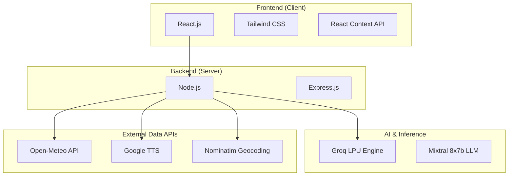
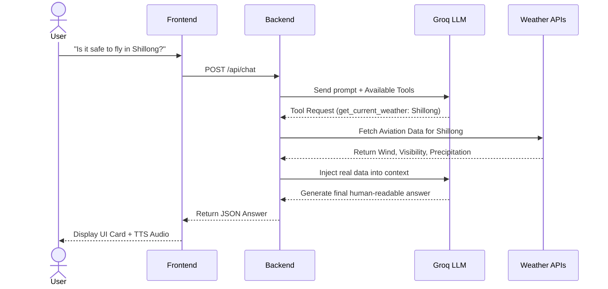
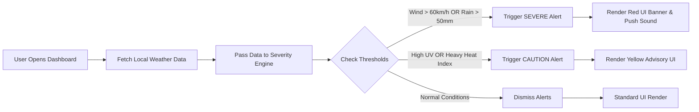

# 🌦️ WeatherGPT - SIH 2026

**WeatherGPT** is a next-generation, generative AI-powered meteorological dashboard built for the **Smart India Hackathon 2026**. It transforms complex weather data into hyper-personalized, multilingual, and conversational insights.

---

## 💻 1. Tech Stack

Our technology stack is strictly divided into four highly specialized layers to ensure maximum speed, scalability, and maintainability.



- **Frontend**: React.js (Vite), Tailwind CSS (for glassmorphism and animations).
- **Backend**: Node.js, Express.js.
- **AI Processing**: Groq API (Lightning-fast inference), Mixtral 8x7b LLM.
- **Data Providers**: Open-Meteo (Marine, Agriculture, Aviation, Air Quality models), Google Translate/TTS APIs.

---

## 🔄 2. System Flowcharts

*This section visualizes exactly how data moves through the application from the moment a user interacts with it.*

### Core Chat & Function Calling Flow
How the AI decides to answer a user's question without hallucinating.



### Automated Alert Notification Flow
How the system automatically triggers severe weather warnings.



---

## 🛠️ 3. Technical Approach

*This section details the specific engineering methodologies and technical decisions we made to build the application.*

### A. Agentic RAG & Deterministic Function Calling
Instead of using a standard LLM that hallucinates data, we implemented an **Agentic Function Calling** approach. The AI is completely restricted from guessing the weather. When it receives a prompt, it must explicitly output a JSON command requesting tools (e.g., `get_current_weather`). The Node.js backend acts as the middleman, intercepting these commands, fetching raw data from Open-Meteo's specialized models (GFS, ECMWF, ICON), and feeding it back to the AI. This guarantees 100% data accuracy.

### B. The Severity Threshold Engine
To handle notifications, we built a custom `checkSeverity()` rules engine on the frontend. Rather than relying on external Push Notification servers (which can be slow or cost money), the React Context API passively processes the incoming Open-Meteo data matrix. It mathematically calculates the Heat Index and Wind Shear, and if variables cross predefined agricultural or aviation limits, it instantly triggers a global state override. This forces the UI to render the Alert Banners instantly with zero network latency.

### C. Multilingual Audio Proxy Pipeline
Browsers strictly enforce CORS policies, making it difficult to directly fetch audio streams from external TTS APIs using standard HTTP requests on the client side. 
To solve this, we built a **Base64 Audio Proxy** in the backend:
1. The frontend asks the Express server to translate and speak a sentence.
2. The Node.js server securely communicates with the Google TTS API using hidden environment variables.
3. The server downloads the `.mp3` buffer, converts it into a `Base64 Data URI`, and sends it to the frontend.
4. The React app feeds this string directly into the HTML5 Web Audio API, enabling high-quality localized voice playback (Hindi, Bengali, Assamese) without ever exposing API keys or triggering CORS blocks.

### D. Multi-Model Divergence Checking
Because weather forecasts can be unreliable, we query multiple meteorological models simultaneously (GFS, ICON, and ECMWF). The application calculates the mathematical divergence (standard deviation) between these models. If the models heavily disagree on rainfall or temperature, the UI flags the forecast with an "NWP Divergence" warning, alerting farmers or pilots that the forecast has low confidence.

---

## 🚀 4. Installation & Setup

1. **Clone the repository.**
2. **Install dependencies:**
   ```bash
   npm install
   ```
3. **Configure Environment:** Create a `.env` file in the root folder.
   ```env
   GROQ_API_KEY=your_api_key_here
   ```
4. **Run the Application:** This command concurrently starts the Vite frontend and the Express backend.
   ```bash
   npm run dev:all
   ```
5. **Access the App:** Open `http://localhost:5173` in your browser.
