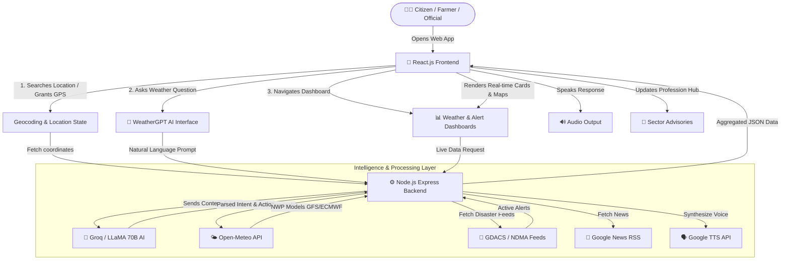

# ??? WeatherGPT � SIH 2026

> **Smart India Hackathon 2026 | Problem Statement PS-26068**
> *India's First AI-Powered, Profession-Aware, Multilingual Hyperlocal Weather Intelligence Platform*

---

## ?? Why WeatherGPT Wins

WeatherGPT is **not** just another weather app. It is the first platform in India that combines:
- **Real-time NWP multi-model forecasts** (GFS + ICON + ECMWF) with transparent confidence scoring
- **Groq-powered AI** that calls live APIs on demand and answers in the user's own language
- **Profession-specific intelligence** for Farmers, Fishermen, Aviators, and Urban Planners
- **Integrated Emergency SOS** with GPS, photo upload, and disaster authority dispatch
- **4 Indian Languages** � English, Hindi, Assamese, Bengali � covering UI, alerts, and AI chat

| Capability | Other Apps | WeatherGPT |
|---|---|---|
| Indian language UI | ? | ? EN, HI, AS, BN |
| AI chat with live data | ? | ? Groq + Tool Calling |
| Profession-specific advice | ? | ? 4 professions |
| 3-model NWP comparison | ? | ? GFS + ICON + ECMWF |
| Emergency SOS dispatch | ? | ? GPS + Photo + Server |
| Self-verifying accuracy | ? | ? Automated daily check |
| Disaster authority portal | ? | ? Full /manager dashboard |

---

## ?? Table of Contents

1. [System Architecture Overview](#1-system-architecture-overview)
2. [Complete Feature List](#2-complete-feature-list)
3. [Data Flow Diagrams](#3-data-flow-diagrams)
4. [AI Engine Deep Dive](#4-ai-engine-deep-dive)
5. [Profession Advisory System](#5-profession-advisory-system)
6. [Alert & Safety System](#6-alert--safety-system)
7. [Multi-Language System](#7-multi-language-system)
8. [Technology Stack](#8-technology-stack)
9. [All Data Sources & APIs](#9-all-data-sources--apis)
10. [Project Structure](#10-project-structure)
11. [Setup & Installation](#11-setup--installation)
12. [SIH Judge Notes � Key Innovations](#12-sih-judge-notes--key-innovations)

---

## 1. System Architecture Overview

`mermaid
graph TB
    subgraph CLIENT["??? React PWA (Frontend)"]
        CHAT[WeatherGPT AI Chat]
        DASH[Weather Dashboard]
        ALERTS[Live Alerts Screen]
        STAGE[Weather Stage / Radar]
        HIST[Historical Analytics]
        PROF[Profession Hub Modal]
        SOS[SOS Emergency Button]
        MGR[Manager Dashboard]
    end

    subgraph SERVER["?? Express.js Backend (Node.js)"]
        GROQ_EP[/api/chat\nGroq AI Orchestrator]
        SOS_EP[/api/sos\nEmergency Dispatcher]
        NEWS_EP[/api/news\nGoogle News]
        TTS_EP[/api/tts\nVoice Synthesis]
        SNAP_EP[/api/accuracy\nForecast Verifier]
        ALERT_EP[/api/alerts\nDisaster Authority]
        TOOLS[AI Tool Functions]
    end

    subgraph BRAIN["?? AI Layer"]
        GROQ[Groq LLaMA 70B\nFunction Calling]
        GEMINI[Google Gemini Flash\nFallback + Risk Map]
    end

    subgraph EXTERNAL["?? External APIs"]
        OM_CORE[Open-Meteo Forecast]
        OM_HIST[Open-Meteo Archive]
        OM_MARINE[Open-Meteo Marine]
        OM_AGRO[Open-Meteo Agro]
        OM_GEO[Open-Meteo Geocoding]
        OM_NWP[GFS + ICON + ECMWF]
        GNEWS[Google News RSS]
        NDMA[NDMA Sachet CAP XML]
        GTTS[Google TTS]
    end

    subgraph DB["??? Storage"]
        MONGO[(MongoDB Atlas)]
        JSON[(Local JSON Fallback)]
    end

    CLIENT --> SERVER
    SERVER --> BRAIN
    TOOLS --> OM_CORE & OM_HIST & OM_MARINE & OM_AGRO
    SERVER --> GNEWS & NDMA & GTTS
    SERVER --> MONGO
    MONGO -.->|offline fallback| JSON
    DASH --> OM_GEO & OM_CORE & OM_NWP

    style CLIENT fill:#0f172a,stroke:#3b82f6,color:#e2e8f0
    style SERVER fill:#0f172a,stroke:#10b981,color:#e2e8f0
    style BRAIN fill:#0f172a,stroke:#a855f7,color:#e2e8f0
    style EXTERNAL fill:#0f172a,stroke:#f59e0b,color:#e2e8f0
    style DB fill:#0f172a,stroke:#ec4899,color:#e2e8f0
`

---

## 2. Complete Feature List

### ??? Core Weather Engine

| Feature | Details |
|---|---|
| **Live Current Conditions** | Temp, feels-like, humidity, wind, UV, AQI, visibility, rain, day/night |
| **7-Day Interactive Forecast** | Click any day ? full dashboard updates for that date |
| **12-Hour Hourly Forecast** | Temperature + precipitation progression |
| **Heat Index** | Rothfusz formula: humidity � temp for physiological danger level |
| **Air Quality (AQI)** | PM2.5, PM10, US-AQI with health classification |
| **Astronomical Arc** | Dynamic SVG sunrise/sunset + moon trajectory arc |
| **Live Radar Map** | Windy.com radar + satellite cloud embed via Leaflet |
| **Smart Location Search** | Debounced autocomplete, multi-city disambiguation |
| **GPS Auto-detect** | Browser geolocation on first visit |
| **Offline Banner** | Network status detection and graceful offline mode |
| **Dynamic Themes** | Background + accent colors auto-change per weather condition |

### ?? AI / WeatherGPT Chat

| Feature | Details |
|---|---|
| **Groq LLaMA 70B** | Ultra-fast AI inference via Groq cloud |
| **Autonomous Tool Calling** | AI decides which real-time weather tools to invoke |
| **Up to 3 Tool Iterations** | Multi-turn AI reasoning loops before final answer |
| **Persona-Aware Responses** | Farmer ? crop language; Fisherman ? marine language |
| **Always Matches User Language** | Hindi in = Hindi out; Assamese in = Assamese out |
| **Follow-Up Suggestions** | 2�3 smart contextual next questions |
| **Severity + Confidence** | None / Caution / Severe + High / Medium / Low |
| **Seasonal Anomaly Note** | Is today's weather unusual for this time of year? |
| **Heat Index Reasoning** | AI uses feels-like, not raw temp, for activity advice |
| **Conversation Memory** | Last 6 messages kept for context-aware replies |
| **Text-to-Speech** | AI answer read aloud via Google TTS (all 4 languages) |
| **Gemini Fallback** | If Groq unavailable, Gemini Flash auto-takes over |
| **Local Context Injection** | Geo-specific facts injected (rivers, crops, flood zones) |

### ?? Alert System

| Feature | Details |
|---|---|
| **Thunderstorm Warning** | WMO codes 95, 96, 99 ? SEVERE level |
| **Heavy Rain & Flood** | >40mm precipitation or heavy rain code ? SEVERE |
| **High Wind Warning** | Wind > 45 km/h ? SEVERE |
| **Poor Visibility** | < 2000m ? CAUTION |
| **Extreme UV** | UV Index > 8 ? CAUTION |
| **Smart City Panel** | AQI, heat index, waterlogging risk metrics |
| **4-Pillar Infrastructure Risk** | Flood / Road / Crop / Power impact scores |
| **India Risk Map** | Top-risk states ranked by AI |
| **National NDMA Alerts** | CAP XML from NDMA Sachet, parsed server-side |
| **IMD Weather News** | Filtered Google News RSS by category |
| **Disaster Safety SOPs** | Flood, cyclone, lightning, heatwave action guides |
| **Fully Translated** | Headlines, desc, precautions ? EN/HI/AS/BN |

### ?? Emergency SOS

| Feature | Details |
|---|---|
| **Always-Visible SOS Button** | Fixed pulsing red button on all screens |
| **Haptic Vibration** | SOS Morse-like vibration [300,100,300,100,300] |
| **Emergency Siren** | Web Audio API square-wave frequency ramp |
| **6 Emergency Categories** | Medical, Evacuation, Food, Shelter, Fire, Other |
| **GPS Capture** | Auto-captures precise coords on form submit |
| **Photo Upload** | Camera or file pick, compressed to 800px/70% JPEG |
| **Server Dispatch** | POSTed to /api/sos ? Disaster Authority dashboard |
| **Fallback** | "Call 112" shown if server unreachable |

### ????? Profession-Specific Intelligence

| Profession | Data Used | Unique Advice |
|---|---|---|
| **?? Farmer** | Rain, UV, wind, humidity, soil moisture, soil temp, ET0 | Kharif/Rabi/Zaid season detection; spray safety; frost/fungal alerts |
| **?? Fisherman** | Wave height, wind, storm code, visibility | Small-craft harbor advisory; fish activity index; fog collision risk |
| **?? Aviation** | Visibility, CAPE, cloud ceiling, wind gusts | VFR minimums check; drone safety rating; crosswind alerts |
| **??? Urban Planner** | AQI, PM2.5/PM10, temp, rainfall | Drainage stress; heat cooling center advisory; worker safety breaks |

### ?? Historical Analytics & Accuracy

| Feature | Details |
|---|---|
| **30-Day Rain Chart** | Daily precipitation bar chart via Recharts |
| **30-Day Temp Chart** | Temperature area chart (gradient) via Recharts |
| **1-Year & 5-Year Views** | Monthly aggregated data views |
| **AI Agri-Risk Assessment** | AI reads 30-day data ? crop moisture analysis |
| **Forecast Accuracy Tracker** | Yesterday's prediction vs today's actual, with % badge |
| **Seasonal Baseline** | 5-year monthly averages for 16 Indian cities |
| **Anomaly Detection** | Flags rainfall >3x normal or temperature >5�C above average |

### ??? Disaster Authority Dashboard (/manager)

| Feature | Details |
|---|---|
| **HMAC-SHA256 Auth** | Secure stateless 24-hour login tokens |
| **State-Level Broadcast** | Alert entire Indian state |
| **District-Level Broadcast** | Alert specific district (full NE India dropdown) |
| **GPS Radius Broadcast** | Haversine distance, 5km�250km slider |
| **4 Severity Levels** | Minor/Watch, Moderate/Advisory, Severe/Warning, Extreme/Emergency |
| **Custom Expiry** | 1hr to 7-day validity settings |
| **SOS Management** | View, navigate to, dispatch, and resolve citizen SOS alerts |
| **Emergency Audio Siren** | Continuous Web Audio siren when pending SOS exists |
| **Google Maps Integration** | One-click navigation to victim GPS coordinates |

---

## 3. Data Flow Diagrams

### 3.0 - End-to-End Prototype Working Flowchart

### 3.1 � AI Chat Query Flow

`mermaid
sequenceDiagram
    participant U as ?? User
    participant FE as ??? React App
    participant BE as ?? Express Server
    participant AI as ?? Groq LLaMA
    participant WX as ?? Open-Meteo

    U->>FE: Types question (any language)
    FE->>BE: POST /api/chat {message, location, profile, lang, history}
    BE->>AI: System prompt + user message + tool schemas
    AI->>BE: Tool call: get_current_weather(location)
    BE->>WX: Fetch live weather data
    WX-->>BE: Weather JSON
    BE->>AI: Tool result returned
    AI->>BE: Tool call: get_forecast(location, days=3)
    BE->>WX: Fetch forecast data
    WX-->>BE: Forecast JSON
    BE->>AI: Tool result returned
    AI->>BE: Final structured JSON response
    BE->>FE: {answer, advisory, severity, confidence, followUp, relevantStat, suggestedQuestions}
    FE->>U: Rendered reply with severity badge + audio TTS + follow-up chips
`

### 3.2 � How Alerts Are Computed

`mermaid
flowchart LR
    A[Live Weather\nData Loaded] --> B{WMO Code\nCheck}
    B -->|95 / 96 / 99| TH["?? THUNDERSTORM\n?? SEVERE"]
    B -->|63,65,81,82\nor rain > 40mm| HR["??? HEAVY RAIN\n?? SEVERE"]
    B -->|rain 15�40mm| MR["??? MODERATE RAIN\n?? CAUTION"]

    A --> W{Wind Speed}
    W -->|> 45 km/h| WD["?? HIGH WIND\n?? SEVERE"]

    A --> V{Visibility}
    V -->|< 2000m| FG["??? POOR VISIBILITY\n?? CAUTION"]

    A --> U{UV Index}
    U -->|> 8| UV["?? EXTREME UV\n?? CAUTION"]

    B -->|No match| AC["? ALL CLEAR\n?? GOOD"]

    TH & HR & MR & WD & FG & UV & AC --> T{Translate to\nUser Language}
    T --> CARD[Display Alert Card\nTitle + Desc + Precaution]
`

### 3.3 � Location Search Flow

`mermaid
flowchart TD
    A[User types city name] --> B{400ms Debounce}
    B --> C{Check local\nNER_CITIES cache}
    C -->|Found| F
    C -->|Not found| D[Open-Meteo\nGeocoding API]
    D --> E[Up to 5 results\nwith admin1/2/country]
    E --> F[Deduplicate entries]
    F --> G[Show autocomplete dropdown\nFormat: City, District, State, Country]
    G --> H{User selects location}
    H --> I[fetchWeather\nlat+lon+name]
    I --> J[Update all screens\nwith new data]

    B2[Or: GPS button] --> K[browser geolocation]
    K --> L[Nominatim reverse\ngeocode ? city name]
    L --> I
`

### 3.4 � Emergency SOS Flow

`mermaid
flowchart TD
    A["?? SOS Button Tapped"] --> B[Haptic vibration\nEmergency siren sound]
    B --> C[Open SOS Form]
    C --> D[Select help category\nMedical / Evacuation / etc.]
    D --> E[Optional: Upload\nemergency photo]
    E --> F[Enter name & phone\noptional]
    F --> G["Submit � Share Location & Send"]
    G --> H[Acquire GPS coordinates]
    H --> I{GPS OK?}
    I -->|Yes| J["POST /api/sos\n{name, phone, type, lat, lng, photo}"]
    J --> K{Server OK?}
    K -->|? Yes| L["Help is Coming!\n? Dispatched to authorities"]
    K -->|? No| M["Transmission Failed\n?? Call 112 immediately!"]
    I -->|No| M
    L --> N[Authority sees SOS\nin /manager dashboard]
    N --> O[Officer dispatches rescue\nvia Google Maps navigation]
`

### 3.5 � NWP Model Confidence Flow

`mermaid
flowchart LR
    G[GFS Global\nNOAA USA] --> C
    I[ICON Global\nDWD Germany] --> C
    E[ECMWF IFS025\nECMWF UK] --> C
    C{Compare Models\nfor selected day}
    C -->|tempDiff < 1�C\nprecipDiff < 15%| HC["? HIGH CONFIDENCE\nGreen badge � Forecast is reliable"]
    C -->|tempDiff = 2.5�C\nor precipDiff = 30%| MC["?? MEDIUM CONFIDENCE\nAmber badge � Check again closer to date"]
    C -->|Large divergence| LC["? LOW CONFIDENCE\nRed badge � Models strongly disagree"]
    HC & MC & LC --> SHOW[Display blended best-match\nforecast to user]
`

### 3.6 � Forecast Accuracy Pipeline

`mermaid
flowchart LR
    A[Every day at run time] --> B[Capture today's forecast\nas a snapshot]
    B --> C[(Save to MongoDB\nor forecast_snapshots.json)]
    C --> D[Next day: Load yesterday's snapshot]
    D --> E[Fetch actual weather\nfrom Open-Meteo Archive]
    E --> F[Compare: predicted vs actual\ntemp + rain probability]
    F --> G{Temp diff = 1.5�C?}
    G -->|Yes| H["? ACCURATE"]
    G -->|= 3�C| I["?? CLOSE"]
    G -->|> 3�C| J["? OFF"]
    H & I & J --> K[Display in\nAccuracy Tracker table]
    K --> L[Show % accuracy badge\nto build user trust]
`

---

## 4. AI Engine Deep Dive

### System Prompt Design Principles

The AI (Groq LLaMA 70B) operates under a tightly-crafted system prompt for India:

| Rule | Implementation |
|---|---|
| **Profile awareness** | Farmer ? crop framing; Fisherman ? marine terms; Aviation ? flight terms |
| **Language mirroring** | Responds in the EXACT language the user types |
| **Plain language mandate** | "Heavy rain after 4 PM" NOT "Precipitation probability: 78%" |
| **Tool discipline** | Only calls the tools actually needed (not all 6 for a simple question) |
| **Heat Index reasoning** | Uses feels-like temp for any activity-related advice |
| **Structured output** | Always returns: answer, advisory, severity, confidence, followUp, relevantStat, suggestedQuestions |
| **Topic guard** | Politely declines non-weather topics |

### AI Tools Available

| Tool | Purpose | Data Source |
|---|---|---|
| get_current_weather | Temp, humidity, wind, UV, AQI, code | Open-Meteo Forecast |
| get_forecast | 7-day forecast, rain prob, UV max | Open-Meteo Forecast |
| get_historical_trend | 30-day rainfall + temp stats | Open-Meteo Archive |
| get_seasonal_comparison | 5-year monthly baseline comparison | 16-city climate dataset |
| get_active_alerts | Active hazards: storm, flood, wind, fog | Open-Meteo computed |
| get_marine_weather | Wave height, period, direction | Open-Meteo Marine |

---

## 5. Profession Advisory System

### Advisory Routing

`mermaid
flowchart TD
    A[User selects profession\nin Onboarding] --> B{Which profession?}
    B -->|Farmer| C[farmerAdvisory.js]
    B -->|Fisherman| D[fishermanAdvisory.js]
    B -->|Aviation| E[aviationAdvisory.js]
    B -->|Urban Planner| F[urbanPlanningAdvisory.js]

    C --> G[Checks: WMO code, rain, UV,\nwind, humidity, soil, season]
    D --> H[Checks: wave height, wind,\nstorm code, visibility]
    E --> I[Checks: CAPE, cloud ceiling,\nvisibility, wind gusts]
    F --> J[Checks: AQI, PM2.5,\nrain accumulation, temp]

    G & H & I & J --> K[Returns: icon + title + advice + type\nin user's language]
    K --> L[Advisory Card in WeatherStage]
    K --> M[AI Chat prompt enrichment]
`

### Farmer Advisory Decision Tree

`
Thunderstorm (95-99)    ? ?? DANGER: Evacuate fields, shelter equipment
Heavy rain (=65/10mm+)  ? ?? DANGER: Postpone spraying, check drainage
Rain prob > 75%          ? ?? DANGER: Prepare for field waterlogging
Light rain / drizzle     ? ?? CAUTION: Delay pesticide application
UV Index = 9             ? ?? DANGER: Stop field work 10 AM � 4 PM
Wind > 25 km/h           ? ?? CAUTION: Spray drift risk, delay application
Humidity>85% + Temp>25�C ? ?? CAUTION: Fungal disease outbreak risk
Fog (code 45/48)         ? ?? CAUTION: Delay transport of produce
Temperature = 5�C        ? ?? DANGER: Frost risk � cover crops
Clear + wind<15 + UV<9   ? ?? GOOD: Ideal conditions for field work
`

**Season Detection (auto):**
- June�October ? Kharif (Paddy, Maize, Cotton)
- November�April ? Rabi (Wheat, Gram, Mustard)
- April�June ? Zaid (Vegetables, Melons)

---

## 6. Alert & Safety System

### Alert Architecture

`mermaid
graph TB
    subgraph COMPUTED["?? Computed from Live Data"]
        C1[Thunderstorm Warning\nWMO 95/96/99]
        C2[Heavy Rain & Flood Risk\n>40mm or heavy code]
        C3[High Wind Warning\n>45 km/h]
        C4[Poor Visibility\n<2000m]
        C5[Extreme UV\nUV > 8]
        C6[All Clear\nNo triggers]
    end

    subgraph AUTHORITY["?? Authority Issued"]
        A1[State-level broadcast]
        A2[District-level broadcast]
        A3[GPS radius broadcast]
    end

    subgraph NATIONAL["?? National Feeds"]
        N1[NDMA Sachet\nCAP XML alerts]
        N2[Google News RSS\nIndia weather + disaster]
    end

    COMPUTED --> DISPLAY
    AUTHORITY --> DISPLAY
    NATIONAL --> DISPLAY

    subgraph DISPLAY["??? AlertsScreen"]
        D1[Alert Cards\nwith Precautions]
        D2[News Feed\nFiltered by category]
        D3[India Risk Map]
        D4[Smart City Panel]
        D5[Safety SOPs]
    end
`

---

## 7. Multi-Language System

### Translation Architecture

`mermaid
flowchart TD
    A[User selects language\nEN / HI / AS / BN] --> B[Stored in AppContext\nglobal state]
    B --> C[All components read language]

    C --> D[translations.js\nCore UI labels]
    C --> E[translationsExtra.js\nAlert texts + filter pills]
    C --> F[featureTranslations.js\nProfession advisories]
    C --> G[WEATHER_CONDITIONS_I18N\nCondition name strings]

    D & E & F & G --> H[100% translated UI]

    B --> I[chatApi.js\nPasses lang to backend]
    I --> J[Groq AI mirrors\nuser's language in reply]
    J --> K[Google TTS\ngenerates audio in same language]
`

### Coverage Matrix

| Screen / Feature | EN | HI | AS | BN |
|---|:---:|:---:|:---:|:---:|
| Navigation tabs | ? | ? | ? | ? |
| Weather labels | ? | ? | ? | ? |
| Condition names | ? | ? | ? | ? |
| Alert headlines | ? | ? | ? | ? |
| Alert descriptions | ? | ? | ? | ? |
| Alert precautions | ? | ? | ? | ? |
| Filter pills | ? | ? | ? | ? |
| Impact levels | ? | ? | ? | ? |
| Profession advisories | ? | ? | ? | ? |
| Historical insights | ? | ? | ? | ? |
| Smart City panel | ? | ? | ? | ? |
| AI chat responses | ? | ? | ? | ? |

---

## 8. Technology Stack

### Frontend

| Technology | Version | Purpose |
|---|---|---|
| React | 18.3 | UI framework with Context API |
| Vite | 5.4 | Lightning-fast build tool |
| Tailwind CSS | 3.4 | Utility-first styling |
| Leaflet.js + React-Leaflet | 1.9 / 4.2 | Interactive radar maps |
| Recharts | 3.10 | Historical weather charts |
| Web Audio API | Browser native | SOS siren, emergency audio |
| Vibration API | Browser native | SOS haptic feedback |
| Canvas API | Browser native | Photo compression for SOS |

### Backend

| Technology | Version | Purpose |
|---|---|---|
| Node.js + Express | 4.21 | REST API server |
| Groq SDK | latest | LLaMA 70B AI inference |
| Google Generative AI | 0.24 | Gemini Flash fallback |
| mongoose | 9.9 | MongoDB Atlas ORM |
| google-tts-api | 2.0 | Text-to-speech synthesis |
| fast-xml-parser | 5.11 | NDMA CAP XML parsing |
| crypto (built-in) | � | HMAC-SHA256 auth tokens |

### Infrastructure

| Technology | Purpose |
|---|---|
| Docker + docker-compose | Containerized deployment |
| Vercel | Frontend CDN hosting |
| MongoDB Atlas | Cloud database (SOS, alerts, accuracy) |
| Local JSON fallback | Zero-config offline persistence |
| localtunnel / ngrok | Share dev server publicly |

---

## 9. All Data Sources & APIs

| Source | Type | What We Get |
|---|---|---|
| **Open-Meteo Forecast** | Free, no key | Current + 7-day + hourly weather |
| **Open-Meteo Archive** | Free, no key | 30-day / 1-year / 5-year historical |
| **Open-Meteo Marine** | Free, no key | Wave height, period, swell direction |
| **Open-Meteo Agro** | Free, no key | Soil moisture, soil temp, ET0 (FAO-56) |
| **Open-Meteo Air Quality** | Free, no key | US-AQI, PM2.5, PM10 |
| **Open-Meteo Geocoding** | Free, no key | City name ? lat/lon, state, country |
| **Open-Meteo GFS** | Free, no key | NOAA GFS NWP model forecast |
| **Open-Meteo ICON** | Free, no key | DWD ICON NWP model forecast |
| **Open-Meteo ECMWF** | Free, no key | ECMWF IFS025 NWP model forecast |
| **Nominatim (OSM)** | Free, no key | Reverse geocoding + village names |
| **Groq API** | API key | LLaMA 3.3 70B ultra-fast inference |
| **Google Gemini API** | API key | AI fallback + national risk scoring |
| **NDMA Sachet CAP** | Free, no key | Official Indian disaster alerts (XML) |
| **Google News RSS** | Free, no key | India weather & disaster news feed |
| **Google TTS API** | Free (via npm) | Voice synthesis in 4 languages |
| **NPoint JSON Bin** | Free | Cloud storage for community reviews |
| **Windy.com Embed** | Free | Interactive radar + satellite embed |

---

## 10. Project Structure

`
WeatherGPT/
+-- ?? src/
�   +-- ?? components/
�   �   +-- AlertsScreen.jsx          ? Live alerts + smart city + news
�   �   +-- WeatherDashboard.jsx      ? 7-day forecast + NWP model panel
�   �   +-- WeatherStage.jsx          ? Main animated weather view
�   �   +-- ChatScreen.jsx            ? AI chat interface
�   �   +-- HistoricalAnalytics.jsx   ? 30-day/1yr/5yr trend charts
�   �   +-- ProfessionModal.jsx       ? Farming/Marine/Aviation/Urban hub
�   �   +-- Header.jsx                ? Nav + GPS + saved locations + accessibility
�   �   +-- SosButton.jsx             ? Emergency SOS with GPS + photo
�   �   +-- ModelConfidence.jsx       ? GFS vs ICON vs ECMWF comparison
�   �   +-- AccuracyTracker.jsx       ? Forecast vs actual audit table
�   �   +-- ManagerDashboard.jsx      ? Disaster authority portal (/manager)
�   �   +-- ReviewsScreen.jsx         ? Community weather reviews
�   �   +-- Onboarding.jsx            ? First-launch: language + profession
�   �   +-- WeatherScene.jsx          ? Animated rain/sun/storm CSS scenes
�   �   +-- SevereAlertBanner.jsx     ? Top-of-screen severe weather banner
�   +-- ?? services/
�   �   +-- weatherApi.js             ? Open-Meteo + geocoding + location search
�   �   +-- chatApi.js                ? AI chat REST call wrapper
�   +-- ?? utils/
�   �   +-- translations.js           ? Core UI labels (EN/HI/AS/BN)
�   �   +-- translationsExtra.js      ? Alert texts + filters (EN/HI/AS/BN)
�   �   +-- featureTranslations.js    ? Profession advisories (EN/HI/AS/BN)
�   �   +-- farmerAdvisory.js         ? Agricultural decision rules
�   �   +-- fishermanAdvisory.js      ? Marine safety rules
�   �   +-- aviationAdvisory.js       ? Aviation/drone rules
�   �   +-- urbanPlanningAdvisory.js  ? Smart city rules
�   �   +-- climateSeasonal.js        ? 5-year baseline for 16 Indian cities
�   �   +-- weatherConditions.jsx     ? WMO code ? condition name mapping
�   �   +-- heatIndex.js              ? Rothfusz heat index formula
�   �   +-- themes.js                 ? Weather-based dynamic theme engine
�   �   +-- tts.js                    ? Google TTS audio stream handler
�   +-- ?? context/
�   �   +-- AppContext.jsx            ? Global state (React Context)
�   +-- App.jsx                       ? Root + routing + background engine
+-- ?? server/
�   +-- tools.js                      ? AI function tool definitions + logic
�   +-- models.js                     ? MongoDB: Alert, SosRequest, AccuracyLog
�   +-- validateTools.js             ? Tool schema validation helpers
+-- server.js                         ? Express API + Groq + all REST routes
+-- package.json
+-- vite.config.js
+-- Dockerfile
+-- docker-compose.yml
`

---

## 11. Setup & Installation

### Prerequisites
`
Node.js >= 18.x
npm >= 9.x
`

### Environment Variables
Create .env in project root:
`env
GROQ_API_KEY=your_groq_api_key_here
GNEWS_API_KEY=your_gnews_api_key_here
VITE_API_URL=http://localhost:3001
MONGODB_URI=mongodb+srv://...   # Optional � falls back to JSON if not set
GEMINI_API_KEY=your_gemini_key  # Optional � for fallback and risk map
`

### Quick Start
`ash
# 1. Install all dependencies
npm install

# 2. Start frontend + backend together
npm run dev:all

# Frontend available at: http://localhost:5173
# Backend available at:  http://localhost:3001
`

### Access from Any Phone (Public URL)
`ash
# Generate public tunnel URL � works on any network
npx --yes localtunnel --port 5173
# Opens: https://xxxx.loca.lt
`

### Same WiFi Access (Local Network)
`
http://YOUR_PC_IP:5173
# Find IP: ipconfig (Windows) or ip addr (Linux)
`

### Docker Deployment
`ash
docker-compose up --build
`

### Manager Dashboard
`
http://localhost:5173/manager
# or
https://your-domain.com/manager
`

---

## 12. SIH Judge Notes � Key Innovations

### ? Problem Statement PS-26068 � Direct Mapping

| PS Requirement | How WeatherGPT Solves It |
|---|---|
| Accessible weather for rural India | Plain-language AI chat in Hindi, Assamese, Bengali |
| Actionable guidance for farmers | Profession-aware advisory with crop season awareness |
| Early warning systems | Multi-hazard alert engine + NDMA CAP integration |
| Disaster response coordination | Emergency SOS with GPS dispatch to authority dashboard |
| Trust and reliability | 3-model NWP confidence + self-verified accuracy tracker |

### ?? Technical Firsts in India

1. **NWP Consensus Transparency** � First Indian weather app to show GFS + ICON + ECMWF model agreement to general public
2. **Agentic Weather AI** � AI doesn't answer from training data; it calls real APIs autonomously per query
3. **Seasonal Anomaly Engine** � Tells users if today is unusual for their city based on real 5-year history
4. **Profession-Agro Intelligence** � FAO-56 Penman-Monteith ET0, soil moisture depth, pesticide spray matrix in one app
5. **Integrated Disaster Chain** � SOS button ? GPS capture ? photo ? server dispatch ? authority dashboard ? rescue dispatch � all in one platform

---

*?? Built to win SIH 2026 � Making weather intelligence accessible to every Indian, in their own language.*
