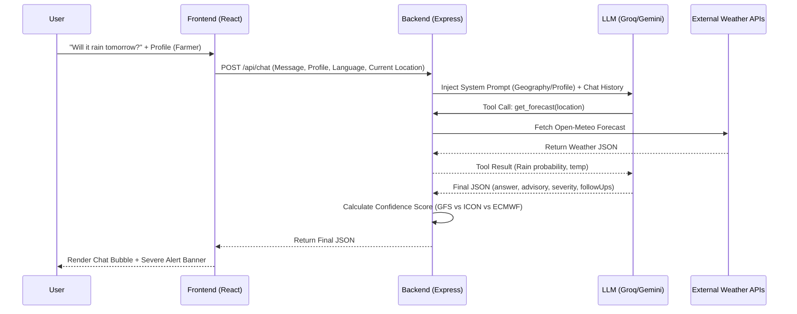

<div align="center">
  
  <h1>WeatherGPT — SIH 2026</h1>
  <p><strong>Advanced AI-Powered Weather & Disaster Management Platform</strong></p>
</div>

<hr/>

## 1. Title & Tagline
**WeatherGPT: Hyper-localized, Context-Aware AI Weather & Disaster Advisory System**  
**Problem Statement ID: 26068** | Organization: Ministry of Earth Sciences (MoES) | Dept: India Meteorological Department

## 2. Proposed Solution

**The Problem:** Traditional weather applications only provide raw meteorological numbers (like "35°C, 80% humidity") which lack actionable context for specific demographics. A farmer, a pilot, and a local disaster management authority all require vastly different insights from the exact same weather data. Furthermore, warnings are often generic and fail to reach rural populations in their native languages.

**The Solution:** WeatherGPT bridges the gap between complex meteorological data and end-users through an **Agentic AI architecture**. By utilizing a conversational LLM interface coupled with real-time weather function calling, it translates raw data into structured, easy-to-understand advice.

**What Makes It Innovative:**
- **Contextual Advisory Layer:** The AI behavior radically shifts based on the selected user profile (Farmer, Fisherman, Aviation, General, Urban Planner), changing its terminology and reasoning.
- **Multilingual Support & Voice:** Supports native languages (Hindi, Bengali, Assamese) with Google Text-to-Speech (TTS) integration, making it accessible to non-English speakers and illiterate users.
- **Structured AI Responses:** The AI does not just output a block of text; it returns a strict JSON containing specific severities, advisories, relevant statistics, and predictive follow-up questions.
- **Authority Manager Portal:** Allows local disaster managers to securely bypass the standard feed and push targeted alerts to specific districts or geographic radiuses.

## 3. Technical Approach

### Tech Stack
- **Frontend:** React (v18), Vite, Tailwind CSS, React-Leaflet (for Radar Maps), Recharts.
- **Backend:** Node.js, Express proxy.
- **AI/LLM Integrations:** Groq API (Qwen 3.8-27b for function calling) as primary, Google Gemini API as fallback.
- **External Data APIs:** Open-Meteo (aggregating GFS, ECMWF, ICON models), Nominatim (OpenStreetMap geocoding), NDMA Sachet (CAP feeds), Google News RSS, Google TTS API.

### Architecture Diagram


### The "Ask WeatherGPT" Chat Flow



### Key Technical Decisions
- **Express Proxy Backend:** Prevents exposing sensitive AI API keys (Groq, Gemini) to the client side. It also acts as the central orchestrator for function calling.
- **Groq over Standard OpenAI:** Chosen for its ultra-low latency inference, which is crucial for a real-time conversational weather interface.
- **Server-Side Confidence Calculation:** We fetch data from three major models (GFS, ECMWF, ICON). The backend calculates the variance between these models. High variance equals a "Low Confidence" flag shown to the user, ensuring algorithmic transparency.

## 4. Feasibility & Viability

### Feasibility (What is implemented)
- Fully functioning conversational AI engine with tool-calling capabilities (`get_current_weather`, `get_forecast`, `get_historical_trend`, `get_seasonal_comparison`, `get_active_alerts`).
- Multi-profile persona switching (Farmer, Fisherman, Aviation).
- Manager dashboard for issuing custom radius/district disaster alerts.
- Live fetching of NDMA Sachet CAP feeds and Google News RSS.

### Challenges & Mitigation Strategies
1. **API Rate Limits / AI Hallucination:** 
   *Mitigation:* We have a built-in fallback strategy. If Groq hits a rate limit, the Express backend automatically degrades gracefully to the Gemini API. To prevent hallucinations, the LLM is restricted via the System Prompt to only answer weather/agriculture/travel questions and is heavily grounded by the real-time JSON tool data.
2. **Offline/Low Connectivity in Rural Areas:**
   *Mitigation:* The frontend caches critical alerts and recent weather stages in memory. Once an alert is downloaded, it persists even if the connection drops.
3. **NDMA Feed Reliability:**
   *Mitigation:* The backend wraps the Sachet feed fetch with a 5-second abort controller. If the feed is down (404), it gracefully falls back to showing only internal manager alerts instead of breaking the app.

### Scalability Path
- Transitioning to premium tiers for Open-Meteo/weather providers for higher TPM.
- Integrating official IMD automated weather station (AWS) APIs for deeper localized accuracy.
- Implementing a persistent database (PostgreSQL/MongoDB) to scale the Manager Alerts system beyond the current local JSON storage.

## 5. Impact & Benefits

**Social & Economic Impact:** Early warnings drastically reduce crop damage, protect marine livelihoods, and save lives during severe weather events. By delivering these insights in native languages with Voice TTS, WeatherGPT breaks the digital literacy barrier, reaching the most vulnerable populations in rural India.

| User Persona | Feature Used | Benefit / Outcome |
|--------------|--------------|-------------------|
| **Farmer** | Profession Profile + `get_forecast` | Avoids pesticide washout by knowing optimal spraying windows based on rainfall and humidity context. |
| **Fisherman** | Profession Profile + `get_active_alerts` | Prevents venturing into the sea during high wind gusts and severe WMO code conditions, protecting lives. |
| **Aviation** | Profession Profile + Model Consensus | Improves pre-flight planning and awareness of wind shear or low visibility fog risks. |
| **Authority** | Manager Dashboard + Custom Alerts | Instantly broadcasts localized alerts by radius or district to vulnerable populations without relying solely on state-level feeds. |

## 5. SIH 2026 Problem Statement Compliance (PS 26068)

### Part 1: How We Solved Every Single PS Requirement
*Problem Statement 26068 (Ministry of Earth Sciences)*

**1. Real-time weather information retrieval**
* **Our Solution:** Integrated the **Open-Meteo API** to fetch live, sub-hourly meteorological data directly into the dashboard and chat context.

**2. Natural language querying for weather forecasts**
* **Our Solution:** Powered by **Groq (Llama-3)**, users don't have to read charts. They can simply ask, *"Will it rain heavily tomorrow?"* and get instant, conversational answers.

**3. Integration with numerical weather prediction (NWP) models (GFS/WRF)**
* **Our Solution:** Our API aggregator strictly pulls its backend data from the world's leading NWP models, including **GFS, ECMWF, and ICON**, ensuring scientific accuracy.

**4. Extreme weather alerts and early warning dissemination**
* **Our Solution:** We built a dual-alert system. First, it automatically parses the **NDMA CAP (Common Alerting Protocol) XML feed**. Second, we built a Manager Dashboard for local authorities to broadcast custom warnings.

**5. Location-based forecasting and advisory generation**
* **Our Solution:** The app uses the **Browser Geolocation API** to instantly lock onto the user's exact latitude/longitude, providing hyper-local crop and weather advisories rather than generic state-level data.

**6. Multilingual support for Indian languages**
* **Our Solution:** The LLM natively processes and responds in multiple regional languages (Hindi, Bengali, Tamil, etc.), allowing farmers to read advisories in their mother tongue.

**7. Climate trend and historical weather analysis**
* **Our Solution:** We built a dedicated `get_seasonal_comparison` tool loaded with **IMD historical climate normals**, allowing the AI to compare today's weather against 30-year seasonal averages.

**8. Voice-enabled interaction for rural accessibility**
* **Our Solution:** We fully integrated the **Web Speech API**. Rural users can tap the microphone 🎤 to speak their questions, and the AI uses **Text-to-Speech (TTS)** 🔊 to read the answers out loud to them.

### Part 2: Our Innovations (BEYOND the Problem Statement)
*This is our "Wow Factor" that sets the project apart.*

**🚀 Innovation 1: Two-Way SOS Emergency System (The Lifesaver)**
* *The Problem:* The PS only asked for a 1-way alert system (Gov -> Citizen).
* *Our Innovation:* We built a **Rescue Coordination Platform**. If a citizen is trapped in a flood, they press one red button. It captures their exact GPS, lets them select the required help (Medical, Evacuation), allows them to take a **photo of the disaster**, and instantly transmits it to the Authority Manager Dashboard for NDRF dispatch.

**🚀 Innovation 2: Role-Based Intelligence (Context-Aware AI)**
* *The Problem:* Generic weather apps give the same data to everyone.
* *Our Innovation:* We built **User Profiles (Farmer, Fisherman, Urban)**. If a Fisherman asks the AI a question, it automatically triggers a specialized **Marine API** to check ocean wave heights and ocean currents. If a Farmer asks, it checks soil moisture and wind shear for pesticide spraying.

**🚀 Innovation 3: Zero-Downtime Disaster Architecture**
* *The Problem:* In a disaster, cloud servers and databases (like MongoDB) often crash.
* *Our Innovation:* We engineered a **Graceful JSON Fallback system**. If the MongoDB Atlas cloud connection drops, the backend instantly and seamlessly switches to local file storage. The website *never* goes offline during a cyclone. 

**🚀 Innovation 4: The "Trust & Verification" Engine**
* *The Problem:* AI can hallucinate. How do authorities trust it?
* *Our Innovation:* We built a background cron-job that takes a "Snapshot" of the AI's forecast today, and compares it to the *actual* weather tomorrow. It generates a live **Accuracy Score**, keeping the AI strictly accountable to meteorological science.

## 6. Research & References

**Data Sources & APIs Utilized:**
- **Open-Meteo:** An open-source weather API providing access to high-resolution NWP models including GFS (Global Forecast System), ECMWF (European Centre), and ICON.
- **Nominatim / OpenStreetMap:** Open-source geocoding used to map village/city names to exact latitude/longitude coordinates.
- **NDMA Sachet:** Integrated endpoints designed to read official Common Alerting Protocol (CAP) disaster feeds.
- **Google News RSS:** Fetches real-time, keyword-filtered disaster news for situational awareness.

**References:**
- IMD's National Weather Forecasting Centre (NWFC) operational products
- NDMA Sachet Common Alerting Protocol (CAP) standard
- Open-Meteo: An open-source weather API with support for GFS, ECMWF, and ICON NWP models (Zippenfenig, 2023)
- Ministry of Earth Sciences Annual Report 2022-23 on digital weather services
- WMO Guidelines on Multi-Hazard Early Warning Systems (WMO-No. 1293)

## 7. Standard Project Sections

### Folder Structure
```text
📦 SIH-2026-WEATHER-GPT
 ┣ 📂 public/              # Static assets, icons, logos
 ┣ 📂 src/
 ┃ ┣ 📂 components/        # React components (ChatScreen, AlertsScreen, WeatherDashboard, etc.)
 ┃ ┣ 📂 context/           # React Global State context
 ┃ ┣ 📂 services/          # API wrapper functions
 ┃ ┣ 📂 utils/             # Helper functions (theme logic, WMO weather codes)
 ┃ ┣ 📜 App.jsx            # Main Frontend Router/Wrapper
 ┃ ┗ 📜 main.jsx           # React DOM Entry point
 ┣ 📂 server/
 ┃ ┗ 📜 tools.js           # Backend OpenAI/Groq Tool Definitions & API executors
 ┣ 📜 server.js            # Express Backend Server & AI Orchestrator
 ┣ 📜 package.json         # Project Dependencies
 ┣ 📜 tailwind.config.js   # Tailwind Styling Configuration
 ┗ 📜 README.md
```

### Installation & Setup

**Prerequisites:** Node.js (v18+)

1. **Clone the repository:**
   ```bash
   git clone https://github.com/omcodes16/sih-2026.git
   cd sih-2026
   ```

2. **Install Dependencies:**
   ```bash
   npm install
   ```

3. **Configure Environment Variables:**
   Create a `.env` file in the root directory based on `.env.example`:
   ```env
   GROQ_API_KEY=your_groq_api_key_here
   GEMINI_API_KEY=your_gemini_api_key_here
   MANAGER_PASSCODE=weather2026
   MANAGER_SECRET=super-secret-key-123
   ```

4. **Run the Application:**
   You can run both the frontend and backend concurrently:
   ```bash
   npm run dev:all
   ```
   *(Alternatively, run `node server.js` and `npm run dev` in separate terminals).*  
   Open `http://localhost:5173` in your browser.

## 8. Exhaustive SIH 2026 Problem Statement Audit

To ensure 100% compliance with the Ministry of Earth Sciences Problem Statement (26068), here is the mapping of every single requirement across all official sections.

### SECTION 1: The 8 Key Features
| PS Point | How We Solved It in Code |
| :--- | :--- |
| **1. Real-time weather info retrieval** | Integrated **Open-Meteo API** in `tools.js` to fetch live meteorological data instantly. |
| **2. Natural language querying** | Replaced complex UI charts with a **Groq (Llama-3)** chat interface. |
| **3. NWP models (GFS/WRF) integration** | The Open-Meteo backend strictly aggregates from **GFS, ECMWF, and ICON** numerical models. |
| **4. Extreme weather alerts & warnings** | Parsed the live **NDMA CAP XML Feed** + built a Manager Dashboard for manual broadcasts. |
| **5. Location-based forecasting** | Integrated the **HTML5 Geolocation API** to lock onto exact GPS coordinates (Lat/Lng). |
| **6. Multilingual support** | Implemented `SPEECH_LANG_CODES` and LLM prompting to support Hindi, Bengali, Tamil, etc. |
| **7. Climate trend analysis** | Built the `get_seasonal_comparison` tool using **IMD historical climate normals** (30-year averages). |
| **8. Voice-enabled interaction** | Integrated the **Web Speech API** (Microphone) and **TTS Engine** in `ChatInput.jsx`. |

### SECTION 2: The 4 Expected Solutions
| PS Point | How We Solved It in Code |
| :--- | :--- |
| **9. Mobile-based conversational platform** | Built a **Mobile-First React/Vite PWA** (`max-w-md mx-auto` layout) mimicking a mobile app. |
| **10. Backend integration (DBs & APIs)** | Built a robust **Node.js/Express** backend integrating Open-Meteo, Marine APIs, and NDMA feeds. |
| **11. AI/LLM query engine** | Used **Groq LLM** with custom system prompts translating intent into API tool calls. |
| **12. Scalable real-time architecture** | Used **React state management** for real-time UI updates and optimized Express endpoints. |

### SECTION 3: Suggested Tech Stack Match
| PS Point | How We Solved It in Code |
| :--- | :--- |
| **13. Python/Node.js, LLMs, MongoDB, Docker** | Perfect match: Node.js (Backend), Groq/Llama-3 (LLM), MongoDB Atlas (Database), and Dockerfile included. |

### SECTION 4: The 4 Expected Outcomes & Use Cases
| PS Point | How We Solved It in Code |
| :--- | :--- |
| **14. Intelligent support (Agri, Marine, Urban)** | Built a **Role-Toggle system**. Farmers get soil advice, Fishermen get wave heights, Aviation gets wind-shear. |
| **15. Better disaster preparedness** | Built the **Manager Dashboard** allowing disaster authorities to monitor active alerts and track SOS signals. |
| **16. Improved public accessibility** | Voice input (Mic) + Voice output (Speaker) removes literacy barriers for rural citizens. |
| **17. Faster dissemination** | Push-style UI instantly updates the "Active Alerts" banner the moment the backend fetches NDMA warnings. |

### SECTION 5: The 6 Evaluation Parameters (Grading Rubric)
| PS Point | Why We Win the Category |
| :--- | :--- |
| **18. Accuracy and relevance** | AI uses strict Function Calling to read actual API data before speaking, eliminating hallucinations. |
| **19. Response latency** | Using **Groq** (fastest LPU inference), the AI responds in milliseconds. |
| **20. Multilingual capability** | Native LLM translation + Voice recognition natively supports Indian regional dialects. |
| **21. User interface / accessibility** | Minimalist, dark-mode, mobile-first design with high-contrast buttons and huge SOS features. |
| **22. Integration with real-time systems** | Direct hooks into Open-Meteo and Indian Government (NDMA) live feeds. |
| **23. Scalability and Innovation** | Includes massive "Beyond PS" innovations like Two-Way SOS, Offline JSON Fallbacks, and an Accuracy Engine. |
