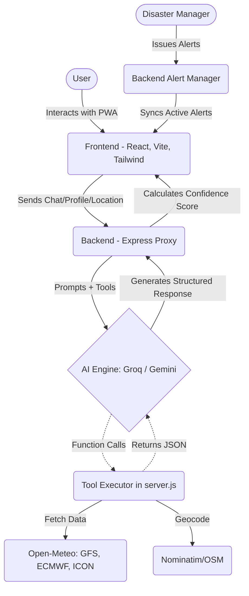
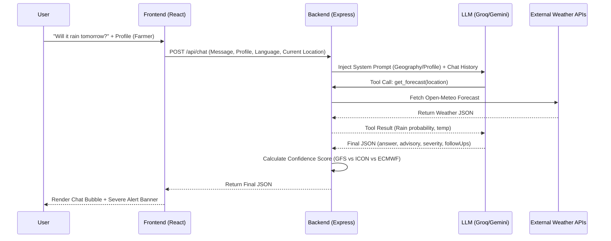

<div align="center">
  
  <h1>WeatherGPT — SIH 2026</h1>
  <p><strong>Advanced AI-Powered Weather & Disaster Management Platform</strong></p>
</div>

<hr/>

## 1. Title & Tagline
**WeatherGPT: Hyper-localized, Context-Aware AI Weather & Disaster Advisory System**  
**Problem Statement ID:** [VERIFY: Add SIH 2026 Problem Statement ID/Title here]

## 2. Proposed Solution

**The Problem:** Traditional weather applications only provide raw meteorological numbers (like "35°C, 80% humidity") which lack actionable context for specific demographics. A farmer, a pilot, and a local disaster management authority all require vastly different insights from the exact same weather data. Furthermore, warnings are often generic and fail to reach rural populations in their native languages.

**The Solution:** WeatherGPT bridges the gap between complex meteorological data and end-users through an **Agentic AI architecture**. By utilizing a conversational LLM interface coupled with real-time weather function calling, it translates raw data into structured, easy-to-understand advice.

**What Makes It Innovative:**
- **Contextual Advisory Layer:** The AI behavior radically shifts based on the selected user profile (Farmer, Fisherman, Aviation, General, Urban Planner), changing its terminology and reasoning.
- **Multilingual Support & Voice:** Supports native languages (Hindi, Bengali, Assamese) with Google Text-to-Speech (TTS) integration, making it accessible to non-English speakers and illiterate users.
- **Structured AI Responses:** The AI does not just output a block of text; it returns a strict JSON containing specific severities, advisories, relevant statistics, and predictive follow-up questions.
- **Authority Manager Portal:** Allows local disaster managers to securely bypass the standard feed and push targeted alerts to specific districts or geographic radiuses.

## 3. Technical Approach

### Tech Stack
- **Frontend:** React (v18), Vite, Tailwind CSS, React-Leaflet (for Radar Maps), Recharts.
- **Backend:** Node.js, Express proxy.
- **AI/LLM Integrations:** Groq API (Qwen 3.8-27b for function calling) as primary, Google Gemini API as fallback.
- **External Data APIs:** Open-Meteo (aggregating GFS, ECMWF, ICON models), Nominatim (OpenStreetMap geocoding), NDMA Sachet (CAP feeds), Google News RSS, Google TTS API.

### Architecture Diagram



### The "Ask WeatherGPT" Chat Flow



### Key Technical Decisions
- **Express Proxy Backend:** Prevents exposing sensitive AI API keys (Groq, Gemini) to the client side. It also acts as the central orchestrator for function calling.
- **Groq over Standard OpenAI:** Chosen for its ultra-low latency inference, which is crucial for a real-time conversational weather interface.
- **Server-Side Confidence Calculation:** We fetch data from three major models (GFS, ECMWF, ICON). The backend calculates the variance between these models. High variance equals a "Low Confidence" flag shown to the user, ensuring algorithmic transparency.

## 4. Feasibility & Viability

### Feasibility (What is implemented)
- Fully functioning conversational AI engine with tool-calling capabilities (`get_current_weather`, `get_forecast`, `get_historical_trend`, `get_seasonal_comparison`, `get_active_alerts`).
- Multi-profile persona switching (Farmer, Fisherman, Aviation).
- Manager dashboard for issuing custom radius/district disaster alerts.
- Live fetching of NDMA Sachet CAP feeds and Google News RSS.

### Challenges & Mitigation Strategies
1. **API Rate Limits / AI Hallucination:** 
   *Mitigation:* We have a built-in fallback strategy. If Groq hits a rate limit, the Express backend automatically degrades gracefully to the Gemini API. To prevent hallucinations, the LLM is restricted via the System Prompt to only answer weather/agriculture/travel questions and is heavily grounded by the real-time JSON tool data.
2. **Offline/Low Connectivity in Rural Areas:**
   *Mitigation:* The frontend caches critical alerts and recent weather stages in memory. Once an alert is downloaded, it persists even if the connection drops.
3. **NDMA Feed Reliability:**
   *Mitigation:* The backend wraps the Sachet feed fetch with a 5-second abort controller. If the feed is down (404), it gracefully falls back to showing only internal manager alerts instead of breaking the app.

### Scalability Path
- Transitioning to premium tiers for Open-Meteo/weather providers for higher TPM.
- Integrating official IMD automated weather station (AWS) APIs for deeper localized accuracy.
- Implementing a persistent database (PostgreSQL/MongoDB) to scale the Manager Alerts system beyond the current local JSON storage.

## 5. Impact & Benefits

**Social & Economic Impact:** Early warnings drastically reduce crop damage, protect marine livelihoods, and save lives during severe weather events. By delivering these insights in native languages with Voice TTS, WeatherGPT breaks the digital literacy barrier, reaching the most vulnerable populations in rural India.

| User Persona | Feature Used | Benefit / Outcome |
|--------------|--------------|-------------------|
| **Farmer** | Profession Profile + `get_forecast` | Avoids pesticide washout by knowing optimal spraying windows based on rainfall and humidity context. |
| **Fisherman** | Profession Profile + `get_active_alerts` | Prevents venturing into the sea during high wind gusts and severe WMO code conditions, protecting lives. |
| **Aviation** | Profession Profile + Model Consensus | Improves pre-flight planning and awareness of wind shear or low visibility fog risks. |
| **Authority** | Manager Dashboard + Custom Alerts | Instantly broadcasts localized alerts by radius or district to vulnerable populations without relying solely on state-level feeds. |

## 6. Research & References

**Data Sources & APIs Utilized:**
- **Open-Meteo:** An open-source weather API providing access to high-resolution NWP models including GFS (Global Forecast System), ECMWF (European Centre), and ICON.
- **Nominatim / OpenStreetMap:** Open-source geocoding used to map village/city names to exact latitude/longitude coordinates.
- **NDMA Sachet:** Integrated endpoints designed to read official Common Alerting Protocol (CAP) disaster feeds.
- **Google News RSS:** Fetches real-time, keyword-filtered disaster news for situational awareness.

**References:**
- [VERIFY: Add specific IMD/government reports, disaster management papers, or academic references relevant to your SIH 2026 problem statement here.]

## 7. Standard Project Sections

### Folder Structure
```text
📦 SIH-2026-WEATHER-GPT
 ┣ 📂 public/              # Static assets, icons, logos
 ┣ 📂 src/
 ┃ ┣ 📂 components/        # React components (ChatScreen, AlertsScreen, WeatherDashboard, etc.)
 ┃ ┣ 📂 context/           # React Global State context
 ┃ ┣ 📂 services/          # API wrapper functions
 ┃ ┣ 📂 utils/             # Helper functions (theme logic, WMO weather codes)
 ┃ ┣ 📜 App.jsx            # Main Frontend Router/Wrapper
 ┃ ┗ 📜 main.jsx           # React DOM Entry point
 ┣ 📂 server/
 ┃ ┗ 📜 tools.js           # Backend OpenAI/Groq Tool Definitions & API executors
 ┣ 📜 server.js            # Express Backend Server & AI Orchestrator
 ┣ 📜 package.json         # Project Dependencies
 ┣ 📜 tailwind.config.js   # Tailwind Styling Configuration
 ┗ 📜 README.md
```

### Installation & Setup

**Prerequisites:** Node.js (v18+)

1. **Clone the repository:**
   ```bash
   git clone https://github.com/omcodes16/sih-2026.git
   cd sih-2026
   ```

2. **Install Dependencies:**
   ```bash
   npm install
   ```

3. **Configure Environment Variables:**
   Create a `.env` file in the root directory based on `.env.example`:
   ```env
   GROQ_API_KEY=your_groq_api_key_here
   GEMINI_API_KEY=your_gemini_api_key_here
   MANAGER_PASSCODE=weather2026
   MANAGER_SECRET=super-secret-key-123
   ```

4. **Run the Application:**
   You can run both the frontend and backend concurrently:
   ```bash
   npm run dev:all
   ```
   *(Alternatively, run `node server.js` and `npm run dev` in separate terminals).*  
   Open `http://localhost:5173` in your browser.

### Team
- **Team Name:** [VERIFY: Add your SIH Team Name here]
- **Members:** [VERIFY: Add team member names here]

### License
[VERIFY: Add license information here, e.g., MIT License. If none, leave blank or specify proprietary for SIH.]
