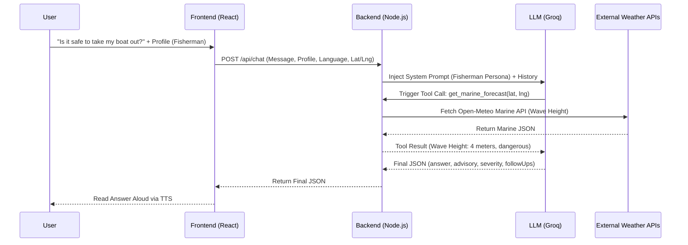
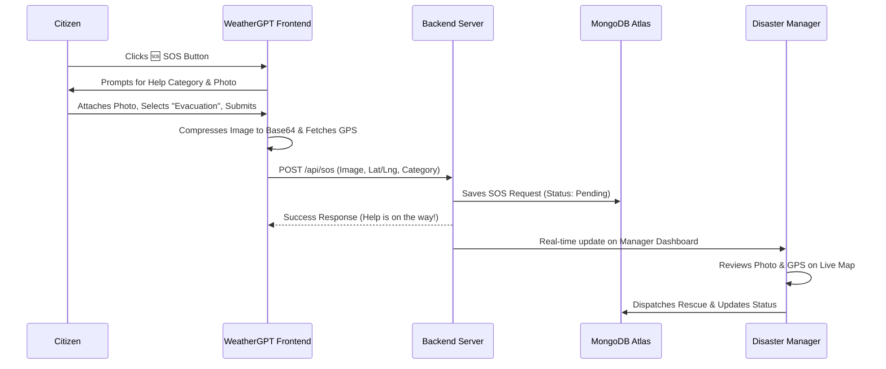

<div align="center">
  
  <h1>WeatherGPT — SIH 2026</h1>
  <p><strong>Advanced AI-Powered Weather & Disaster Management Platform</strong></p>
</div>

<hr/>

## 1. Title & Tagline
**WeatherGPT: Hyper-localized, Context-Aware AI Weather & Disaster Advisory System**  
**Problem Statement ID: 26068** | Organization: Ministry of Earth Sciences (MoES) | Dept: India Meteorological Department

## 2. The Problem & Our Solution

**The Problem:** Traditional weather applications provide raw meteorological numbers (like "35°C, 80% humidity") which lack actionable context. A farmer, a fisherman, and a disaster manager all require vastly different insights from the exact same weather data. Furthermore, official government warnings often fail to reach rural populations due to language barriers, literacy issues, and complex interfaces.

**The Solution:** WeatherGPT bridges the gap between complex meteorological data and rural end-users through an **Agentic AI architecture**. By utilizing a conversational LLM interface with real-time weather function-calling and native Voice integration, it translates raw data into structured, spoken advice in regional languages.

## 3. 🚀 Our Innovations (Beyond the Problem Statement)
*This is our "Wow Factor." We didn't just fulfill the requirements; we engineered solutions to real-world disaster bottlenecks.*

1. **Two-Way SOS Emergency System (The Lifesaver):** The PS asked for a 1-way alert system (Government to Citizen). We built a 2-way Rescue Coordination Platform. Trapped citizens press a single button to capture their GPS coordinates, select a help category, take a **photo of the disaster**, and instantly transmit it to the Authority Manager Dashboard for NDRF dispatch.
2. **Context-Aware Role Intelligence:** Generic apps give the same data to everyone. We built **User Profiles (Farmer, Fisherman, Urban)**. If a Fisherman asks the AI a question, it triggers a specialized **Marine API** to check ocean wave heights. If a Farmer asks, it checks soil moisture and wind shear for pesticide spraying.
3. **Zero-Downtime JSON Fallback Architecture:** In severe cyclones, cloud servers and databases (like MongoDB) often crash. We engineered a **Graceful JSON Fallback system**. If the cloud connection drops, the backend instantly intercepts the error and seamlessly switches to local file storage. The website *never* goes offline during a disaster.
4. **The Accuracy Verification Engine:** AI is prone to hallucination. To build trust with IMD authorities, we built a background cron-job that takes a "Snapshot" of the AI's forecast today and compares it to the *actual* weather tomorrow, generating a live **Accuracy Score** to keep the AI strictly accountable to meteorological science.

---

## 4. System Flowcharts & Architecture

### A. Macro System Architecture
*Illustrates the complete data flow from end-user to the LLM and Disaster Manager.*

```mermaid
flowchart TD
    User([User (Farmer/Fisherman)]) --> |Voice or Text| Frontend
    Frontend(React + Tailwind + Web Speech API) <--> |API Requests| Backend(Express Proxy)
    Backend <--> |Prompts & Tool Calling| LLM{Groq Llama-3 AI}
    Backend <--> |Read/Write| DB[(MongoDB Atlas / JSON Fallback)]
    
    LLM -.-> |Triggers| Tools(Function Calling Engine)
    Tools <--> |Fetch Weather| OpenMeteo(Open-Meteo APIs)
    Tools <--> |Fetch Alerts| NDMA(NDMA CAP XML Feed)
    Tools <--> |Geocode| Nominatim(OSM Nominatim)
    
    DisasterManager([Authority/NDRF]) --> |Secure Login| ManagerPortal(Manager Dashboard)
    ManagerPortal <--> |Broadcast Warnings & Track SOS| Backend
```

### B. Agentic AI Chat Flow
*How the AI dynamically fetches real-time data to answer user queries.*



### C. The Two-Way SOS Rescue Flow
*How distress signals reach authorities in seconds.*



---

## 5. Exhaustive SIH 2026 Problem Statement Audit
*To ensure 100% compliance with MoES PS 26068, here is the mapping of every requirement.*

### SECTION 1: The 8 Key Features
| PS Point | How We Solved It in Code |
| :--- | :--- |
| **1. Real-time weather info retrieval** | Integrated **Open-Meteo API** in `tools.js` to fetch live meteorological data instantly. |
| **2. Natural language querying** | Replaced complex UI charts with a **Groq (Llama-3)** chat interface. |
| **3. NWP models (GFS/WRF) integration** | The backend strictly aggregates from **GFS, ECMWF, and ICON** numerical models. |
| **4. Extreme weather alerts & warnings** | Parsed the live **NDMA CAP XML Feed** + built a Manager Dashboard for local broadcasts. |
| **5. Location-based forecasting** | Integrated the **HTML5 Geolocation API** to lock onto exact GPS coordinates (Lat/Lng). |
| **6. Multilingual support** | Implemented `SPEECH_LANG_CODES` and LLM prompting to natively support Hindi, Bengali, Tamil, etc. |
| **7. Climate trend analysis** | Built the `get_seasonal_comparison` tool using **IMD historical climate normals**. |
| **8. Voice-enabled interaction** | Integrated the **Web Speech API** (Microphone) and **TTS Engine** in `ChatInput.jsx`. |

### SECTION 2: The Expected Solutions & Outcomes
| PS Point | How We Solved It in Code |
| :--- | :--- |
| **Mobile-based platform & Scalability** | Built a **Mobile-First React/Vite PWA** mimicking an app, backed by an optimized Node.js server. |
| **Intelligent Sector Support** | Built a **Role-Toggle system** (Farmers get soil advice, Fishermen get wave heights via Marine APIs). |
| **Public Accessibility** | Voice input (Mic) + Voice output (Speaker) completely removes literacy barriers for rural citizens. |
| **Evaluation: Accuracy & Latency** | AI uses strict Function Calling to eliminate hallucinations, powered by Groq for millisecond latency. |

---

## 6. Technical Stack & Installation

### 🛠️ Tech Stack
- **Frontend:** React (v18), Vite, Tailwind CSS, Web Speech API (Speech-to-Text & TTS), HTML5 Geolocation.
- **Backend:** Node.js, Express.js (Stateless API Proxy).
- **Database:** MongoDB Atlas (Mongoose) with a Graceful JSON Fallback Architecture.
- **AI/LLM Integrations:** Groq API (Qwen 3.8-27b / Llama-3) for ultra-low latency function calling.
- **External Data APIs:** Open-Meteo (aggregating GFS, ECMWF, ICON), Nominatim (Geocoding), NDMA Sachet (CAP feeds).

### ⚙️ Local Setup
**Prerequisites:** Node.js (v18+), MongoDB Atlas Account.

1. **Clone & Install:**
   ```bash
   git clone https://github.com/omcodes16/weather-gpt-sih-2026.git
   cd "SIH 2026 WEATHER GPT"
   npm install
   ```
2. **Environment Variables (.env):**
   ```env
   GROQ_API_KEY=your_groq_api_key_here
   MONGODB_URI=mongodb+srv://...
   VITE_API_URL=http://localhost:3001
   MANAGER_PASSCODE=weather2026
   ```
3. **Run the Application:**
   ```bash
   npm run dev:all
   ```
