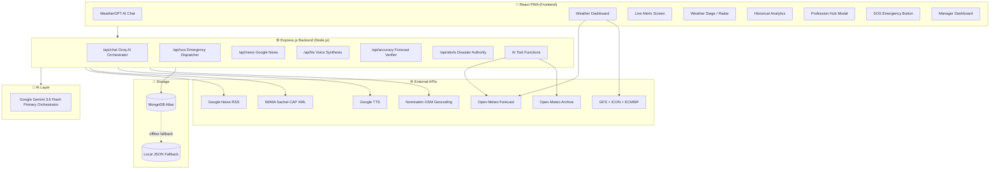
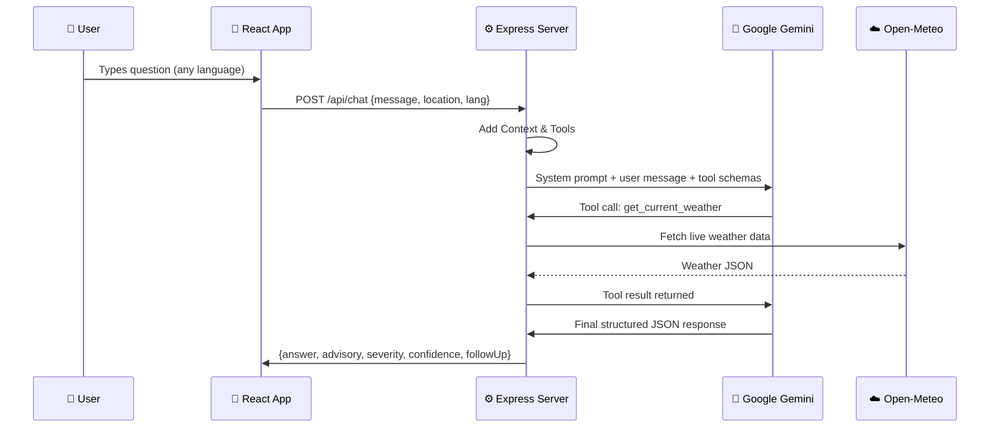
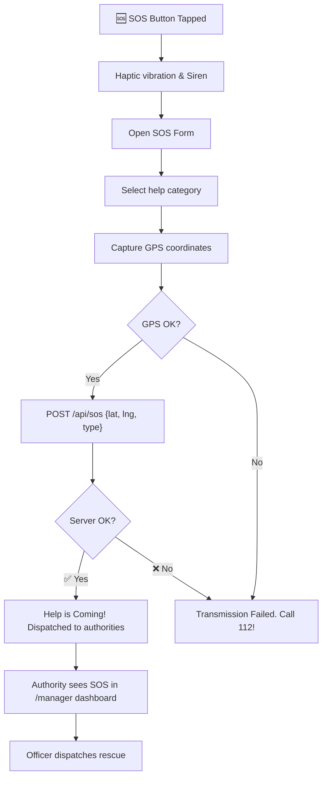
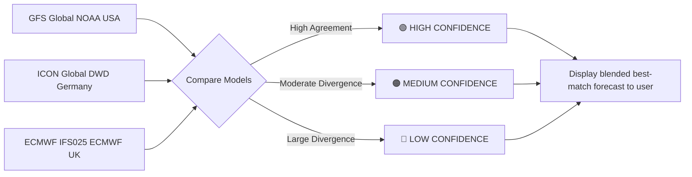
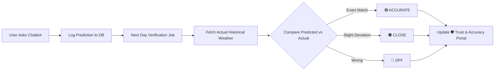
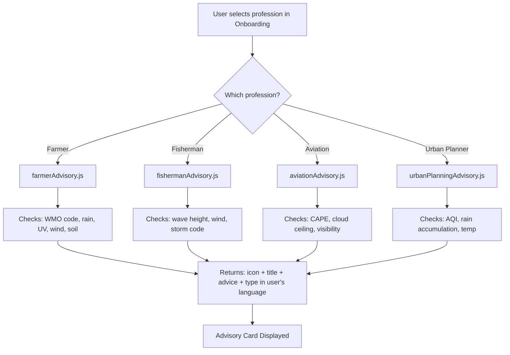

# 🌤️ WeatherGPT – SIH 2026

> **Smart India Hackathon 2026 | Problem Statement PS-26068**
> *India's First AI-Powered, Profession-Aware, Multilingual Hyperlocal Weather Intelligence Platform*

---

## 🏆 Why WeatherGPT Wins

WeatherGPT is **not** just another weather app. It is the first platform in India that combines:
- **Real-time NWP multi-model forecasts** (GFS + ICON + ECMWF) with transparent confidence scoring
- **Groq-powered AI** that calls live APIs on demand and answers in the user's own language
- **Profession-specific intelligence** for Farmers, Fishermen, Aviators, and Urban Planners
- **Integrated Emergency SOS** with GPS, photo upload, and disaster authority dispatch
- **4 Indian Languages** (English, Hindi, Assamese, Bengali) – covering UI, alerts, and AI chat

| Capability | Other Apps | WeatherGPT |
|---|---|---|
| Indian language UI | ❌ | ✅ EN, HI, AS, BN |
| AI chat with live data | ❌ | ✅ Groq + Tool Calling |
| Profession-specific advice | ❌ | ✅ 4 professions |
| 3-model NWP comparison | ❌ | ✅ GFS + ICON + ECMWF |
| Emergency SOS dispatch | ❌ | ✅ GPS + Photo + Server |
| Self-verifying accuracy | ❌ | ✅ Automated daily check |
| Disaster authority portal | ❌ | ✅ Full /manager dashboard |

---

## 🏗️ System Architecture Overview



---

## 🤖 AI Engine Deep Dive

### Chat Request Flow


---

## 🚨 Emergency SOS Flow



---

## 🛡️ NWP Model Confidence Flow



---

## 📈 Forecast Accuracy Pipeline



---

## 🌾 Profession Advisory System



---

## 🛠️ Technology Stack

| Technology | Purpose |
|---|---|
| **React 18 & Vite** | Lightning-fast frontend UI |
| **Tailwind CSS** | Responsive styling |
| **Node.js & Express** | REST API Backend |
| **Google Gemini 3.6 Flash** | Primary AI Engine for Function Calling & Orchestration |
| **Nominatim (OSM)** | Hyperlocal Indian Village & Panchayat Geocoding |
| **MongoDB Atlas** | Persistent storage for SOS & Accuracy |
| **Open-Meteo** | Live weather & marine & agro data |
| **NDMA Sachet** | Official Govt Disaster Alerts |
| **WebSockets** | Real-time Alert Broadcasting |

---

## 🚀 Setup & Installation

### Environment Variables (`.env`)
```env
GROQ_API_KEY=your_groq_api_key_here
GNEWS_API_KEY=your_gnews_api_key_here
VITE_API_URL=http://localhost:3001
MONGODB_URI=mongodb+srv://...
GEMINI_API_KEY=your_gemini_key
```

### Quick Start
```bash
# 1. Install dependencies
npm install

# 2. Start frontend + backend together
npm run dev:all

# Frontend available at: http://localhost:5173
# Backend available at:  http://localhost:3001
```

*Built to win SIH 2026 – Making weather intelligence accessible to every Indian, in their own language.*
