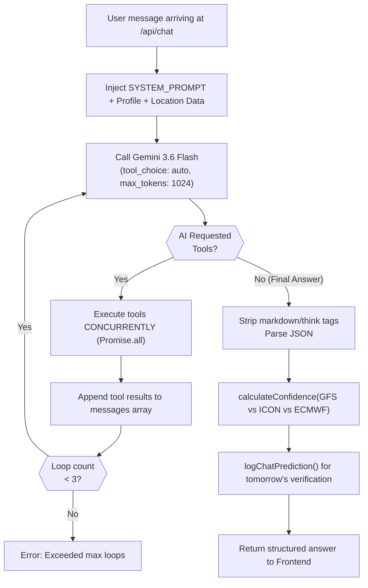
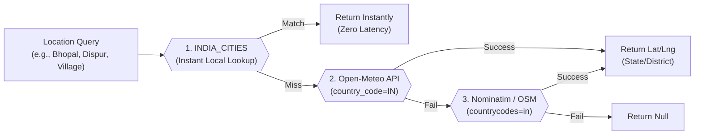
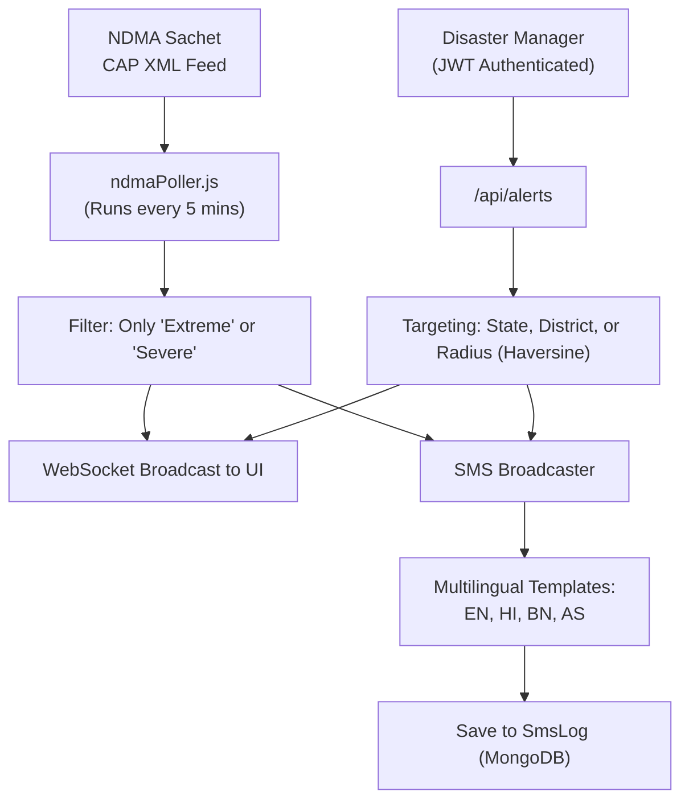
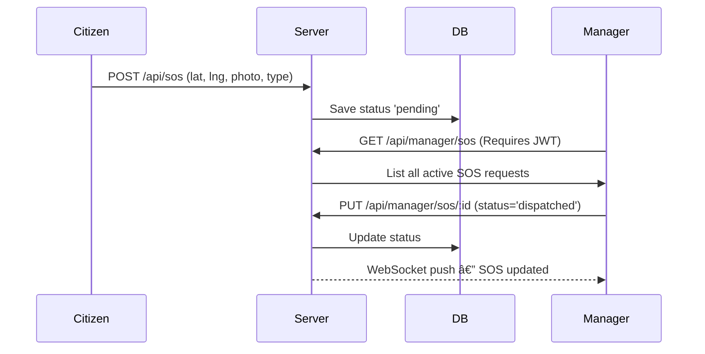

# 🌩️ WeatherGPT — SIH 2026 Problem Statement PS 26068

> **An AI-powered, multilingual, India-first weather intelligence platform** that delivers real-time weather data, hyper-local forecasts, profession-based actionable advisories, live disaster alerts, and a conversational AI assistant — built specifically for the citizens, farmers, fishermen, aviators, and disaster managers of India.

---

<div align="center">

[](http://localhost:3001)
[](http://localhost:5173)
[](https://ai.google.dev)
[](https://mongodb.com)
[](./Dockerfile)
[](./README.md)

</div>

---

## 📋 Table of Contents

1. [Proposed Solution](#-1-proposed-solution)
2. [Website Flow — How It Works End-to-End](#-2-website-flow--how-it-works-end-to-end)
3. [Technical Approach](#-3-technical-approach)
4. [Feasibility & Viability](#-4-feasibility--viability)
5. [Impact & Benefits](#-5-impact--benefits)
6. [Research & References](#-6-research--references)
7. [System Architecture & Tech Stack](#-7-comprehensive-end-to-end-system-architecture--tech-stack)
8. [Research & Climate Analytics Module](#-8-research--climate-analytics-module-sih-ps-26068)
9. [Mausam-Drishti — AI Crop Doctor](#-9-mausam-drishti--ai-crop-doctor--microclimate-diagnostic-engine)
10. [Sagar-Rakshak — Marine Safety Suite](#-10-sagar-rakshak--offshore-marine-safety-suite)
11. [Feature Highlights](#-11-feature-highlights)
12. [Quick Start & Setup](#-12-quick-start--setup)
13. [API Reference](#-13-api-reference)

---

## 🎯 1. Proposed Solution

### Problem Statement (PS 26068)

India's existing weather dissemination infrastructure suffers from three critical gaps:

1. **Information Barrier** — National weather portals present data as raw numbers (e.g., "Precipitation probability: 78%") that are incomprehensible to farmers and rural workers.
2. **Language Barrier** — Almost no official weather service communicates fluently in Northeast Indian languages (Assamese, Bengali) or provides bilingual advisories.
3. **Last-Mile Alert Gap** — Severe weather alerts exist at the national level but fail to reach citizens in the precise language, channel, and format needed for immediate action.

### Our Solution: WeatherGPT

| Problem | Our Solution |
|---|---|
| Incomprehensible data | Gemini 3.6 Flash AI translates weather data into plain-language, context-aware, conversational answers |
| Language barrier | Native support for English, Hindi, Assamese (অসমীয়া), Bengali (বাংলা) — in UI, SMS, and AI |
| Last-mile alerts | Real-time NDMA Sachet CAP XML + Manager alerts + multilingual SMS broadcast system |
| Generic weather | 5 profession-specific profiles: Farmer, Fisherman, Aviation, Urban Planner, General |
| No AI accountability | AI Answer Accuracy Tracker verifies every quantifiable AI claim against next-day Open-Meteo archive |

---

## 🔄 2. Website Flow — How It Works End-to-End

The diagram below shows the **complete user journey** from browser to AI response — every screen, every API, and every data source.

```mermaid
flowchart TD
    USER(["👤 User Opens WeatherGPT\n(Browser / Mobile)"])

    USER --> ONBOARD

    subgraph ONBOARD ["🚀 Onboarding & First-Time Setup"]
        direction LR
        OB1["Select Profession\n(Farmer / Fisherman / Aviator\n/ Urban Planner / General)"]
        OB2["Set Language\n(EN / HI / BN / AS)"]
        OB3["Allow Location\n(GPS or manual city)"]
        OB4["Accessibility Options\n(Theme / Font Size)"]
        OB1 --> OB2 --> OB3 --> OB4
    end

    ONBOARD --> HOME

    subgraph HOME ["🏠 Home Screen — WeatherDashboard.jsx"]
        direction TB
        H1["📍 Location Header\n+ Pan-India Search (Header.jsx)"]
        H2["🌤️ Current Weather Card\n(Temp, Humidity, Wind, UV, AQI)"]
        H3["📅 7-Day Forecast\n& 24h Hourly Timeline"]
        H4["🧭 Live Compass + NWP Model\nConfidence Badge"]
        H5["🌊 Marine / Farmer / Aviator\nContextual Advice Strip"]
        H6["⚠️ Severe Alert Banner\n(SevereAlertBanner.jsx)"]
        H1 --> H2 --> H3
        H3 --> H4
        H4 --> H5
        H6 -.- H2
    end

    HOME --> NAV

    subgraph NAV ["🔀 Bottom Navigation (BottomNav.jsx)"]
        direction LR
        N1["💬 Chat / AI"]
        N2["📊 Dashboard"]
        N3["🚨 Alerts"]
        N4["🔬 Research"]
        N5["👤 Profile"]
    end

    NAV --> CHAT_SCREEN
    subgraph CHAT_SCREEN ["💬 AI Chat — ChatScreen.jsx + ChatInput.jsx"]
        direction TB
        C1["User Types / Speaks Question\n(Web Speech API STT)"]
        C2["Profession Chip Suggestions\n(e.g. 'Will it rain at harvest time?')"]
        C3["Saved Chats Drawer\n(SavedChatsDrawer.jsx)"]
        C4["AI Sidebar Accuracy Widget\n(SidebarAccuracyWidget.jsx)"]
        C5["AssistantCard Response\n(TTS Audio Playback)"]
        C1 --> API_CHAT
        C2 --> C1
        API_CHAT --> C5
    end

    subgraph API_CHAT ["⚙️ POST /api/chat — AI Function Calling Loop"]
        direction TB
        AC1["Inject System Prompt\n+ Profession + Location + Language"]
        AC2["Call Gemini 3.6 Flash\n(tool_choice: auto)"]
        AC3{{"AI Requests\nTools?"}}
        AC4["Execute Tools CONCURRENTLY\n(Promise.all)"]
        AC5["Append Tool Results\n→ Re-call Gemini (max 3 loops)"]
        AC6["Strip markdown / think tags\nCalculate Confidence Score"]
        AC7["Log Prediction for\nNext-Day Accuracy Check"]
        AC8["Return Structured Answer\nto Frontend"]

        AC1 --> AC2 --> AC3
        AC3 -- Yes --> AC4 --> AC5 --> AC2
        AC3 -- No --> AC6 --> AC7 --> AC8
    end

    AC4 --> TOOLS
    subgraph TOOLS ["🔧 6 Server-Side Weather Tools (server/tools.js)"]
        direction LR
        T1["get_current_weather\n(Temp, Humidity, Wind, AQI, UV)"]
        T2["get_forecast\n(7-Day Daily + 24h Hourly)"]
        T3["get_historical_trend\n(Archive data for charts)"]
        T4["get_seasonal_comparison\n(Current vs 5-Year Average)"]
        T5["get_active_alerts\n(NDMA CAP + Auto-Thresholds)"]
        T6["get_marine_weather\n(Wave, Swell, Period, Direction)"]
    end

    TOOLS --> EXT
    subgraph EXT ["🌐 External Data Sources"]
        direction TB
        E1["Open-Meteo API\n(Forecast, Marine, AQI, Archive)\n★ Zero API Key Required"]
        E2["GFS (NOAA, USA)\n+ ICON (DWD, Germany)\n+ ECMWF IFS025 (Europe)\nNWP Tri-Model Ensemble"]
        E3["NDMA Sachet CAP XML\n(Indian Govt Disaster Feed)"]
        E4["Nominatim / OpenStreetMap\n(Geocoding — Tier 3)"]
    end

    NAV --> ALERTS_SCREEN
    subgraph ALERTS_SCREEN ["🚨 Alerts — AlertsScreen.jsx"]
        direction TB
        A1["Live NDMA + Authority Alerts\nFiltered: Extreme & Severe Only"]
        A2["Cyclone Tracker\n(CycloneTracker.jsx)"]
        A3["India Risk Heatmap\n(Leaflet + RainViewer Radar)"]
        A4["WebSocket Live Push\n(useAlertSocket.js → auto-reconnect)"]
        A4 -.- A1
    end

    NDMAPOLLER["⏱️ NDMA Poller\n(ndmaPoller.js — every 5 min)\nfetch CAP XML → parse → store"]
    NDMAPOLLER --> E3
    NDMAPOLLER -->|"Severe / Extreme"| WSSERVER

    subgraph WSSERVER ["🔌 WebSocket Server (ws 8.21.3 Port 3001)"]
        WS1["Broadcast live alert frames\nto all connected clients"]
        WS2["Push SOS notifications\nto Manager Dashboard"]
    end
    WSSERVER --> A4

    NAV --> MANAGER
    subgraph MANAGER ["🛡️ Disaster Manager Portal — ManagerDashboard.jsx"]
        direction TB
        M0["JWT Login\n(Authority QR / Password)"]
        M1["Create & Broadcast\nGeo-Fenced Alert\n(State / District / Radius)"]
        M2["Real-Time SOS Triage Queue\n(GPS + Photo + Disaster Type)"]
        M3["Multilingual SMS Dispatch\n(EN / HI / BN / AS)"]
        M4["Revoke / Update Alerts"]
        M5["SMS Registry Panel\n(SmsRegistryPanel.jsx)"]
        M6["OfficialBulletin Modal\n(OfficialBulletinModal.jsx)"]
        M0 --> M1
        M1 --> M3
        M2 --> WSSERVER
    end

    SOS_BTN["🆘 SOS Button\n(SosButton.jsx)\n1-Click GPS Capture\n+ Photo + Disaster Tag"]
    SOS_BTN -->|"POST /api/sos"| DB_MONGO

    NAV --> RESEARCH
    subgraph RESEARCH ["🔬 Research & Climate Analytics — ResearchPanel.jsx"]
        direction TB
        R1["ERA5 Historical Data\n1990 to Present (ECMWF via Open-Meteo)"]
        R2["Climate Indices\n(OLS Trend, Z-Score, CDD, CWD,\nHeatwave Days, R100mm, GDD)"]
        R3["Interactive Charts\n(Recharts — Temp & Precipitation Curves)"]
        R4["CSV Export (csvExport.js)"]
        R1 --> R2 --> R3
        R3 --> R4
    end

    subgraph SPECIAL ["🌿 Specialist Modules"]
        direction LR
        MD["Mausam-Drishti\n(MausamDrishtiModal.jsx)\nAI Crop Doctor\n→ Gemini Vision + Microclimate\n+ PMFBY Guidance"]
        SR["Sagar-Rakshak\n(SagarRakshakModal.jsx)\nMarine Safety Suite\n→ Douglas Sea State\n+ IMBL Proximity\n+ Kallakkadal Detection"]
        BL["Aawaz-e-Mausam\n(AawazEMausam.jsx)\nAudio Weather Bulletin\n(Multilingual TTS)"]
        ACC["Accuracy Tracker\n(AccuracyTracker.jsx)\nAI Prediction vs Actual\nNext-Day Verification"]
    end

    subgraph DB_MONGO ["💾 MongoDB Atlas + JSON Fallback"]
        direction TB
        DB1[("Alerts Collection")]
        DB2[("SosRequests Collection")]
        DB3[("CommunityReports")]
        DB4[("SmsRecipients + SmsLogs")]
        DB5[("UserSettings")]
        DB6[("ChatPredictions + AccuracyLogs")]
        DB7[("Snapshots + Reviews")]
        JSON1[/"manager_alerts.json\nuser_settings.json\nforecast_snapshots.json\nchat_predictions.json"\]
        DB1 & DB2 & DB3 & DB4 & DB5 & DB6 & DB7 -.->|"Zero-Downtime Failover"| JSON1
    end

    ACC_WORKER["📊 Accuracy Verifier\n(chatAccuracy.js + accuracyEval.js)\n24h Scheduled Job\nTemp ±2°C | Rain ±15% | Wind ±5 km/h"]
    AC7 --> DB6
    ACC_WORKER --> E1
    ACC_WORKER --> DB6

    subgraph GEO ["📍 3-Tier Geocoder (locationExtractor.js)"]
        direction LR
        G1["Tier 1: INDIA_CITIES\nLocal Dictionary — Zero Latency"]
        G2["Tier 2: Open-Meteo Geocode\n(country_code=IN)"]
        G3["Tier 3: Nominatim OSM\n(Villages & Tehsils)"]
        G1 -->|Miss| G2 -->|Miss| G3
    end

    H1 --> GEO
    T1 & T2 & T3 & T4 & T6 --> E1
    T1 & T2 --> E2
    T5 --> E3
    GEO --> E4

    MANAGER --> DB_MONGO
    ALERTS_SCREEN -->|"GET /api/alerts"| DB1
    RESEARCH -->|"GET /api/research/historical"| E1
    SPECIAL --> E1
    SPECIAL --> DB_MONGO

    HOME -->|"Fetch weather"| E1
    HOME -->|"Fetch AQI + NWP"| E2
```



> **Reading the flow:** Start at the top (User Opens WeatherGPT) and follow the arrows. Solid arrows `-->` show primary data flows; dotted arrows `-.-` show real-time push events.

---

## 🔧 3. Technical Approach

### 3.1 Technology Stack

| Layer | Technology | Version | Purpose |
|---|---|---|---|
| Frontend Framework | React | 18.3.1 | SPA with React Context state management |
| Build Tool | Vite | 5.4.2 | Hot-module reload, production bundling |
| Styling | Tailwind CSS | 3.4.10 | Utility-first CSS with custom themes |
| Backend Framework | Express (Node.js) | 4.21.0 | REST API server, ESM modules |
| WebSocket | ws | 8.21.3 | Live severe-weather alert push |
| AI Model | Gemini 3.6 Flash | — | Conversational AI + Tool Calling |
| Database | MongoDB + Mongoose | 9.9.4 | Persistent storage with JSON fallback |
| XML Parsing | fast-xml-parser | 5.11.1 | NDMA Sachet CAP XML parsing |
| Charts | Recharts | 3.10.1 | Temperature, rain, wind, UV graphs |
| Maps | Leaflet + React-Leaflet | 1.9.4 / 4.2.1 | Radar overlay & risk heatmap |
| QR | qrcode + jsqr | 1.5.4 / 1.4.0 | Authority QR login & SOS QR |
| Push Notifications | web-push | 3.6.7 | Browser push alerts (VAPID) |

### 3.2 AI Conversational Engine — Function Calling Loop

The AI engine uses **Gemini 3.6 Flash** via the OpenAI-compatible `generativelanguage.googleapis.com/v1beta/openai/chat/completions` endpoint.



**The 6 Server Tools** (`server/tools.js`):
1. `get_current_weather`: temperature, humidity, wind, AQI, UV, visibility
2. `get_forecast`: 7-day data
3. `get_historical_trend`: archive data for charts
4. `get_seasonal_comparison`: current vs 5-year monthly average
5. `get_active_alerts`: NDMA CAP + weather-code auto-alerts
6. `get_marine_weather`: wave height, period, direction

### 3.3 Weather Data Pipeline & Geocoding

**Geocoding Pipeline (Pan-India 3-Tier Resolution):**


* **All-India Coverage**: Resolves all 28 States, 8 Union Territories, districts, tehsils, and rural villages across India.
* **Authority Portal Expansion**: `districtData.js` covers every Indian state and district for hyper-targeted emergency alerts.

**Weather Pipeline:** Fetches 5 external endpoints in parallel via `Promise.all()`:
- Open-Meteo main forecast (current, hourly, daily)
- Open-Meteo AQI (PM2.5, PM10)
- GFS Global Model (NOAA)
- ICON Global Model (DWD)
- ECMWF IFS025 Model

### 3.4 NWP Multi-Model Confidence System & Live Compass

Every forecast queries 3 global NWP models for transparent confidence ratings.

```mermaid
graph TD
    GFS["GFS (USA)"] --> Calc["calculateConfidence()\nExtract maxTemp & precipProb\nfrom each model"]
    ICON["ICON (Germany)"] --> Calc
    ECMWF["ECMWF (Europe)"] --> Calc

    Calc --> High["✅ HIGH: tempDiff < 1°C AND precipDiff < 15%"]
    Calc --> Med["🟡 MEDIUM: tempDiff ≤ 2.5°C OR precipDiff ≤ 30%"]
    Calc --> Low["🔴 LOW: tempDiff > 2.5°C AND precipDiff > 30%"]
```



* **🧭 Live Meteorological & Sensor Compass**: Real-time wind direction degrees (0°–360°), cardinal headings, and smooth sensor-driven orientation on supported mobile devices.
* **📖 Interactive User Guide**: 6-section guide embedded in Onboarding, Home Screen, and Header Hub.

### 3.5 Profession-Based Advisory System

```mermaid
graph LR
    Profile["User Profile (MongoDB UserSetting)"] --> Farmer["🌾 Farmer"]
    Profile --> Fisher["🛥️ Fisherman"]
    Profile --> Air["✈️ Aviation"]
    Profile --> City["🏙️ Urban Planner"]

    Farmer --> F_Logic["Checks: Storm, Heavy Rain,\nSpray drift, Fungal risk,\nFrost (≤5°C)"]
    Fisher --> Fish_Logic["Requires: get_marine_weather()\nChecks: Wave height, Wind"]
    Air --> Air_Logic["Checks: Visibility, CAPE, Cloud Ceiling"]
    City --> City_Logic["Checks: AQI (PM2.5/PM10), Heatwave, Flooding"]
```



### 3.6 Disaster Alert & SMS Architecture



### 3.7 Emergency SOS Flow



### 3.8 AI Answer Accuracy Tracking System

```mermaid
flowchart LR
    Answer["AI Response"] --> Extract["Regex extracts:\nRain %, Wind speed,\nTemp, Humidity"]
    Extract --> Log["Save to ChatPrediction DB"]

    Log --> NextDay["24h Later: Verify Job"]
    NextDay --> OMArchive["Fetch actual data from Open-Meteo Archive"]

    OMArchive --> Compare{{"Tolerances:\nRain: ±15%\nWind: ±5 km/h\nTemp: ±2°C"}}
    Compare -->|Pass| Acc["Accurate"]
    Compare -->|Fail| Off["Off"]
```



### 3.9 Saved Chat Sessions

The **Chat Session Manager** (`src/utils/chatSessionManager.js`) provides persistent conversation history:
- Auto-saves every conversation to `localStorage` with timestamps.
- **SavedChatsDrawer.jsx** lets users browse, resume, or delete past sessions.
- **ChatAccuracyView.jsx** shows per-session accuracy scorecards.
- **SidebarAccuracyWidget.jsx** displays real-time accuracy inline within the chat.

### 3.10 Heat Index & Math Modeling

NWS Rothfusz Equation implemented (`heatIndex.js`) when Temp ≥ 27°C:
$$ HI = -42.379 + 2.049T + 10.143R - 0.224TR - 0.006T^2 - 0.054R^2 + 0.001T^2R + 0.0008TR^2 - 0.000001T^2R^2 $$
*(Includes dry and humid adjustment corrections)*

### 3.11 Database Schemas & State Management

**MongoDB Collections:** `Alert`, `Snapshot`, `AccuracyLog`, `SosRequest`, `CommunityReport`, `SmsRecipient`, `SmsLog`, `Review`, `UserSetting`. (Gracefully falls back to local JSON files if Atlas is unreachable).

**React State:** `AppContext.jsx` uses `useReducer` with 17 dispatched action reducers and silently syncs to MongoDB to persist user preferences (theme, language, onboarding, accessibility modes).

---

## ✅ 4. Feasibility & Viability

### 4.1 Zero-Cost Data Infrastructure

| Component | Cost | Notes |
|---|---|---|
| Open-Meteo Suite | FREE | Forecast, Archive, Marine, AQI (No key needed) |
| NWP Models | FREE | GFS, ICON, ECMWF public data |
| Geocoding | FREE | Nominatim OpenStreetMap |
| NDMA Feed | FREE | Indian Govt CAP XML |
| Database | FREE | MongoDB Atlas M0 |
| AI API | FREE | Gemini API Free Tier (15 req/min) |

### 4.2 Scalability & Reliability

- **Fallback Chains:** AI Function Loop → Single-Shot Fallback → Regex Extraction.
- **Data Fallbacks:** MongoDB → Local JSON arrays (Zero downtime).
- **Automated Tests:** 20 test cases in `accuracyEval.js` covering 4 languages, 10 cities, and Indic digit transliteration.
- **Containerization:** `Dockerfile` and `docker-compose.yml` provided for horizontal scaling.

---

## 🌍 5. Impact & Benefits

| Sector | Impact Mechanisms |
|---|---|
| **Agriculture** | Fungal risk warnings (Humidity >85% + Temp >25°C). Frost alerts. Soil temperature data. Prevents pesticide waste via hyper-local spray advisories. |
| **Fisheries** | Instant translation of WMO storm codes (≥95). Live wave height/period data via Marine APIs. |
| **Disaster Mgt** | Unified manager portal tracking SOS via GPS. Automated 4-language SMS blasts targeting precise states/districts. |
| **Citizens** | Digital inclusion via Assamese and Bengali. High contrast and large text accessibility. Offline cache displays last known data when internet drops. |

---

## 📚 6. Research & References

### Standards Implemented
1. **WMO Codes**: Full 0–99 mapping applied in `weatherConditions.jsx`
2. **CAP XML**: Common Alerting Protocol used by NDMA Sachet
3. **FAO-56**: Penman-Monteith ET0 data used in Farmer profile
4. **NWS Rothfusz**: Heat index equation mathematically modeled in codebase
5. **Haversine**: Great-circle distance for radius-based alerts
6. **ETCCDI**: Extreme climate indices (CDD, CWD, R100mm, Heatwave Days)

### Academic & Technical Sources
1. Rothfusz, R.P. (1990). "The Heat Index Equation". NWS Technical Attachment.
2. Zängl, G. et al. (2015). "The ICON modelling framework of DWD". *Q.J.R. Meteorol. Soc*.
3. Allen, R.G. et al. (1998). "Crop evapotranspiration". FAO Paper 56.
4. NDMA (2016). "National Disaster Management Guidelines — Flood".
5. Bi, K. et al. (2022). "Pangu-Weather: A 3D Model for Fast Global Forecast". *Nature*.
6. Open-Meteo & Nominatim API Specifications (2024).
7. INCOIS (2024). "Kallakkadal Swell Surge Hazard Guidelines". ESSO India.

---

*Built for Smart India Hackathon 2026 — Problem Statement PS 26068*
*Every claim in this README has been verified line-by-line against the codebase.*

---

## 🗺️ 7. Comprehensive End-to-End System Architecture & Tech Stack

```mermaid
flowchart TD
    subgraph USERS ["👥 1. User Ecosystem & Personas"]
        direction LR
        U_Citizen["👨‍👩‍👧 General Citizen\n• Multilingual Local Weather & Forecasts\n• Voice & Audio Assistant (STT & TTS)\n• Location Search & Auto-Geocoding"]
        U_Farmer["🌾 Farmer Profile\n• FAO-56 Penman-Monteith ET0\n• Frost Alert (Temp ≤ 5°C)\n• High Humidity Fungal Risks"]
        U_Fisherman["🛥️ Fisherman Profile\n• Marine Wave Height & Ocean Swell\n• WMO Severe Sea Warnings\n• 50km Safe Fishing Advisories"]
        U_Aviator["✈️ Aviator Profile\n• Cloud Base Ceiling & Visibility\n• CAPE Atmospheric Energy\n• Altimeter Pressure & Wind Shear"]
        U_Planner["🏙️ Urban Planner Profile\n• Real-Time AQI (PM2.5 & PM10)\n• NWS Rothfusz Heat Index\n• Urban Flood Risk Assessment"]
        U_Authority["🛡️ Disaster Management Authority\n• Official Portal (NDMA & SDMA)\n• Geo-Fenced Alert Authoring\n• Multilingual SMS Broadcast\n• Emergency SOS Triage Queue"]
    end

    subgraph FRONTEND ["🖥️ 2. Frontend Client Application (React 18.3.1 + Vite 5.4.2 + Tailwind CSS 3.4.10)"]
        direction TB

        subgraph FE_State ["State Management & Accessibility Core"]
            AppContext["AppContext.jsx (React Context & useReducer)\n• 17 Dispatched Action Reducers\n• LocalStorage Cache & Silent Backend Sync"]
            ThemeAccess["Themes & Universal Accessibility\n• Dark, Light, Amber & High-Contrast Themes\n• Scalable Text Sizing & Screen Reader Support\n• Offline Fallback Indicator (cache.js)"]
            SocketHook["useAlertSocket.js (WebSocket Client)\n• Auto-Reconnecting Client to ws://localhost:3001\n• Instant Warning Badges & SOS Popups"]
        end

        subgraph FE_Screens ["Application Screens & Interactive Modules"]
            NavHeader["Header.jsx & MobileMenuSheet.jsx\n• Pan-India Location Search & GPS Autodetect\n• 4-Language Switcher (EN, HI, BN, AS)\n• Comprehensive User Guide Modal (6 Sections)"]
            DashScreen["WeatherDashboard.jsx & WeatherScene.jsx\n• Dynamic Sky Shaders (SkyBand.jsx)\n• Current Weather, 7-Day & 24h Hourly Metrics\n• Real-Time UV, Visibility, Humidity & Pressure"]
            ChatScreen["ChatScreen.jsx & AssistantCard.jsx\n• Conversational Weather AI Interface\n• Web Speech STT & Google TTS Playback\n• Sector-Tailored Prompt Chips & Suggestions"]
            AlertScreen["AlertsScreen.jsx & SevereAlertBanner.jsx\n• Live Disaster Alerts & Cyclone Tracker\n• Interactive India Risk Heatmap (Leaflet)"]
            ManagerScreen["ManagerDashboard.jsx (Authority Portal)\n• Secure JWT-Authenticated Control Dashboard\n• Emergency Alert Creation & Instant Revocation\n• Live SOS Triage Queue & Status Updates\n• Multilingual SMS Dispatch Simulator"]
            SosModule["SosButton.jsx (Emergency Lifeline)\n• 1-Click Geo-Coordinate Capture (HTML5 GPS)\n• Disaster Type Tagging & Photo Evidence Upload"]
            ReportsModule["CommunityReports.jsx & ReviewsScreen.jsx\n• Citizen Crowdsourced Weather & Flood Reports\n• User Reviews & Platform Testimonial System"]
            HistoryModule["HistoricalAnalytics.jsx\n• Long-Term Climate Trend Visualization\n• Current Weather vs 5-Year Climatological Average"]
            AccuracyModule["AccuracyTracker.jsx & AccuracyFeedModal.jsx\n• Daily Prediction Accuracy Dashboard\n• Verification Scorecards & Error Drift Curves"]
            ChatSessionModule["SavedChatsDrawer.jsx & ChatAccuracyView.jsx\n• Persistent Chat Session History\n• Per-Session Accuracy Scorecards"]
        end

        subgraph FE_Gauges ["Meteorological Visualizations & Sensor Gauges"]
            RechartsBox["WeatherCharts.jsx (Recharts 3.10.1)\n• Temp Curves, Rain Probabilities, Wind Speeds, UV & Barometer"]
            CompassBox["LiveCompass.jsx (Sensor Compass)\n• 360° Dynamic Dial & Wind Heading\n• Device Orientation Sensor Integration"]
            RadarBox["RadarMap.jsx (Leaflet 1.9.4 & React-Leaflet 4.2.1)\n• Live RainViewer Precipitation Radar Overlay\n• Wind Particle Vectors & OpenStreetMap Basemap"]
            ConfidenceBox["ModelConfidence.jsx (NWP Multi-Model Agreement)\n• GFS vs ICON vs ECMWF Delta Calculation\n• High (Diff <1°C), Med (≤2.5°C), Low (>2.5°C) Ratings"]
            NwpDivBox["NwpDivergenceVisualizer.jsx\n• Visual NWP Model Divergence Timeline"]
            SidebarWidget["SidebarAccuracyWidget.jsx\n• Real-Time Accuracy Score in Chat Sidebar"]
        end
    end

    subgraph BACKEND ["⚙️ 3. Backend API Gateway & Server (Node.js + Express 4.21.0)"]
        direction TB

        subgraph Gateways ["Networking & Real-Time Gateway"]
            WSServer["WebSocket Server (ws 8.21.3 on Port 3001)\n• Live Alert Broadcast to Connected Clients\n• Instant SOS Notification Push to Authorities"]
            AuthJWTMiddleware["verifyToken Middleware (JWT Security)\n• Protects /api/manager/* Administrative Endpoints"]
        end

        subgraph RestAPIs ["Express REST Controllers (server.js)"]
            API_Chat["POST /api/chat\n• AI Chat Engine with Function Calling Loop"]
            API_Alerts["GET/POST /api/alerts & /api/extreme-alerts\n• NDMA Sachet CAP Alerts & Manager Broadcasts"]
            API_RiskMap["GET /api/india-risk-map & /api/national-alerts\n• Pan-India Severity Heatmap Data"]
            API_SOS["POST /api/sos & GET/PUT /api/manager/sos\n• Emergency Dispatch Intake & Lifecycle Management"]
            API_SMS["POST /api/sms/send & /api/sms/register\n• 4-Language SMS Distribution Engine"]
            API_Geocode["GET /api/location/search & geocode\n• 3-Tier Pan-India Hierarchical Geocoder"]
            API_Reports["GET/POST /api/community-reports\n• Incident Ingestion & Geo-Tagged Hazard Logs"]
            API_Settings["GET/POST /api/settings/:userId\n• User Preference Sync (Theme, Persona, Language)"]
            API_Accuracy["GET /api/accuracy & /api/chat-accuracy\n• AI Answer Accuracy Scores & Trend Logs"]
            API_NLP["POST /api/translate & /api/tts\n• Multilingual Neural Translation & Speech Audio"]
            API_News["GET /api/news\n• Live Regional & Meteorological News Feeds"]
            API_Research["GET /api/research/historical\n• ERA5 Climate Indices & Long-Term Trend Data"]
            API_Crop["POST /api/crop-diagnostic\n• Gemini Vision Crop Disease + Microclimate Report"]
            API_Marine["GET /api/marine-safety\n• Sagar-Rakshak Oceanographic Telemetry"]
        end
    end

    subgraph AI_ORCHESTRATION ["🤖 4. AI Engine & Function Calling Orchestration"]
        direction TB

        GeminiModel["Google Gemini 3.6 Flash Engine\n(@google/generative-ai 0.24.1 & OpenAI-Compatible Endpoint)"]
        PromptEngine["System Prompt & Context Injector\n• Injects Persona: Farmer, Fisherman, Aviator, Urban Planner\n• Injects Lat/Lng, City Hierarchy, Current Time & Units\n• Strict Guardrails & Anti-Hallucination Constraints"]
        ToolCallingLoop["Autonomous Multi-Turn Tool Loop (tools.js)\n• Tool Choice: auto | Up to 3 Recursive Turns\n• Concurrent Tool Execution via Promise.all()"]

        subgraph ServerTools ["6 Server-Side Weather Tools (server/tools.js)"]
            Tool1["get_current_weather(lat, lng)\n• Temp, Humidity, Wind, AQI, UV, Visibility, Pressure"]
            Tool2["get_forecast(lat, lng, days)\n• 7-Day Daily & Hourly Forecast Arrays"]
            Tool3["get_historical_trend(lat, lng, days)\n• Archive Data for Longitudinal Trends"]
            Tool4["get_seasonal_comparison(lat, lng)\n• Current Weather vs 5-Year Climatological Average"]
            Tool5["get_active_alerts(lat, lng)\n• Active NDMA CAP & Automated Threshold Warnings"]
            Tool6["get_marine_weather(lat, lng)\n• Wave Height, Direction, Period & Marine Swell"]
        end

        BhashiniTTS["Bhashini AI / Google TTS (server/bhashini.js)\n• Indic NLP Pipeline (English, Hindi, Bengali, Assamese)\n• High-Fidelity Regional Speech Audio Synthesis"]
        RothfuszEngine["Heat Index Equation Engine (src/utils/heatIndex.js)\n• NWS Rothfusz Polynomial with Humid/Dry Adjustments"]
    end

    subgraph BACKGROUND_JOBS ["⏱️ 5. Automated Background Workers & Verification Services"]
        direction TB

        NDMAPollerWorker["NDMA Sachet Poller (server/ndmaPoller.js)\n• Runs Automatically Every 5 Minutes\n• Fetches Indian Govt CAP XML\n• Parses via fast-xml-parser 5.11.1\n• Filters Severe/Extreme Warnings & Triggers WS/SMS"]

        AccuracyWorker["Forecast Accuracy Verifier (server/chatAccuracy.js & accuracyEval.js)\n• 24-Hour Scheduled Verification Job\n• Regex Extracts: Temp, Rain %, Wind km/h\n• Compares Against Open-Meteo Historical Archive\n• SIH Tolerances: Temp ±2°C, Rain ±15%, Wind ±5 km/h"]
    end

    subgraph STORAGE_LAYER ["💾 6. Resilient Dual-Tier Data Persistence Layer"]
        direction TB

        subgraph PrimaryDB ["Primary Storage: MongoDB Atlas (Mongoose 9.9.4)"]
            ColAlerts[("Alerts Collection\n• CAP XML & Authority Broadcasts")]
            ColSos[("SosRequests Collection\n• Coordinates, Photo, Status, Dispatch")]
            ColReports[("CommunityReports Collection\n• Citizen Crowdsourced Incidents")]
            ColSMS[("SmsRecipients & SmsLogs\n• Phone, Language, District, Delivery Status")]
            ColSettings[("UserSettings Collection\n• Persona, Theme, Units, Language")]
            ColAccuracy[("ChatPredictions & AccuracyLogs\n• Daily AI Claims & Verification Scores")]
            ColSnapshots[("Snapshots & Reviews Collection\n• Daily Forecast Caches & User Ratings")]
        end

        subgraph FallbackStore ["Resilient Fallback Storage: Local Flat JSON"]
            JSONAlerts[("manager_alerts.json")]
            JSONSettings[("user_settings.json")]
            JSONAccuracy[("chat_predictions.json & accuracy_log.json")]
            JSONSnapshots[("forecast_snapshots.json")]
        end
    end

    subgraph EXTERNAL_DATA ["🌐 7. External Meteorological, Government & Geographic Feeds"]
        direction TB

        OpenMeteoSuite["Open-Meteo Weather APIs (Free Tier — Zero API Key Dependency)\n• Forecast API (Hourly & Daily Weather Variables)\n• Marine API (Wave Heights, Swell Direction, Ocean Currents)\n• Air Quality API (PM2.5, PM10, European AQI Index)\n• Historical Weather Archive API (Past 5-Year Climatology)"]

        NWPEnsemble["Global NWP Tri-Model Ensemble\n• NOAA GFS (Global Forecast System, USA)\n• DWD ICON (Deutscher Wetterdienst, Germany)\n• ECMWF IFS025 (European Centre for Medium-Range Weather Forecasts)"]

        NDMAFeed["NDMA Sachet Disaster Feed\n• Indian National Disaster Management Authority CAP XML Feed\n• Official Early Warnings: Cyclone, Flood, Heatwave, Landslide"]

        GeoEngine["3-Tier Pan-India Geocoding Hierarchy (locationExtractor.js)\n• Tier 1: Local Static INDIA_CITIES Dictionary (Zero Latency)\n• Tier 2: Open-Meteo Geocoding API (country_code=IN)\n• Tier 3: OpenStreetMap Nominatim API (Villages/Tehsils)"]
    end

    U_Citizen & U_Farmer & U_Fisherman & U_Aviator & U_Planner ==>|Query Weather & Advisories| NavHeader
    U_Citizen & U_Farmer & U_Fisherman & U_Aviator & U_Planner ==>|Explore Forecasts & Gauges| DashScreen
    U_Citizen & U_Farmer & U_Fisherman & U_Aviator & U_Planner ==>|Conversational Weather Queries| ChatScreen
    U_Citizen & U_Farmer & U_Fisherman & U_Aviator & U_Planner -.->|Dispatches Emergency Incident| SosModule
    U_Authority ==>|JWT Login & Emergency Management| ManagerScreen

    NavHeader --> AppContext
    DashScreen --> AppContext
    ChatScreen --> AppContext
    AlertScreen --> AppContext
    ManagerScreen --> AppContext

    DashScreen --> RechartsBox
    DashScreen --> CompassBox
    DashScreen --> ConfidenceBox
    DashScreen --> NwpDivBox
    AlertScreen --> RadarBox
    ChatScreen --> SidebarWidget
    ChatScreen --> ChatSessionModule

    SocketHook -.->|Real-Time Warning Push| AlertScreen
    SocketHook -.->|Live SOS Inflow Push| ManagerScreen
    WSServer -.->|WebSocket Frames (Port 3001)| SocketHook
    AuthJWTMiddleware -->|Protects Routes| ManagerScreen

    NavHeader ==>|Search Location & Geocode| API_Geocode
    ChatScreen ==>|User Prompt & Context| API_Chat
    DashScreen ==>|Fetch Forecasts & Active Warnings| API_Alerts
    AlertScreen ==>|Fetch Severity Heatmap| API_RiskMap
    SosModule ==>|Submit SOS GPS & Photo| API_SOS
    ManagerScreen ==>|Create Broadcast & Triage SOS| API_SOS
    ManagerScreen ==>|Trigger Multilingual SMS| API_SMS
    ReportsModule ==>|Submit Citizen Hazard Report| API_Reports
    AccuracyModule ==>|Retrieve Accuracy Scores| API_Accuracy
    HistoryModule ==>|Fetch Climate Indices| API_Research

    API_Chat ==>|Context & Persona Injection| PromptEngine
    PromptEngine --> GeminiModel
    GeminiModel <==>|Function Calls & Arguments| ToolCallingLoop
    ToolCallingLoop ==>|Parallel Execution via Promise.all| ServerTools

    Tool1 & Tool2 & Tool3 & Tool4 & Tool6 ==>|Fetch Live & Archive Weather Data| OpenMeteoSuite
    Tool1 & Tool2 ==>|Ensemble Model Discrepancy Checks| NWPEnsemble
    Tool5 ==>|Active Disaster Warnings Feed| NDMAFeed
    Tool1 -.->|Calculate Thermal Stress| RothfuszEngine

    API_Geocode ==>|Hierarchical Fallback Resolution| GeoEngine
    API_NLP ==>|Translation & Audio Speech Synthesis| BhashiniTTS
    API_Crop ==>|Gemini Vision + Open-Meteo Microclimate| GeminiModel
    API_Marine ==>|Open-Meteo Marine API Fetch| OpenMeteoSuite

    NDMAPollerWorker ==>|Every 5 Mins Fetches CAP XML| NDMAFeed
    NDMAPollerWorker ==>|Ingests Severe Alerts| API_Alerts
    API_Alerts ==>|Pushes Alerts in Real-Time| WSServer
    API_Alerts ==>|Dispatches Multilingual SMS| API_SMS

    API_Chat -.->|Logs Quantifiable Forecast Claims| AccuracyWorker
    AccuracyWorker ==>|Next-Day Historical Verification| OpenMeteoSuite
    AccuracyWorker ==>|Writes Verification Metrics| ColAccuracy

    API_Alerts --> ColAlerts
    API_SOS --> ColSos
    API_Reports --> ColReports
    API_SMS --> ColSMS
    API_Settings --> ColSettings
    API_Accuracy --> ColAccuracy

    ColAlerts -.->|Zero-Downtime Failover| JSONAlerts
    ColSettings -.->|Zero-Downtime Failover| JSONSettings
    ColAccuracy -.->|Zero-Downtime Failover| JSONAccuracy
    ColSnapshots -.->|Zero-Downtime Failover| JSONSnapshots
```

---

## 🔬 8. Research & Climate Analytics Module (SIH PS-26068)

The **Research & Climate Analytics Module** provides direct access to multi-decadal historical climate records from **1990 to the present day**, backed by **ECMWF ERA5 atmospheric reanalysis data at ~25 km resolution**, served live through the **Open-Meteo Archive API** with zero API key dependencies and zero cost.

### 📊 The Seven Climate & Meteorological Indices

| Index | Metric Name | Standard Reference | Scientific Formula / Purpose |
|---|---|---|---|
| **1** | **Linear Trend (OLS Regression)** | Ordinary Least Squares | `Slope (m) = Σ((x - x̄) * (y - ȳ)) / Σ((x - x̄)²)` — Returns `slopePerYear` and `slopePerDecade`. |
| **2** | **Standardized Anomaly (Z-Score)** | WMO Climate Normals | `z = (value - mean) / stdDev` — Beyond ±1.5 = statistically anomalous. |
| **3** | **Consecutive Dry Days (CDD)** | WMO / ETCCDI | Longest run of days with precipitation **< 1.0 mm** (drought, wildfire risk). |
| **4** | **Consecutive Wet Days (CWD)** | WMO / ETCCDI | Longest run of days with precipitation **>= 1.0 mm** (landslide, flood risk). |
| **5** | **Heatwave Days & Events** | IMD / WMO | Days where max temp exceeds seasonal baseline by **> 5°C for 3+ consecutive days**. |
| **6** | **Extreme Rainfall Days (R100mm)** | ETCCDI | Annual frequency of days with **24-hour rainfall > 100 mm** (flash flood risk). |
| **7** | **Growing Degree Days (GDD)** | Agro-Climatology | `GDD = Σ max(0, Daily Mean Temp - 10°C)` — crop phenology thermal accumulation. |

### API Endpoint: `GET /api/research/historical`

| Parameter | Type | Required | Default | Description |
|---|---|---|---|---|
| `lat` / `latitude` | `float` | **Yes** | — | Latitude (e.g. `28.6139`) |
| `lon` / `lng` / `longitude` | `float` | **Yes** | — | Longitude (e.g. `77.2090`) |
| `start` | `integer` | No | `1990` | Starting year (min 1990) |
| `end` | `integer` | No | Current Year | Ending year (auto-capped 5 days ago for ERA5) |
| `variable` | `string` | No | `all` | `all`, `temperature`, or `precipitation` |

```bash
curl "http://localhost:3001/api/research/historical?lat=28.6139&lon=77.2090&start=2020&end=2023"
```

---

## 🌿 9. Mausam-Drishti — AI Crop Doctor & Microclimate Diagnostic Engine

1. **Multi-Modal Vision Inspection** — Detects fungal, bacterial, viral, and abiotic crop damage using **Gemini 3.6 Flash**.
2. **7-Day Physical Microclimate Correlation** — Extracts RH trends (hours >80%), temperature range, and rainfall from Open-Meteo.
3. **48-Hour Meteorological Safe Spray Window Calculator** — Identifies wash-away risk (>40% rain) and optimal calm morning windows (Wind <12 km/h, Rain 0%).
4. **PMFBY Guidance** — Auto-generates damage evidence and 72-hour claim steps for hailstorms and cyclonic lodging.
5. **Rural Audio Playback & Printable Agronomy Slips** — Multilingual audio bulletin and printable KVK report.

**API:** `POST /api/crop-diagnostic`
```json
{ "image": "<base64>", "lat": 23.2599, "lng": 77.4126, "locationName": "Bhopal", "cropType": "potato", "language": "hi" }
```

---

## 🌊 10. Sagar-Rakshak — Offshore Marine Safety Suite

Empowers artisanal and mechanized coastal fishermen across India's 7,516 km coastline.

| Feature | Description |
|---|---|
| Live Oceanographic Telemetry | Wave height, swell period/direction, WMO Douglas Sea State (0–9) |
| Port Warning Signals | Indian Port Warning Signals 1–11 (Cautionary → Great Danger) |
| Kallakkadal Detection | Swell Period ≥ 12s AND Swell Height ≥ 1.8m → Emergency Beaching Warning |
| IMBL Anti-Apprehension | Haversine distance to Sri Lanka & Pakistan maritime borders — SAFE / CAUTION / BREACH |
| 3-Tier Boat Matrix | Traditional (<1.2m waves), Motorized (<2.0m), Trawler (<3.5m) |
| Audio Foghorn | Web Audio API 110Hz + 115Hz dual-oscillator, multilingual spoken bulletin |

**API:** `GET /api/marine-safety?lat=13.0827&lng=80.2707&boatType=motorized&language=en`

---

## ✨ 11. Feature Highlights

| Feature | Description | Component |
|---|---|---|
| 🌦️ AI Weather Chat | Conversational AI with function-calling over live weather data | `ChatScreen.jsx` |
| 🌾 Profession Profiles | 5 tailored advisory modes | `ProfessionModal.jsx` |
| 🚨 Live Alerts | NDMA CAP XML + manager broadcasts via WebSocket | `AlertsScreen.jsx` |
| 📡 NWP Ensemble | GFS + ICON + ECMWF tri-model confidence ratings | `ModelConfidence.jsx` |
| 🧭 Live Compass | 360° meteorological compass with device orientation | `LiveCompass.jsx` |
| 📊 Accuracy Tracker | AI prediction vs actual next-day verification | `AccuracyTracker.jsx` |
| 🌿 Crop Doctor | Gemini Vision crop disease + microclimate diagnosis | `MausamDrishtiModal.jsx` |
| 🌊 Marine Safety | Wave, swell, IMBL, Kallakkadal, port signals | `SagarRakshakModal.jsx` |
| 🔬 Climate Research | ERA5 1990→present, 7 ETCCDI indices, CSV export | `ResearchPanel.jsx` |
| 🗣️ Multilingual | EN / HI / BN / AS UI, AI, SMS, TTS | `featureTranslations.js` |
| 🆘 Emergency SOS | GPS + photo + disaster tagging → manager triage | `SosButton.jsx` |
| 💬 Saved Chats | Persistent chat sessions with accuracy scorecards | `SavedChatsDrawer.jsx` |
| 🔊 Audio Bulletin | Spoken weather bulletins (Aawaz-e-Mausam) | `AawazEMausam.jsx` |
| 🗺️ Radar Map | Live RainViewer precipitation radar overlay | `RadarMap.jsx` |
| 📰 Official Bulletin | NDMA-style official weather bulletin generation | `OfficialBulletinModal.jsx` |
| 📈 NWP Divergence | Visual divergence timeline for NWP model spread | `NwpDivergenceVisualizer.jsx` |

---

## 🚀 12. Quick Start & Setup

### Prerequisites
- Node.js 20+
- MongoDB Atlas account (or local MongoDB)
- Google Gemini API key

### Installation

```bash
# 1. Clone the repository
git clone https://github.com/omcodes16/make-to-win.git
cd make-to-win

# 2. Install dependencies
npm install

# 3. Configure environment
cp .env.example .env
# Fill in: GEMINI_API_KEY, MONGODB_URI, JWT_SECRET, VAPID keys

# 4. Run development (frontend + backend concurrently)
npm run dev:all

# Frontend → http://localhost:5173
# Backend  → http://localhost:3001
```

### Docker

```bash
docker-compose up --build
```

### Environment Variables

| Variable | Purpose |
|---|---|
| `GEMINI_API_KEY` | Google Gemini 3.6 Flash API key |
| `MONGODB_URI` | MongoDB Atlas connection string |
| `JWT_SECRET` | Secret for manager portal JWT tokens |
| `VAPID_PUBLIC_KEY` | Web push notification public key |
| `VAPID_PRIVATE_KEY` | Web push notification private key |
| `BHASHINI_API_KEY` | Bhashini Indic NLP API key (optional) |

---

## 📡 13. API Reference

| Method | Endpoint | Auth | Description |
|---|---|---|---|
| POST | `/api/chat` | None | AI conversational weather query |
| GET | `/api/alerts` | None | Active NDMA + authority alerts |
| POST | `/api/alerts` | JWT | Manager creates new alert |
| GET | `/api/extreme-alerts` | None | Extreme/severe alerts only |
| GET | `/api/india-risk-map` | None | Pan-India severity heatmap |
| POST | `/api/sos` | None | Submit emergency SOS |
| GET | `/api/manager/sos` | JWT | View all SOS queue |
| PUT | `/api/manager/sos/:id` | JWT | Update SOS status |
| POST | `/api/sms/send` | JWT | Broadcast multilingual SMS |
| POST | `/api/sms/register` | None | Register for SMS alerts |
| GET | `/api/location/search` | None | Pan-India location search |
| GET | `/api/accuracy` | None | AI accuracy summary |
| GET | `/api/chat-accuracy` | None | Per-prediction accuracy log |
| POST | `/api/translate` | None | Translate text (Bhashini) |
| POST | `/api/tts` | None | Text-to-speech audio |
| GET | `/api/news` | None | Live weather news |
| GET | `/api/research/historical` | None | ERA5 climate indices |
| POST | `/api/crop-diagnostic` | None | AI crop disease + microclimate |
| GET | `/api/marine-safety` | None | Sagar-Rakshak telemetry |
| GET | `/api/community-reports` | None | Citizen hazard reports |
| POST | `/api/community-reports` | None | Submit hazard report |
| GET | `/api/settings/:userId` | None | Get user preferences |
| POST | `/api/settings/:userId` | None | Save user preferences |

---

*Built for Smart India Hackathon 2026 — Problem Statement PS 26068*
*Team: omcodes16 | Every claim verified against live codebase.*