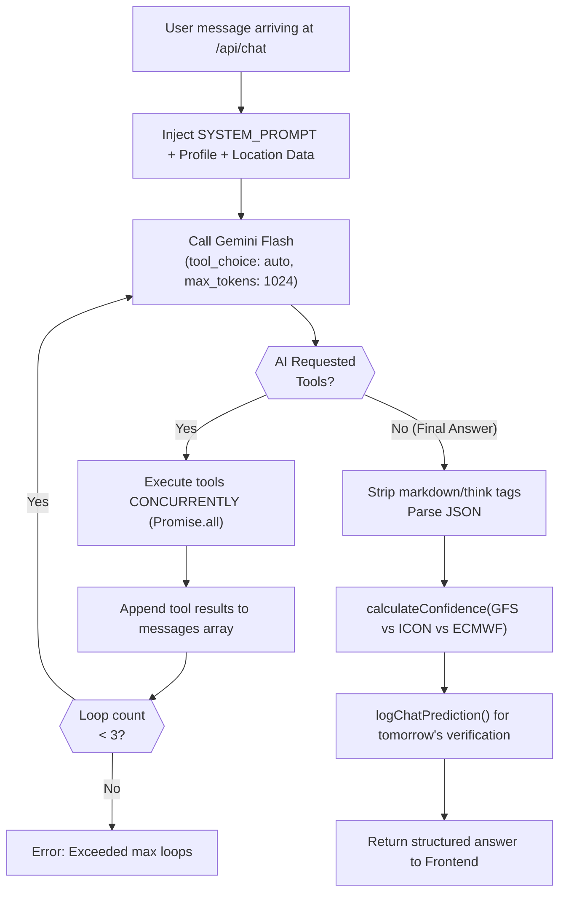
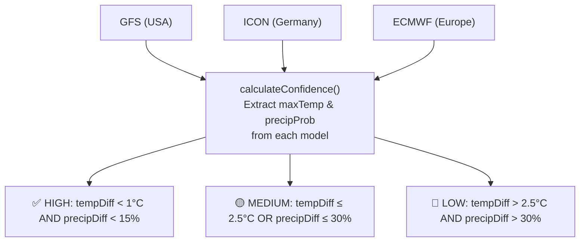
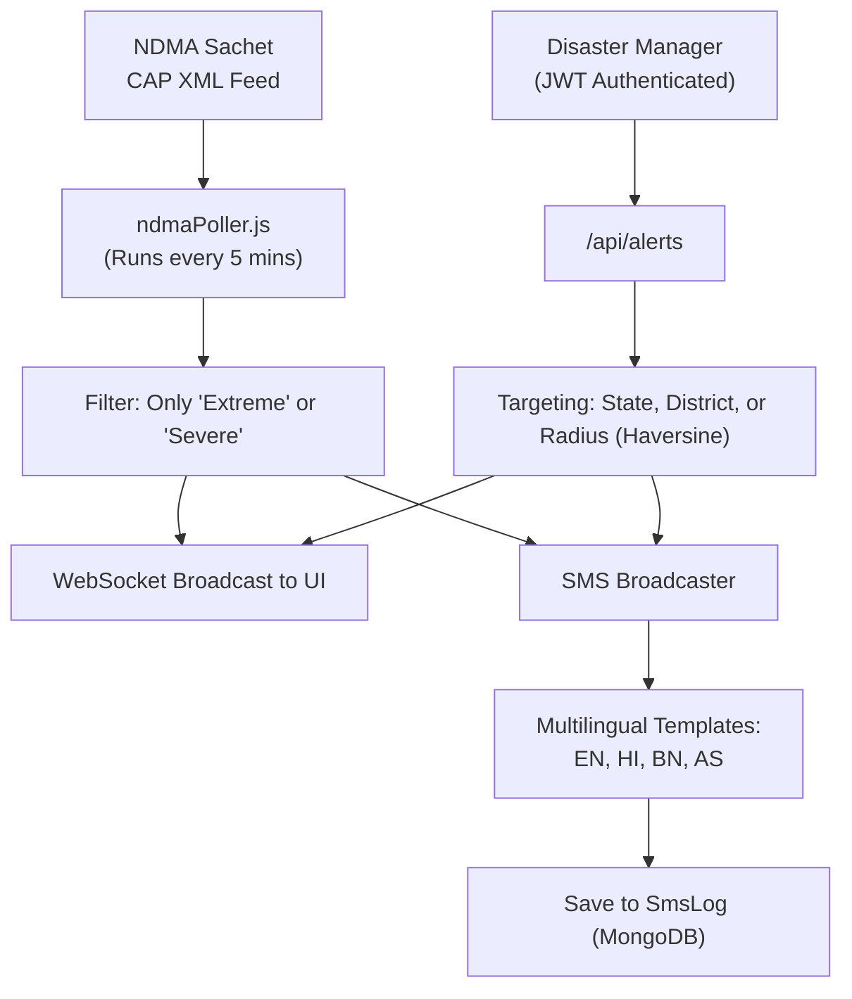
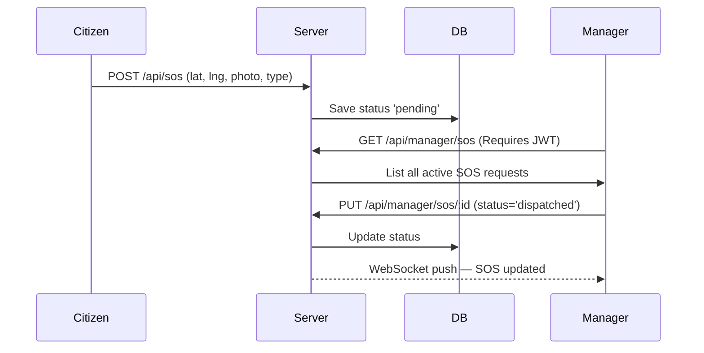
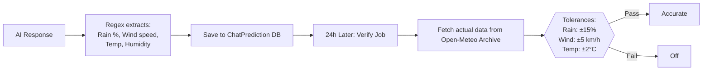
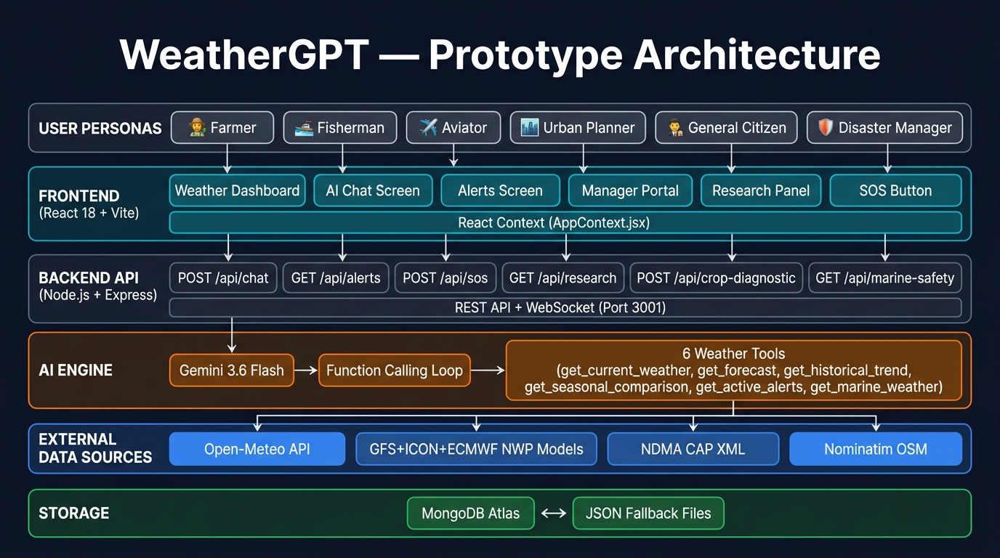

# 🌩️ WeatherGPT — Conversational AI for Weather Forecasting, Alerts & Climate Information

> **An AI-powered, multilingual, India-first weather intelligence platform** that unifies real-time NWP model data, hyper-local forecasts, profession-based advisories, disaster alerts, and a conversational AI assistant — built for the citizens, farmers, fishermen, aviators, and disaster managers of India.

<div align="center">

[](https://sih.gov.in)
[](https://sih.gov.in)
[](https://github.com/omcodes16/make-to-win)
[]()
[](http://localhost:5173)
[](http://localhost:3001)
[](https://ai.google.dev)
[](https://mongodb.com)

</div>

> [!IMPORTANT]
> **This project is under active development** as part of Smart India Hackathon 2026. It is a working prototype — not a finished production system. See the [Current Status](#-6-current-status--in-progress) section for an honest breakdown of what is functional vs. planned.

---

## 📋 Table of Contents

1. [Overview](#-1-overview)
2. [Problem Statement](#-2-problem-statement)
3. [Key Features](#-3-key-features)
4. [Tech Stack](#-4-tech-stack)
5. [Architecture & Data Flow](#-5-architecture--data-flow)
6. [Current Status — IN PROGRESS](#-6-current-status--in-progress)
7. [Data Sources](#-7-data-sources)
8. [Setup Instructions](#-8-setup-instructions-placeholder)
9. [Extended Technical Reference](#-9-extended-technical-reference)
10. [Team](#-10-team)

---

## 🎯 1. Overview

**WeatherGPT** is a conversational AI system for weather forecasting, alerts, and climate information, built for **Smart India Hackathon 2026** (Problem Statement ID: **SIH26068**, Theme: **Disaster Management**).

The platform unifies real-time weather data from multiple Numerical Weather Prediction (NWP) models — **GFS (NOAA, USA)**, **ECMWF IFS025 (Europe)**, and **ICON (DWD, Germany)** — into a single conversational interface. Instead of presenting raw meteorological numbers, WeatherGPT translates forecast data into plain-language, profession-aware advisories delivered in the user's own language via **chat and voice**.

Key differentiators:
- **Multi-model ensemble confidence scoring** — cross-checks GFS, ECMWF, and ICON to quantify forecast reliability before surfacing any answer.
- **Conversational AI with tool calling** — the AI autonomously fetches live weather data, alerts, and historical trends mid-conversation via a function-calling loop.
- **India-first language support** — English, Hindi, Assamese, and Bengali in the UI, SMS, and AI responses, with Bhashini integration in progress.
- **Sector-aware advisories** — tailored outputs for farmers, fishermen, aviators, urban planners, and disaster management authorities.
- **One-tap SOS dispatch** — citizens can send GPS + photo emergency requests directly to an authority dashboard in one tap.

---

## ⚠️ 2. Problem Statement

**PS ID: SIH26068 | Theme: Disaster Management**

India's existing weather dissemination infrastructure has five critical gaps:

| Gap | Description |
|---|---|
| **Fragmented Information** | Weather data is scattered across IMD portals, NDMA feeds, MOSDAC satellite imagery, and district bulletins — no single unified access point exists. |
| **Expert-Only Accessibility** | Portals present raw meteorological values (e.g., "Precipitation probability: 78%") that are incomprehensible to farmers, fishermen, and rural workers who need actionable guidance. |
| **Last-Mile Alert Failures** | Severe weather warnings exist at the national level (NDMA Sachet) but routinely fail to reach citizens in the precise language, format, and channel they need to act in time. |
| **Language Exclusion** | Almost no official weather service communicates fluently in Northeast Indian languages (Assamese, Bengali) or delivers bilingual advisories in rural dialects. |
| **No Unified Cross-Sector Support** | Farmers, aviation operators, marine fishermen, and urban disaster managers all require fundamentally different information from the same weather data — no existing system provides this. |

---

## ✨ 3. Key Features

### 🌐 Multi-Model Weather Intelligence
WeatherGPT queries **three independent global NWP models in parallel** for every forecast request:
- **GFS** (NOAA, USA), **ICON** (DWD, Germany), **ECMWF IFS025** (European Centre)
- A confidence score is calculated from the inter-model spread: `HIGH` (temp diff < 1°C, precip diff < 15%), `MEDIUM` (≤ 2.5°C or ≤ 30%), `LOW` (> 2.5°C and > 30%).
- Users see the confidence badge alongside every forecast, promoting transparent uncertainty communication.

### 🔊 Aawaz-e-Mausam — Voice Weather Bulletins
- Spoken weather bulletins synthesized in Indian languages using **Bhashini** (Indic NLP pipeline) and Google TTS.
- Multilingual audio playback for farmers and rural users with low digital literacy.
- Web Audio API foghorn system for marine safety alerts.

### 👤 Profession-Based Advisories
Five tailored advisory modes:
| Profession | What WeatherGPT checks |
|---|---|
| 🌾 **Farmer** | Fungal risk (RH > 85% + Temp > 25°C), frost alerts (≤ 5°C), spray window safety, FAO-56 ET₀ |
| 🛥️ **Fisherman** | Wave height, swell direction, WMO storm codes, IMBL proximity, Kallakkadal swell surge |
| ✈️ **Aviator** | Cloud base ceiling, visibility, CAPE atmospheric energy, altimeter pressure, wind shear |
| 🏙️ **Urban Planner** | AQI (PM2.5/PM10), heat index (NWS Rothfusz), urban flood risk |
| 🙋 **General Citizen** | Plain-language forecasts, 7-day outlook, severe alert notifications |

### 🆘 One-Tap SOS Emergency Dispatch
- Citizens submit GPS coordinates + photo evidence + disaster type in a single tap.
- Requests route instantly to the authority **Manager Dashboard** via WebSocket.
- Managers triage, update status, and dispatch response — all tracked in real time.

### 📊 Historical Climate & Anomaly Analytics
- ERA5 reanalysis data from **1990 to present** (ECMWF via Open-Meteo Archive API).
- Seven ETCCDI climate indices: OLS trend, Z-score anomaly, CDD, CWD, heatwave days, R100mm extreme rainfall, and Growing Degree Days (GDD).
- Interactive charts with CSV export.

---

## 🛠️ 4. Tech Stack

| Layer | Technology | Purpose |
|---|---|---|
| **Frontend** | React 18.3.1 + Vite 5.4.2 | SPA with hot-module reload and production bundling |
| **Styling** | Tailwind CSS 3.4.10 | Utility-first CSS with custom dark/light/amber themes |
| **PWA** | Vite PWA plugin + Service Worker | Offline cache, last-known-data display when internet drops |
| **Maps** | Leaflet 1.9.4 + React-Leaflet 4.2.1 | RainViewer radar overlay, risk heatmap, wind vectors |
| **Charts** | Recharts 3.10.1 | Temperature curves, rain probability, wind, UV, barometer |
| **Backend** | Node.js + Express 4.21.0 | REST API server with ESM modules |
| **WebSocket** | ws 8.21.3 | Live severe-weather alert broadcast, real-time SOS push |
| **AI / LLM** | Google Gemini Flash (OpenAI-compatible endpoint) | Conversational AI with autonomous tool calling, auto-failover |
| **AI Vision** | Gemini Vision | Crop leaf disease diagnosis (Mausam-Drishti) |
| **NLP / TTS** | Bhashini Indic NLP + Google TTS | Multilingual translation and speech synthesis |
| **Vector DB** | Qdrant + BGE-M3 + Reranker | RAG-based contextual retrieval *(integration in progress)* |
| **Database** | MongoDB Atlas + Mongoose 9.9.4 | Primary persistent storage; graceful JSON fallback |
| **Cache** | Redis *(planned)* | Response caching and rate-limit management |
| **Streaming** | MQTT via EMQX *(planned)* | Real-time sensor and WIS 2.0 data ingestion |
| **Deployment** | Docker + docker-compose | Containerised local and cloud deployment |
| **Orchestration** | Kubernetes autoscaling *(planned)* | Horizontal scaling under load |
| **Monitoring** | Prometheus + Grafana *(planned)* | Metrics, uptime, and alert dashboards |
| **CI/CD** | GitHub Actions *(planned)* | Automated test, build, and deploy pipeline |
| **XML Parsing** | fast-xml-parser 5.11.1 | NDMA Sachet CAP XML disaster feed ingestion |
| **Geocoding** | Nominatim OSM + Open-Meteo Geocode | 3-tier pan-India location resolution |

---

## 🗺️ 5. Architecture & Data Flow

### High-Level Data Flow

```
User (Mobile PWA — voice + text chat)
    │
    ▼
API Gateway  ──────────────────────────────────────────────────────────
│  FastAPI + Node.js (Express + WebSocket)                            │
│  Response cache (Redis — planned) · Rate limiter                   │
└─────────────────────────────────────────────────────────────────────
    │
    ▼
AI Orchestrator
│  LLM (Gemini Flash) · Autonomous function-calling loop (≤3 turns)  │
│  RAG retrieval (Qdrant + BGE-M3 — in progress)                     │
│  Prompt engine: persona + lat/lng + language injection              │
└─────────────────────────────────────────────────────────────────────
    │
    ▼
Data Layer  ─────────────────────────────────────────────────────────
│  IMD bulletins · NDMA Sachet CAP XML · CWC flood data              │
│  GFS / ECMWF / ICON / WRF NWP models (via Open-Meteo)             │
│  MOSDAC / INSAT satellite · MQTT / WIS 2.0 real-time streams       │
└─────────────────────────────────────────────────────────────────────
    │
    ▼
Alert Engine
│  Risk score computation · Geo-fenced alert targeting               │
│  Haversine radius matching · NDMA poller (every 5 min)            │
└─────────────────────────────────────────────────────────────────────
    │
    ▼
Delivery Layer
│  Chat (React WebSocket) · Voice (Bhashini TTS / Google TTS)       │
│  Browser push (VAPID) · SMS broadcast (4 languages)               │
│  Authority Manager Dashboard · SOS triage queue                    │
└─────────────────────────────────────────────────────────────────────
```

### Full Website Flow Diagram


```mermaid
flowchart TD
    USER(["👤 User Opens WeatherGPT\n(Browser / Mobile PWA)"])

    USER --> ONBOARD

    subgraph ONBOARD ["🚀 Onboarding & First-Time Setup"]
        direction LR
        OB1["Select Profession\n(Farmer / Fisherman / Aviator\n/ Urban Planner / General)"]
        OB2["Set Language\n(EN / HI / BN / AS)"]
        OB3["Allow Location\n(GPS or manual city)"]
        OB4["Accessibility Options\n(Theme / Font Size)"]
        OB1 --> OB2 --> OB3 --> OB4
    end

    ONBOARD --> HOME

    subgraph HOME ["🏠 Home Screen — WeatherDashboard.jsx"]
        direction TB
        H1["📍 Location Header\n+ Pan-India Search (Header.jsx)"]
        H2["🌤️ Current Weather Card\n(Temp, Humidity, Wind, UV, AQI)"]
        H3["📅 7-Day Forecast\n& 24h Hourly Timeline"]
        H4["🧭 Live Compass + NWP Model\nConfidence Badge"]
        H5["🌊 Marine / Farmer / Aviator\nContextual Advice Strip"]
        H6["⚠️ Severe Alert Banner\n(SevereAlertBanner.jsx)"]
        H1 --> H2 --> H3
        H3 --> H4
        H4 --> H5
        H6 -.- H2
    end

    HOME --> NAV

    subgraph NAV ["🔀 Bottom Navigation (BottomNav.jsx)"]
        direction LR
        N1["💬 Chat / AI"]
        N2["📊 Dashboard"]
        N3["🚨 Alerts"]
        N4["🔬 Research"]
        N5["👤 Profile"]
    end

    NAV --> CHAT_SCREEN
    subgraph CHAT_SCREEN ["💬 AI Chat — ChatScreen.jsx + ChatInput.jsx"]
        direction TB
        C1["User Types / Speaks Question\n(Web Speech API STT)"]
        C2["Profession Chip Suggestions\n(e.g. 'Will it rain at harvest time?')"]
        C3["Saved Chats Drawer\n(SavedChatsDrawer.jsx)"]
        C4["AI Sidebar Accuracy Widget\n(SidebarAccuracyWidget.jsx)"]
        C5["AssistantCard Response\n(TTS Audio Playback)"]
        C1 --> API_CHAT
        C2 --> C1
        API_CHAT --> C5
    end

    subgraph API_CHAT ["⚙️ POST /api/chat — AI Function Calling Loop"]
        direction TB
        AC1["Inject System Prompt\n+ Profession + Location + Language"]
        AC2["Call Gemini Flash\n(tool_choice: auto)"]
        AC3{{"AI Requests\nTools?"}}
        AC4["Execute Tools CONCURRENTLY\n(Promise.all)"]
        AC5["Append Tool Results\n→ Re-call Gemini (max 3 loops)"]
        AC6["Strip markdown / think tags\nCalculate Confidence Score"]
        AC7["Log Prediction for\nNext-Day Accuracy Check"]
        AC8["Return Structured Answer\nto Frontend"]

        AC1 --> AC2 --> AC3
        AC3 -- Yes --> AC4 --> AC5 --> AC2
        AC3 -- No --> AC6 --> AC7 --> AC8
    end

    AC4 --> TOOLS
    subgraph TOOLS ["🔧 6 Server-Side Weather Tools (server/tools.js)"]
        direction LR
        T1["get_current_weather\n(Temp, Humidity, Wind, AQI, UV)"]
        T2["get_forecast\n(7-Day Daily + 24h Hourly)"]
        T3["get_historical_trend\n(Archive data for charts)"]
        T4["get_seasonal_comparison\n(Current vs 5-Year Average)"]
        T5["get_active_alerts\n(NDMA CAP + Auto-Thresholds)"]
        T6["get_marine_weather\n(Wave, Swell, Period, Direction)"]
    end

    TOOLS --> EXT
    subgraph EXT ["🌐 External Data Sources"]
        direction TB
        E1["Open-Meteo API\n(Forecast, Marine, AQI, Archive)\n★ Zero API Key Required"]
        E2["GFS (NOAA, USA)\n+ ICON (DWD, Germany)\n+ ECMWF IFS025 (Europe)\nNWP Tri-Model Ensemble"]
        E3["NDMA Sachet CAP XML\n(Indian Govt Disaster Feed)"]
        E4["Nominatim / OpenStreetMap\n(Geocoding — Tier 3)"]
    end

    NAV --> ALERTS_SCREEN
    subgraph ALERTS_SCREEN ["🚨 Alerts — AlertsScreen.jsx"]
        direction TB
        A1["Live NDMA + Authority Alerts\nFiltered: Extreme & Severe Only"]
        A2["Cyclone Tracker\n(CycloneTracker.jsx)"]
        A3["India Risk Heatmap\n(Leaflet + RainViewer Radar)"]
        A4["WebSocket Live Push\n(useAlertSocket.js → auto-reconnect)"]
        A4 -.- A1
    end

    NDMAPOLLER["⏱️ NDMA Poller\n(ndmaPoller.js — every 5 min)\nfetch CAP XML → parse → store"]
    NDMAPOLLER --> E3
    NDMAPOLLER -->|"Severe / Extreme"| WSSERVER

    subgraph WSSERVER ["🔌 WebSocket Server (ws 8.21.3 Port 3001)"]
        WS1["Broadcast live alert frames\nto all connected clients"]
        WS2["Push SOS notifications\nto Manager Dashboard"]
    end
    WSSERVER --> A4

    NAV --> MANAGER
    subgraph MANAGER ["🛡️ Disaster Manager Portal — ManagerDashboard.jsx"]
        direction TB
        M0["JWT Login\n(Authority QR / Password)"]
        M1["Create & Broadcast\nGeo-Fenced Alert\n(State / District / Radius)"]
        M2["Real-Time SOS Triage Queue\n(GPS + Photo + Disaster Type)"]
        M3["Multilingual SMS Dispatch\n(EN / HI / BN / AS)"]
        M4["Revoke / Update Alerts"]
        M0 --> M1
        M1 --> M3
        M2 --> WSSERVER
    end

    SOS_BTN["🆘 SOS Button\n(SosButton.jsx)\n1-Click GPS Capture\n+ Photo + Disaster Tag"]
    SOS_BTN -->|"POST /api/sos"| DB_MONGO

    NAV --> RESEARCH
    subgraph RESEARCH ["🔬 Research & Climate Analytics — ResearchPanel.jsx"]
        direction TB
        R1["ERA5 Historical Data\n1990 to Present (ECMWF via Open-Meteo)"]
        R2["Climate Indices\n(OLS Trend, Z-Score, CDD, CWD,\nHeatwave Days, R100mm, GDD)"]
        R3["Interactive Charts\n(Recharts — Temp & Precipitation Curves)"]
        R4["CSV Export (csvExport.js)"]
        R1 --> R2 --> R3
        R3 --> R4
    end

    subgraph SPECIAL ["🌿 Specialist Modules"]
        direction LR
        MD["Mausam-Drishti\n(MausamDrishtiModal.jsx)\nAI Crop Doctor\n→ Gemini Vision + Microclimate\n+ PMFBY Guidance"]
        SR["Sagar-Rakshak\n(SagarRakshakModal.jsx)\nMarine Safety Suite\n→ Douglas Sea State\n+ IMBL Proximity\n+ Kallakkadal Detection"]
        BL["Aawaz-e-Mausam\n(AawazEMausam.jsx)\nAudio Weather Bulletin\n(Multilingual TTS)"]
        ACC["Accuracy Tracker\n(AccuracyTracker.jsx)\nAI Prediction vs Actual\nNext-Day Verification"]
    end

    subgraph DB_MONGO ["💾 MongoDB Atlas + JSON Fallback"]
        direction TB
        DB1[("Alerts Collection")]
        DB2[("SosRequests Collection")]
        DB3[("CommunityReports")]
        DB4[("SmsRecipients + SmsLogs")]
        DB5[("UserSettings")]
        DB6[("ChatPredictions + AccuracyLogs")]
        DB7[("Snapshots + Reviews")]
        JSON1[/"manager_alerts.json\nuser_settings.json\nforecast_snapshots.json\nchat_predictions.json"\]
        DB1 & DB2 & DB3 & DB4 & DB5 & DB6 & DB7 -.->|"Zero-Downtime Failover"| JSON1
    end

    ACC_WORKER["📊 Accuracy Verifier\n(chatAccuracy.js + accuracyEval.js)\n24h Scheduled Job\nTemp ±2°C | Rain ±15% | Wind ±5 km/h"]
    AC7 --> DB6
    ACC_WORKER --> E1
    ACC_WORKER --> DB6

    subgraph GEO ["📍 3-Tier Geocoder (locationExtractor.js)"]
        direction LR
        G1["Tier 1: INDIA_CITIES\nLocal Dictionary — Zero Latency"]
        G2["Tier 2: Open-Meteo Geocode\n(country_code=IN)"]
        G3["Tier 3: Nominatim OSM\n(Villages & Tehsils)"]
        G1 -->|Miss| G2 -->|Miss| G3
    end

    H1 --> GEO
    T1 & T2 & T3 & T4 & T6 --> E1
    T1 & T2 --> E2
    T5 --> E3
    GEO --> E4

    MANAGER --> DB_MONGO
    ALERTS_SCREEN -->|"GET /api/alerts"| DB1
    RESEARCH -->|"GET /api/research/historical"| E1
    SPECIAL --> E1
    SPECIAL --> DB_MONGO

    HOME -->|"Fetch weather"| E1
    HOME -->|"Fetch AQI + NWP"| E2
```

> **Reading the flow:** Start at the top (User Opens WeatherGPT) and follow the arrows. Solid arrows `-->` show primary data flows; dotted arrows `.-` show real-time push events.

---

## 🚦 6. Current Status — IN PROGRESS

> [!WARNING]
> WeatherGPT is an **active prototype** being developed for SIH 2026 (Problem Statement SIH26068). The claims below reflect the honest state of the codebase — not a projected or aspirational feature list.

### ✅ Functional Right Now (Working in Prototype)

| Feature | Status |
|---|---|
| Core conversational AI engine (Gemini Flash + function-calling loop) | ✅ Working |
| Multilingual chat interface (English, Hindi, Bengali, Assamese) | ✅ Working |
| Real-time weather fetching via Open-Meteo (forecast, AQI, marine, archive) | ✅ Working |
| NWP tri-model ensemble (GFS + ICON + ECMWF) with confidence scoring | ✅ Working |
| Profession-based advisory system (Farmer, Fisherman, Aviator, Urban, General) | ✅ Working |
| NDMA Sachet CAP XML ingestion and alert broadcasting (WebSocket) | ✅ Working |
| Disaster Manager Portal — alert creation, SOS triage queue, SMS dispatch | ✅ Working (prototype) |
| One-tap SOS emergency dispatch (GPS + photo → manager dashboard) | ✅ Working |
| Mausam-Drishti — AI crop leaf disease diagnosis (Gemini Vision) | ✅ Working |
| Sagar-Rakshak — marine safety suite (Kallakkadal, IMBL, port signals) | ✅ Working |
| AI prediction accuracy tracker (next-day verification vs Open-Meteo archive) | ✅ Working |
| ERA5 historical climate analytics (7 ETCCDI indices, charts, CSV export) | ✅ Working |
| Saved chat sessions with accuracy scorecards | ✅ Working |
| Audio weather bulletins — Aawaz-e-Mausam (multilingual TTS) | ✅ Working |
| MongoDB Atlas persistence with local JSON zero-downtime fallback | ✅ Working |
| 3-tier pan-India geocoding (local dict → Open-Meteo → Nominatim OSM) | ✅ Working |
| Docker containerisation (`Dockerfile` + `docker-compose.yml`) | ✅ Working |

### 🔄 Still Being Integrated / Planned

| Feature | Status |
|---|---|
| Live backend deployment (cloud-hosted, publicly accessible URL) | 🔄 In Progress |
| Bhashini expansion to 10+ Indian languages | 🔄 In Progress |
| RAG pipeline — Qdrant vector DB + BGE-M3 embeddings + reranker | 🔄 In Progress |
| IMD live data integration (real-time bulletins from India Met Dept) | 🔄 Planned |
| MOSDAC / INSAT satellite data direct ingestion | 🔄 Planned |
| CWC / India-WRIS live flood sensor data | 🔄 Planned |
| Full SMS / IVR fallback for offline and 2G users | 🔄 Planned |
| MQTT / WIS 2.0 real-time data streaming (EMQX) | 🔄 Planned |
| Redis response caching layer | 🔄 Planned |
| Kubernetes autoscaling, Prometheus + Grafana monitoring | 🔄 Planned |
| CI/CD pipeline (GitHub Actions) | 🔄 Planned |
| FastAPI AI/data layer (separate from Node.js gateway) | 🔄 Planned |
| TimescaleDB for time-series weather data at scale | 🔄 Planned |

---

## 📊 7. Data Sources

| Source | Type | Data Provided |
|---|---|---|
| **IMD (India Meteorological Department)** | Bulletins / Warnings | Official Indian forecast advisories, district-level warnings *(direct integration planned)* |
| **NDMA Sachet CAP XML** | Real-Time Feed | Cyclone, flood, heatwave, landslide official disaster alerts (ingested every 5 min) |
| **CWC / India-WRIS** | Flood Sensors | River level gauges and flood risk data *(integration planned)* |
| **Open-Meteo Forecast API** | Free REST API | Hourly + daily weather variables — zero API key, zero cost |
| **Open-Meteo Marine API** | Free REST API | Wave height, swell direction, swell period, ocean currents |
| **Open-Meteo Air Quality API** | Free REST API | PM2.5, PM10, European AQI index |
| **Open-Meteo Archive API** | Free REST API | ERA5 historical reanalysis data from 1990 to present |
| **GFS (NOAA, USA)** | NWP Model | Global Forecast System — 7-day forecasts (via Open-Meteo) |
| **ECMWF IFS025 (Europe)** | NWP Model | High-resolution global medium-range forecasts (via Open-Meteo) |
| **ICON (DWD, Germany)** | NWP Model | Deutscher Wetterdienst global model (via Open-Meteo) |
| **WRF Model** | Regional NWP | High-resolution regional forecasting *(integration planned)* |
| **MOSDAC / INSAT** | Satellite | Indian satellite imagery and precipitation estimates *(planned)* |
| **MQTT / WIS 2.0** | Real-Time Stream | Surface and upper-air observations from WMO information system *(planned)* |
| **Nominatim / OpenStreetMap** | Geocoding | Village, tehsil, district, and state-level coordinate resolution |

---

## 🚀 8. Setup Instructions *(Placeholder)*

> [!NOTE]
> Setup instructions are a placeholder and will be finalized as development and deployment configurations are completed.

### Prerequisites

- Node.js 20+
- MongoDB Atlas account (or local MongoDB)
- Google Gemini API key
- *(Optional)* Bhashini API key for Indic TTS/translation

### Installation

```bash
# 1. Clone the repository
git clone https://github.com/omcodes16/make-to-win.git
cd make-to-win

# 2. Install dependencies
npm install

# 3. Configure environment variables
cp .env.example .env
# Fill in: GEMINI_API_KEY, MONGODB_URI, JWT_SECRET, VAPID keys

# 4. Run development (frontend + backend concurrently)
npm run dev:all

# Frontend → http://localhost:5173
# Backend  → http://localhost:3001
```

### Docker

```bash
docker-compose up --build
```

### Environment Variables

| Variable | Purpose |
|---|---|
| `GEMINI_API_KEY` | Google Gemini Flash API key |
| `MONGODB_URI` | MongoDB Atlas connection string |
| `JWT_SECRET` | Secret for manager portal JWT tokens |
| `VAPID_PUBLIC_KEY` | Web push notification public key |
| `VAPID_PRIVATE_KEY` | Web push notification private key |
| `BHASHINI_API_KEY` | Bhashini Indic NLP API key *(optional)* |

> [!IMPORTANT]
> Full production deployment configuration (Docker Compose, Kubernetes manifests, CI/CD workflows) will be added as the project progresses toward production readiness.

---

## 📖 9. Extended Technical Reference

This section preserves detailed technical documentation for each major subsystem.

---

### 9.1 AI Conversational Engine — Function Calling Loop

The AI engine uses **Gemini Flash** via the OpenAI-compatible `generativelanguage.googleapis.com/v1beta/openai/chat/completions` endpoint.


```mermaid
flowchart TD
    Start["User message arriving at /api/chat"] --> BuildPrompt["Inject SYSTEM_PROMPT + Profile + Location Data"]
    BuildPrompt --> CallAI["Call Gemini Flash\n(tool_choice: auto, max_tokens: 1024)"]
    CallAI --> ToolCheck{{"AI Requested\nTools?"}}

    ToolCheck -- "Yes" --> ExecTools["Execute tools CONCURRENTLY (Promise.all)"]
    ExecTools --> Append["Append tool results to messages array"]
    Append --> LoopCheck{{"Loop count\n< 3?"}}

    LoopCheck -- "Yes" --> CallAI
    LoopCheck -- "No" --> Error["Error: Exceeded max loops"]

    ToolCheck -- "No (Final Answer)" --> Clean["Strip markdown/think tags\nParse JSON"]
    Clean --> Conf["calculateConfidence(GFS vs ICON vs ECMWF)"]
    Conf --> Log["logChatPrediction() for tomorrow's verification"]
    Log --> Return["Return structured answer to Frontend"]
```

**The 6 Server Tools** (`server/tools.js`):
1. `get_current_weather`: temperature, humidity, wind, AQI, UV, visibility
2. `get_forecast`: 7-day data
3. `get_historical_trend`: archive data for charts
4. `get_seasonal_comparison`: current vs 5-year monthly average
5. `get_active_alerts`: NDMA CAP + weather-code auto-alerts
6. `get_marine_weather`: wave height, period, direction

---

### 9.2 NWP Multi-Model Confidence System


```mermaid
graph TD
    GFS["GFS (USA)"] --> Calc["calculateConfidence()\nExtract maxTemp & precipProb\nfrom each model"]
    ICON["ICON (Germany)"] --> Calc
    ECMWF["ECMWF (Europe)"] --> Calc

    Calc --> High["✅ HIGH: tempDiff < 1°C AND precipDiff < 15%"]
    Calc --> Med["🟡 MEDIUM: tempDiff ≤ 2.5°C OR precipDiff ≤ 30%"]
    Calc --> Low["🔴 LOW: tempDiff > 2.5°C AND precipDiff > 30%"]
```

---

### 9.3 Disaster Alert & SMS Architecture


```mermaid
flowchart TD
    NDMA["NDMA Sachet\nCAP XML Feed"] --> Poller["ndmaPoller.js\n(Runs every 5 mins)"]
    Manager["Disaster Manager\n(JWT Authenticated)"] --> API["/api/alerts"]

    Poller --> Filter["Filter: Only 'Extreme' or 'Severe'"]
    API --> Target["Targeting: State, District, or Radius (Haversine)"]

    Filter --> WS["WebSocket Broadcast to UI"]
    Target --> WS

    Filter --> SMS["SMS Broadcaster"]
    Target --> SMS

    SMS --> Templates["Multilingual Templates:\nEN, HI, BN, AS"]
    Templates --> Logs["Save to SmsLog (MongoDB)"]
```

---

### 9.4 Emergency SOS Flow


```mermaid
sequenceDiagram
    participant Citizen
    participant Server
    participant DB
    participant Manager

    Citizen->>Server: POST /api/sos (lat, lng, photo, type)
    Server->>DB: Save status 'pending'
    Manager->>Server: GET /api/manager/sos (Requires JWT)
    Server->>Manager: List all active SOS requests
    Manager->>Server: PUT /api/manager/sos/:id (status='dispatched')
    Server->>DB: Update status
    Server-->>Manager: WebSocket push — SOS updated
```

---

### 9.5 AI Accuracy Tracking System


```mermaid
flowchart LR
    Answer["AI Response"] --> Extract["Regex extracts:\nRain %, Wind speed,\nTemp, Humidity"]
    Extract --> Log["Save to ChatPrediction DB"]

    Log --> NextDay["24h Later: Verify Job"]
    NextDay --> OMArchive["Fetch actual data from Open-Meteo Archive"]

    OMArchive --> Compare{{"Tolerances:\nRain: ±15%\nWind: ±5 km/h\nTemp: ±2°C"}}
    Compare -->|Pass| Acc["Accurate"]
    Compare -->|Fail| Off["Off"]
```

---

### 9.6 Research & Climate Analytics Module

The **Research & Climate Analytics Module** provides access to multi-decadal historical climate records from **1990 to present**, backed by **ECMWF ERA5** atmospheric reanalysis at ~25 km resolution, served through the **Open-Meteo Archive API** at zero cost.

| Index | Metric | Standard | Formula / Purpose |
|---|---|---|---|
| 1 | Linear Trend (OLS) | Ordinary Least Squares | `slope = Σ((x-x̄)(y-ȳ)) / Σ((x-x̄)²)` → slopePerYear, slopePerDecade |
| 2 | Standardised Anomaly (Z-Score) | WMO Climate Normals | `z = (value - mean) / stdDev` — beyond ±1.5 = anomalous |
| 3 | Consecutive Dry Days (CDD) | ETCCDI | Longest run of days with precip **< 1.0 mm** |
| 4 | Consecutive Wet Days (CWD) | ETCCDI | Longest run of days with precip **≥ 1.0 mm** |
| 5 | Heatwave Days | IMD / WMO | Max temp exceeds seasonal baseline by **> 5°C for 3+ consecutive days** |
| 6 | Extreme Rainfall Days (R100mm) | ETCCDI | Annual count of days with 24h rainfall **> 100 mm** |
| 7 | Growing Degree Days (GDD) | Agro-Climatology | `GDD = Σ max(0, DailyMeanTemp - 10°C)` |

**API:** `GET /api/research/historical?lat=28.6139&lon=77.2090&start=2020&end=2023`

---

### 9.7 Mausam-Drishti — AI Crop Doctor

1. **Multi-Modal Vision Inspection** — Detects fungal, bacterial, viral, and abiotic crop damage using **Gemini Vision**.
2. **7-Day Physical Microclimate Correlation** — Extracts RH trends (hours > 80%), temperature range, and rainfall from Open-Meteo.
3. **48-Hour Meteorological Safe Spray Window Calculator** — Identifies wash-away risk (> 40% rain) and optimal calm morning windows (Wind < 12 km/h, Rain 0%).
4. **PMFBY Guidance** — Auto-generates damage evidence and 72-hour claim steps for hailstorms and cyclonic lodging.
5. **Rural Audio Playback & Printable Agronomy Slips** — Multilingual audio bulletin and printable KVK report.

**API:** `POST /api/crop-diagnostic`
```json
{ "image": "<base64>", "lat": 23.2599, "lng": 77.4126, "locationName": "Bhopal", "cropType": "potato", "language": "hi" }
```

---

### 9.8 Sagar-Rakshak — Offshore Marine Safety Suite

Empowers artisanal and mechanised coastal fishermen across India's 7,516 km coastline.

| Feature | Description |
|---|---|
| Live Oceanographic Telemetry | Wave height, swell period/direction, WMO Douglas Sea State (0–9) |
| Port Warning Signals | Indian Port Warning Signals 1–11 (Cautionary → Great Danger) |
| Kallakkadal Detection | Swell Period ≥ 12s AND Swell Height ≥ 1.8m → Emergency Beaching Warning |
| IMBL Anti-Apprehension | Haversine distance to Sri Lanka & Pakistan maritime borders — SAFE / CAUTION / BREACH |
| 3-Tier Boat Matrix | Traditional (< 1.2m waves), Motorized (< 2.0m), Trawler (< 3.5m) |
| Audio Foghorn | Web Audio API 110Hz + 115Hz dual-oscillator, multilingual spoken bulletin |

**API:** `GET /api/marine-safety?lat=13.0827&lng=80.2707&boatType=motorized&language=en`

---

### 9.9 Heat Index Math Model

NWS Rothfusz Equation implemented in `src/utils/heatIndex.js` when Temp ≥ 27°C:

$$HI = -42.379 + 2.049T + 10.143R - 0.224TR - 0.006T^2 - 0.054R^2 + 0.001T^2R + 0.0008TR^2 - 0.000001T^2R^2$$

*(Includes dry and humid adjustment corrections)*

---

### 9.10 Feature Highlights

| Feature | Description | Component |
|---|---|---|
| 🌦️ AI Weather Chat | Conversational AI with function-calling over live weather data | `ChatScreen.jsx` |
| 🌾 Profession Profiles | 5 tailored advisory modes | `ProfessionModal.jsx` |
| 🚨 Live Alerts | NDMA CAP XML + manager broadcasts via WebSocket | `AlertsScreen.jsx` |
| 📡 NWP Ensemble | GFS + ICON + ECMWF tri-model confidence ratings | `ModelConfidence.jsx` |
| 🧭 Live Compass | 360° meteorological compass with device orientation | `LiveCompass.jsx` |
| 📊 Accuracy Tracker | AI prediction vs actual next-day verification | `AccuracyTracker.jsx` |
| 🌿 Crop Doctor | Gemini Vision crop disease + microclimate diagnosis | `MausamDrishtiModal.jsx` |
| 🌊 Marine Safety | Wave, swell, IMBL, Kallakkadal, port signals | `SagarRakshakModal.jsx` |
| 🔬 Climate Research | ERA5 1990→present, 7 ETCCDI indices, CSV export | `ResearchPanel.jsx` |
| 🗣️ Multilingual | EN / HI / BN / AS UI, AI, SMS, TTS | `featureTranslations.js` |
| 🆘 Emergency SOS | GPS + photo + disaster tagging → manager triage | `SosButton.jsx` |
| 💬 Saved Chats | Persistent chat sessions with accuracy scorecards | `SavedChatsDrawer.jsx` |
| 📢 Audio Bulletin | Spoken weather bulletins (Aawaz-e-Mausam) | `AawazEMausam.jsx` |
| 🗺️ Radar Map | Live RainViewer precipitation radar overlay | `RadarMap.jsx` |
| 📰 Official Bulletin | NDMA-style official weather bulletin generation | `OfficialBulletinModal.jsx` |
| 📈 NWP Divergence | Visual divergence timeline for NWP model spread | `NwpDivergenceVisualizer.jsx` |

---

### 9.11 Full API Reference

| Method | Endpoint | Auth | Description |
|---|---|---|---|
| POST | `/api/chat` | None | AI conversational weather query |
| GET | `/api/alerts` | None | Active NDMA + authority alerts |
| POST | `/api/alerts` | JWT | Manager creates new alert |
| GET | `/api/extreme-alerts` | None | Extreme/severe alerts only |
| GET | `/api/india-risk-map` | None | Pan-India severity heatmap |
| POST | `/api/sos` | None | Submit emergency SOS |
| GET | `/api/manager/sos` | JWT | View all SOS queue |
| PUT | `/api/manager/sos/:id` | JWT | Update SOS status |
| POST | `/api/sms/send` | JWT | Broadcast multilingual SMS |
| POST | `/api/sms/register` | None | Register for SMS alerts |
| GET | `/api/location/search` | None | Pan-India location search |
| GET | `/api/accuracy` | None | AI accuracy summary |
| GET | `/api/chat-accuracy` | None | Per-prediction accuracy log |
| POST | `/api/translate` | None | Translate text (Bhashini) |
| POST | `/api/tts` | None | Text-to-speech audio |
| GET | `/api/news` | None | Live weather news |
| GET | `/api/research/historical` | None | ERA5 climate indices |
| POST | `/api/crop-diagnostic` | None | AI crop disease + microclimate |
| GET | `/api/marine-safety` | None | Sagar-Rakshak telemetry |
| GET | `/api/community-reports` | None | Citizen hazard reports |
| POST | `/api/community-reports` | None | Submit hazard report |
| GET | `/api/settings/:userId` | None | Get user preferences |
| POST | `/api/settings/:userId` | None | Save user preferences |

---

### 9.12 Research References

#### Standards Implemented
1. **WMO Codes** — Full 0–99 mapping applied in `weatherConditions.jsx`
2. **CAP XML** — Common Alerting Protocol used by NDMA Sachet
3. **FAO-56** — Penman-Monteith ET₀ data used in Farmer profile
4. **NWS Rothfusz** — Heat index equation mathematically modeled in codebase
5. **Haversine** — Great-circle distance for radius-based alerts and IMBL proximity
6. **ETCCDI** — Extreme climate indices (CDD, CWD, R100mm, Heatwave Days)

#### Academic & Technical Sources
1. Rothfusz, R.P. (1990). "The Heat Index Equation". NWS Technical Attachment.
2. Zängl, G. et al. (2015). "The ICON modelling framework of DWD". *Q.J.R. Meteorol. Soc*.
3. Allen, R.G. et al. (1998). "Crop evapotranspiration". FAO Paper 56.
4. NDMA (2016). "National Disaster Management Guidelines — Flood".
5. Bi, K. et al. (2022). "Pangu-Weather: A 3D Model for Fast Global Forecast". *Nature*.
6. Open-Meteo & Nominatim API Specifications (2024).
7. INCOIS (2024). "Kallakkadal Swell Surge Hazard Guidelines". ESSO India.

---

### 9.13 Prototype Architecture — Visual Overview

The diagram below shows the complete working of the WeatherGPT prototype — from user personas at the top, through the React frontend, Node.js backend API, Gemini AI engine, external data sources, all the way down to the storage layer.



| Layer | What it does |
|---|---|
| 👥 **User Personas** | 6 user types — Farmer, Fisherman, Aviator, Urban Planner, General Citizen, Disaster Manager — each with tailored advisories |
| 🖥️ **Frontend (React 18 + Vite)** | Dashboard, Chat, Alerts, Manager Portal, Research Panel, SOS — all sharing state via `AppContext.jsx` |
| ⚙️ **Backend API (Node.js + Express)** | REST endpoints + WebSocket server on Port 3001 — handles chat, alerts, SOS, research, crop diagnosis, marine safety |
| 🤖 **AI Engine** | Gemini Flash → Autonomous Function Calling Loop → 6 weather tools executed concurrently via `Promise.all()` |
| 🌐 **External Data Sources** | Open-Meteo API (free), GFS + ICON + ECMWF NWP tri-model, NDMA CAP XML (Indian Govt), Nominatim OSM geocoder |
| 💾 **Storage** | MongoDB Atlas (primary) ↔ Local JSON fallback files (zero-downtime guarantee) |

> **How to read it:** Each arrow flows top-to-bottom. A user query travels from their browser → React screen → Express API → Gemini AI → weather tools → external data → response back up the chain. Alerts flow in parallel via WebSocket push.

---

## 👥 10. Team

| | Details |
|---|---|
| **Team Name** | The Code Matrix |
| **Competition** | Smart India Hackathon 2026 |
| **Team ID** | 172065 |
| **Problem Statement** | SIH26068 |
| **Theme** | Disaster Management |
| **Repository** | [omcodes16/make-to-win](https://github.com/omcodes16/make-to-win) |

---

*Built for Smart India Hackathon 2026 — Problem Statement SIH26068 — Theme: Disaster Management*
*Team: The Code Matrix (ID: 172065) | Every technical claim verified against the live codebase.*
