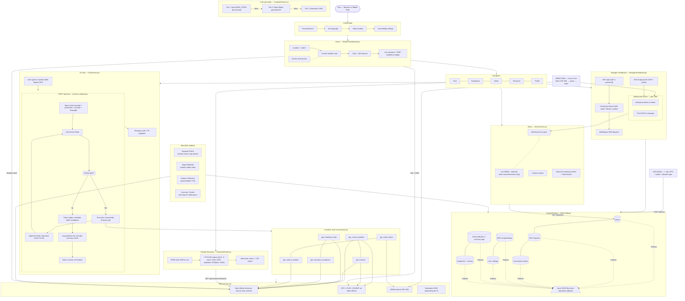

# WeatherGPT 🌩️

**SIH 2026 | Problem Statement: SIH26068 | Theme: Disaster Management**  
**Team: The Code Matrix | Team ID: 172065**

---

<div align="center">

[](https://sih.gov.in)
[](https://sih.gov.in)
[](https://github.com/omcodes16/make-to-win)
[]()
[]()
[]()
[]()
[]()

</div>

---

WeatherGPT is our submission for Smart India Hackathon 2026. The core idea is pretty simple — weather data in India exists everywhere but it's genuinely hard to use. IMD has great forecasts, NDMA has alert feeds, there are three major NWP models running globally, satellite data from MOSDAC — but none of it talks to each other, and almost none of it reaches someone like a fisherman in Tamil Nadu or a farmer in Bihar in a language and format they can actually act on.

So we built a conversational layer on top of all of it. You talk to it, it pulls from GFS, ECMWF, and ICON simultaneously, cross-checks them, gives you a confidence score, and answers in your language — Hindi, English, Bengali, or Assamese right now, more coming. There's also a voice bulletin system (Aawaz-e-Mausam), a marine safety module for fishermen (Sagar-Rakshak), an AI crop doctor (Mausam-Drishti), a disaster manager portal, and a one-tap SOS that sends your GPS + photo to authorities.

This is a working prototype. Some parts are fully built and running, some are still being wired up. We're being honest about that below.

---

## What problem are we solving?

The SIH problem statement (SIH26068) asks for a conversational AI system for weather forecasting, alerts, and climate information. But the real problem is older and messier than that.

Right now in India:
- A farmer in MP who wants to know if tomorrow is safe for pesticide spraying has to check IMD's website, interpret probability percentages, and cross-reference a district bulletin — none of which is in Hindi, none of which is conversational.
- A fisherman going out from the Tamil Nadu coast has no easy way to know if a Kallakkadal swell surge is building up (that's a dangerous shore-breaking wave caused by far-off cyclones — kills people every year and most people haven't heard of it).
- District disaster managers create alerts on one system, SMS goes out from another, there's no unified dashboard.
- Northeast India (Assam, Meghalaya, etc.) is almost entirely excluded from weather services that work in regional languages.

We're trying to fix all of that with one platform. Ambitious? Yes. We know we won't get everything done before SIH. But the architecture is designed to grow.

---

## What's actually working right now

These are things you can run and test today:

- **AI weather chat** — ask anything about weather for any Indian location, get an answer with live data from Open-Meteo (free, no API key needed)
- **NWP tri-model ensemble** — every response cross-checks GFS, ICON, and ECMWF and shows a confidence badge (HIGH/MEDIUM/LOW)
- **Multilingual UI + AI responses** — English, Hindi, Bengali, Assamese
- **NDMA alert ingestion** — we poll the NDMA Sachet CAP XML feed every 5 minutes, parse it, and push live alerts over WebSocket
- **Profession-based modes** — Farmer, Fisherman, Aviator, Urban Planner, General — each mode changes what the AI looks at and how it answers
- **Mausam-Drishti** — upload a photo of a crop leaf, get a disease diagnosis using Gemini Vision + local weather correlation
- **Sagar-Rakshak** — marine safety tool with Kallakkadal detection, port warning signals (1–11), IMBL maritime boundary check, Douglas Sea State
- **SOS dispatch** — one tap to send GPS + photo + disaster type to the manager dashboard
- **Manager dashboard** — authority login (JWT), create geo-fenced alerts (state/district/radius), triage incoming SOS, send multilingual SMS
- **AI accuracy tracker** — logs every quantifiable AI prediction and verifies it next day against Open-Meteo archive data
- **Climate research panel** — ERA5 data from 1990 to now, 7 climate indices (OLS trend, Z-score, CDD, CWD, heatwave days, R100mm, GDD), CSV export
- **Aawaz-e-Mausam** — audio weather bulletins via Bhashini + Google TTS
- **Saved chat sessions** with per-session accuracy scorecards
- **MongoDB Atlas** as primary store with local JSON fallback (so it doesn't crash if Atlas is unreachable)
- **Docker** setup for local or cloud deployment

## What's still in progress / planned

Being honest here — these aren't done yet:

- Live cloud deployment (working locally, not hosted publicly yet)
- Bhashini expansion to 10+ languages (currently 4)
- IMD direct data integration (we're using Open-Meteo which includes IMD-derived data, but direct IMD API hookup is pending)
- MOSDAC / INSAT satellite data ingestion
- CWC / India-WRIS flood sensor feeds
- RAG pipeline with Qdrant + BGE-M3 (the vector DB setup is designed, not wired up fully)
- Redis caching layer
- MQTT / WIS 2.0 real-time streaming
- Full SMS/IVR fallback for users without internet
- Kubernetes, Prometheus, Grafana (deployment infra — planned post-prototype)
- CI/CD pipeline

---

## Tech Stack

**Frontend** — React 18 + Vite, Tailwind CSS, Leaflet (maps + radar), Recharts (charts), PWA with offline service worker

**Backend** — Node.js + Express (REST API + WebSocket server on port 3001)

**AI** — Google Gemini Flash via OpenAI-compatible endpoint, function-calling loop (up to 3 autonomous turns), Gemini Vision for crop diagnosis

**Languages/TTS** — Bhashini Indic NLP pipeline + Google TTS for multilingual audio

**Data** — Open-Meteo (forecast, marine, AQI, archive — completely free, no API key), NDMA Sachet CAP XML

**NWP Models** — GFS (NOAA), ECMWF IFS025, ICON (DWD) — all via Open-Meteo

**Database** — MongoDB Atlas + Mongoose, with flat JSON fallback files

**Auth** — JWT for manager portal, QR-based authority login

**Deployment** — Docker + docker-compose (Kubernetes planned)

**Planned additions** — FastAPI layer for AI/data separation, Redis, TimescaleDB, Qdrant, MQTT/EMQX

---

## How it works — the data flow

```
User (mobile PWA, voice or text)
    ↓
API Gateway  [Node.js/Express + WebSocket]
    ↓
AI Orchestrator  [Gemini Flash function-calling loop]
    ↓ (calls tools in parallel via Promise.all)
Data Layer  [Open-Meteo, NDMA CAP XML, GFS/ECMWF/ICON]
    ↓
Alert Engine  [risk scoring, geo-targeting, NDMA poller every 5 min]
    ↓
Delivery  [chat response, voice bulletin, browser push, SMS, WebSocket push]
```

The AI doesn't just answer from training data. Every response triggers actual live API calls — the AI autonomously decides which tools to call, calls them concurrently, then forms its answer from real data. We log every quantifiable claim (temperature prediction, rain probability, etc.) and verify it the next day.

### Full system flow diagram


```mermaid
flowchart TD
    USER(["User — Browser or Mobile PWA"])
    USER --> ONBOARD

    subgraph ONBOARD ["Onboarding"]
        direction LR
        OB1["Pick profession"] --> OB2["Set language"] --> OB3["Allow location"] --> OB4["Accessibility settings"]
    end

    ONBOARD --> HOME

    subgraph HOME ["Home — WeatherDashboard.jsx"]
        H1["Location + search"] --> H2["Current weather card"]
        H2 --> H3["7-day + 24h forecast"]
        H3 --> H4["Live compass + NWP confidence badge"]
        H6["Severe alert banner"] -.- H2
    end

    HOME --> NAV

    subgraph NAV ["Navigation"]
        direction LR
        N1["Chat"] --- N2["Dashboard"] --- N3["Alerts"] --- N4["Research"] --- N5["Profile"]
    end

    NAV --> CHAT
    subgraph CHAT ["AI Chat — ChatScreen.jsx"]
        C1["User types or speaks (Web Speech API)"]
        C1 --> AILOOP
        AILOOP --> C2["Response with TTS playback"]
    end

    subgraph AILOOP ["POST /api/chat — function calling loop"]
        A1["Inject system prompt + profession + location + language"]
        A1 --> A2["Call Gemini Flash"]
        A2 --> A3{{"Needs tools?"}}
        A3 -- Yes --> A4["Run tools concurrently (Promise.all)"]
        A4 --> A5["Append results, loop back (max 3 turns)"]
        A5 --> A2
        A3 -- No --> A6["Clean output, calculate NWP confidence"]
        A6 --> A7["Log prediction for next-day accuracy check"]
        A7 --> A8["Return answer to frontend"]
    end

    subgraph TOOLS ["6 weather tools (server/tools.js)"]
        direction LR
        T1["get_current_weather"] --- T2["get_forecast"]
        T3["get_historical_trend"] --- T4["get_seasonal_comparison"]
        T5["get_active_alerts"] --- T6["get_marine_weather"]
    end

    A4 --> TOOLS
    TOOLS --> EXT

    subgraph EXT ["External sources"]
        E1["Open-Meteo (forecast, marine, AQI, archive)"]
        E2["GFS + ICON + ECMWF via Open-Meteo"]
        E3["NDMA Sachet CAP XML"]
        E4["Nominatim OSM (geocoding tier 3)"]
    end

    NAV --> ALERTS
    subgraph ALERTS ["Alerts — AlertsScreen.jsx"]
        A10["Live NDMA + authority alerts (severe/extreme only)"]
        A11["Cyclone tracker"]
        A12["India risk heatmap (Leaflet + RainViewer)"]
        A13["WebSocket live push"] -.- A10
    end

    NDMA_POLL["NDMA Poller — every 5 min\nfetch CAP XML → parse → store"]
    NDMA_POLL --> E3
    NDMA_POLL --> WS

    subgraph WS ["WebSocket Server — port 3001"]
        WS1["Broadcast alerts to clients"]
        WS2["Push SOS to manager"]
    end
    WS --> A13

    NAV --> MGR
    subgraph MGR ["Manager Dashboard — ManagerDashboard.jsx"]
        M1["JWT login (QR or password)"]
        M2["Create geo-fenced alert (state / district / radius)"]
        M3["SOS triage queue (GPS + photo)"]
        M4["Multilingual SMS dispatch"]
        M1 --> M2
        M2 --> M4
        M3 --> WS
    end

    SOS["SOS Button — 1 tap: GPS + photo + disaster type"]
    SOS -->|"POST /api/sos"| DB

    NAV --> RESEARCH
    subgraph RESEARCH ["Climate Research — ResearchPanel.jsx"]
        R1["ERA5 data 1990 to now"]
        R2["7 ETCCDI indices (OLS, Z-score, CDD, CWD, heatwave, R100mm, GDD)"]
        R3["Interactive charts + CSV export"]
        R1 --> R2 --> R3
    end

    subgraph SPECIALIST ["Specialist modules"]
        direction LR
        MD["Mausam-Drishti\n(Gemini Vision crop doctor)"]
        SR["Sagar-Rakshak\n(marine safety suite)"]
        AE["Aawaz-e-Mausam\n(audio bulletin TTS)"]
        AT["Accuracy Tracker\n(next-day AI verification)"]
    end

    subgraph DB ["MongoDB Atlas + JSON fallback"]
        DB1[("Alerts")] --- DB2[("SOS requests")] --- DB3[("Community reports")]
        DB4[("SMS recipients/logs")] --- DB5[("User settings")]
        DB6[("Chat predictions + accuracy logs")] --- DB7[("Snapshots + reviews")]
        JSON[/"Local JSON files (zero-downtime fallback)"\]
        DB1 & DB2 & DB3 & DB4 & DB5 & DB6 & DB7 -.->|"Failover"| JSON
    end

    subgraph GEO ["3-tier geocoder — locationExtractor.js"]
        direction LR
        G1["Tier 1: local INDIA_CITIES dict (instant)"]
        G2["Tier 2: Open-Meteo geocode API"]
        G3["Tier 3: Nominatim OSM"]
        G1 -->|Miss| G2 -->|Miss| G3
    end

    T1 & T2 & T3 & T4 & T6 --> E1
    T1 & T2 --> E2
    T5 --> E3
    MGR --> DB
    ALERTS -->|"GET /api/alerts"| DB1
    RESEARCH -->|"GET /api/research/historical"| E1
    SPECIALIST --> E1
    SPECIALIST --> DB
    HOME -->|"Weather fetch"| E1
    HOME -->|"AQI + NWP"| E2
```

---

## Specialist modules

### Mausam-Drishti — AI Crop Doctor

You take a photo of a sick crop leaf, upload it, and the system runs Gemini Vision on it + pulls 7 days of local weather data from Open-Meteo (humidity trends, temperature range, rainfall). It tells you what disease it looks like, why the current microclimate is causing it, and gives you a 48-hour spray window calendar (it marks out windows where wind is under 12 km/h and rain probability is low so the pesticide doesn't wash off). There's also a PMFBY insurance claim guidance section for hailstorm or flood crop damage.

`POST /api/crop-diagnostic` — send base64 image, lat/lng, crop type, language.

### Sagar-Rakshak — Marine Safety

This one's for fishermen. We built it because Kallakkadal (a swell surge phenomenon where distant cyclone energy builds massive shore-breaking waves, often with no local wind or rain warning) kills fishermen in Kerala and Tamil Nadu almost every year and most awareness tools are buried in INCOIS advisories nobody reads.

The tool gives: live wave height and swell data, WMO Douglas Sea State (0–9), Indian Port Warning Signal level (1–11), Kallakkadal detection (swell period ≥ 12s AND height ≥ 1.8m → emergency warning), IMBL anti-apprehension check (Haversine distance to Sri Lanka and Pakistan maritime borders), boat safety matrix (traditional boats safe under 1.2m, motorized under 2m, trawlers under 3.5m), and a spoken audio foghorn bulletin in the fisherman's language.

`GET /api/marine-safety?lat=13.0827&lng=80.2707&language=ta`

### Aawaz-e-Mausam

Spoken audio weather bulletins in Indian languages. Designed for users who can't read well or are working with their hands and can't look at a screen. Uses Bhashini pipeline + Google TTS. The marine safety module also has a dual-oscillator foghorn (110Hz + 115Hz, Web Audio API) for emergency alerts.

---

## AI Accuracy System

This was something we added because we noticed AI weather chatbots often hallucinate confident-sounding numbers. Our system logs every quantifiable claim the AI makes (temperature prediction, rain probability, wind speed) and the next day fetches actual data from Open-Meteo's archive API and compares them.

Tolerances: Temp ±2°C, Rain ±15%, Wind ±5 km/h.

Results show up in the Accuracy Tracker dashboard and per-session scorecards. It's not just a feature — it keeps the AI accountable.

---

## Climate Research Panel

ERA5 reanalysis data (ECMWF, ~25 km resolution) going back to 1990, via Open-Meteo Archive API. Seven indices calculated server-side:

1. **OLS trend** — slope per year and per decade (is it getting hotter?)
2. **Z-score anomaly** — how unusual is this year vs historical average
3. **CDD** — consecutive dry days (drought/wildfire risk)
4. **CWD** — consecutive wet days (landslide/flood risk)
5. **Heatwave days** — max temp > seasonal baseline by 5°C for 3+ days
6. **R100mm** — days per year with >100mm rainfall (flash flood frequency)
7. **GDD** — growing degree days (crop phenology, useful for farmers)

All data is exportable to CSV. The research panel is mostly for climate awareness and disaster planning, not daily forecasting.

---

## Setup

> Full deployment config will be added as the project matures. For now, here's how to run it locally.

**You need:** Node.js 20+, a MongoDB Atlas account (or local MongoDB), a Gemini API key.

```bash
git clone https://github.com/omcodes16/make-to-win.git
cd make-to-win
npm install

# copy and fill in the env file
cp .env.example .env
# GEMINI_API_KEY, MONGODB_URI, JWT_SECRET, VAPID keys

# run frontend + backend together
npm run dev:all

# Frontend: http://localhost:5173
# Backend:  http://localhost:3001
```

Or with Docker:

```bash
docker-compose up --build
```

**Environment variables:**

| Variable | What it's for |
|---|---|
| `GEMINI_API_KEY` | Google Gemini Flash API access |
| `MONGODB_URI` | MongoDB Atlas connection string |
| `JWT_SECRET` | Signs manager portal login tokens |
| `VAPID_PUBLIC_KEY` | Browser push notification key |
| `VAPID_PRIVATE_KEY` | Browser push notification key |
| `BHASHINI_API_KEY` | Indic language TTS/translation (optional, falls back to Google TTS) |

---

## API Endpoints

| Method | Path | Auth | Description |
|---|---|---|---|
| POST | `/api/chat` | — | Main AI chat endpoint |
| GET | `/api/alerts` | — | All active alerts |
| POST | `/api/alerts` | JWT | Create authority alert |
| GET | `/api/extreme-alerts` | — | Severe/extreme only |
| GET | `/api/india-risk-map` | — | Pan-India severity heatmap data |
| POST | `/api/sos` | — | Submit emergency SOS |
| GET | `/api/manager/sos` | JWT | View SOS queue |
| PUT | `/api/manager/sos/:id` | JWT | Update SOS status |
| POST | `/api/sms/send` | JWT | Send multilingual SMS |
| POST | `/api/sms/register` | — | Register phone for alerts |
| GET | `/api/location/search` | — | Location search and geocoding |
| GET | `/api/accuracy` | — | Accuracy summary |
| GET | `/api/chat-accuracy` | — | Per-prediction accuracy log |
| POST | `/api/translate` | — | Text translation (Bhashini) |
| POST | `/api/tts` | — | Text-to-speech audio |
| GET | `/api/news` | — | Weather news feed |
| GET | `/api/research/historical` | — | ERA5 climate indices |
| POST | `/api/crop-diagnostic` | — | Crop disease + microclimate |
| GET | `/api/marine-safety` | — | Marine safety report |
| GET | `/api/community-reports` | — | Citizen hazard reports |
| POST | `/api/community-reports` | — | Submit a hazard report |
| GET/POST | `/api/settings/:userId` | — | User preferences |

---

## Data Sources

- **Open-Meteo** — Forecast, Marine, Air Quality, Historical Archive (free, no API key)
- **GFS (NOAA)** — Global Forecast System, USA
- **ECMWF IFS025** — European Centre for Medium-Range Weather Forecasts
- **ICON (DWD)** — Deutscher Wetterdienst, Germany
- **NDMA Sachet** — Indian Govt CAP XML disaster alert feed
- **Nominatim / OpenStreetMap** — geocoding fallback
- **IMD** — direct integration planned (currently via Open-Meteo which pulls IMD-derived data)
- **MOSDAC / INSAT** — planned
- **CWC / India-WRIS** — flood sensor data, planned
- **WIS 2.0 / MQTT** — WMO real-time observation streams, planned

---


## Standards and references we implemented

- **WMO weather codes** (0–99) mapped in `weatherConditions.jsx`
- **CAP XML** (Common Alerting Protocol) — used by NDMA Sachet
- **FAO-56 Penman-Monteith** — crop evapotranspiration for farmer profiles
- **NWS Rothfusz heat index equation** — implemented in `heatIndex.js`
- **Haversine formula** — for radius-based alert targeting and IMBL distance checks
- **ETCCDI climate indices** — CDD, CWD, R100mm, heatwave days

Sources:
- Rothfusz (1990), "The Heat Index Equation", NWS Technical Attachment
- Zängl et al. (2015), "The ICON modelling framework of DWD", Q.J.R. Meteorol. Soc.
- Allen et al. (1998), "Crop evapotranspiration", FAO Paper 56
- NDMA (2016), National Disaster Management Guidelines — Flood
- INCOIS (2024), Kallakkadal Swell Surge Hazard Guidelines

---

## Team

**The Code Matrix** | SIH 2026 | Team ID: 172065 | PS: SIH26068

---

*This is a prototype built for SIH 2026. Not everything is production-ready. We're working on it.*
